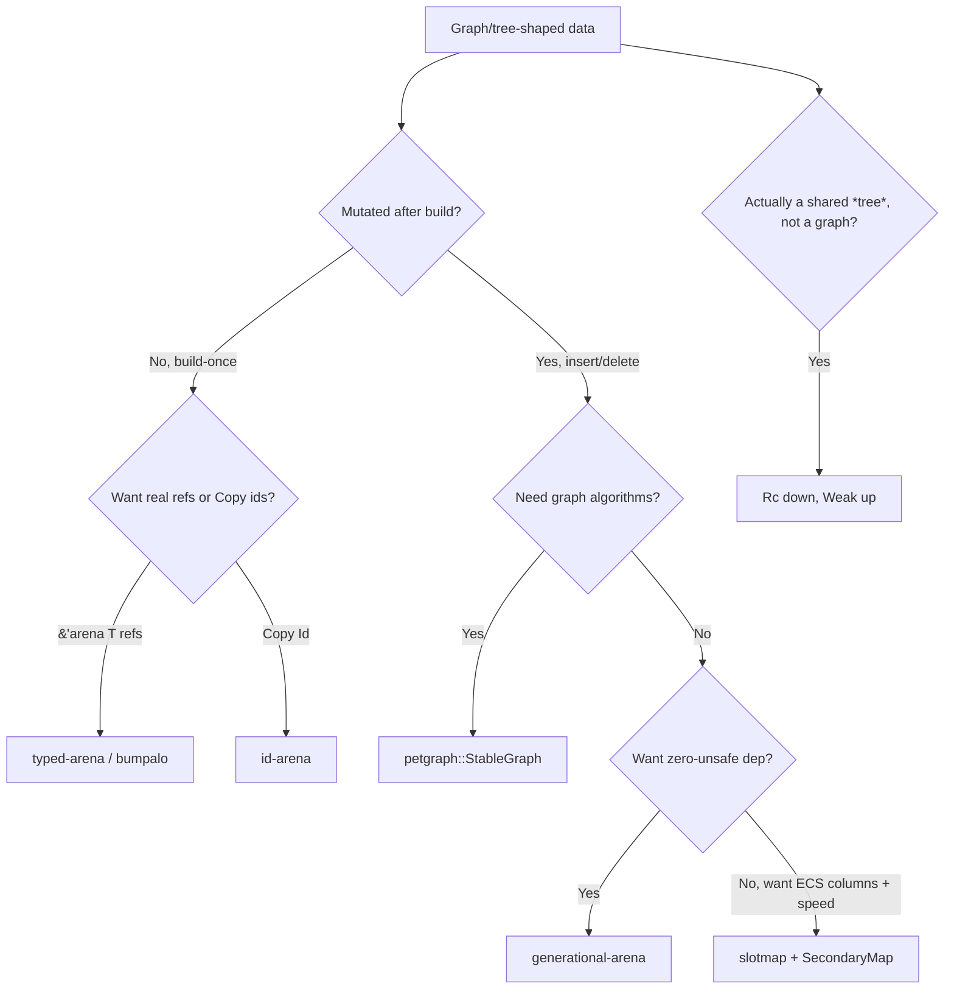

# 01 — Arenas, Generational Indices & Graphs

> The idiomatic Rust answer to "how do I model a graph/tree without fighting the borrow
> checker" is almost never `Rc<RefCell<T>>`. It is: **one owner (an arena), and indices
> instead of pointers.** This file is the deep version of that claim.

## Why `Rc<RefCell<T>>` is the wrong default for graphs

The canonical community text, *Learning Rust With Entirely Too Many Linked Lists*
(<https://rust-unofficial.github.io/too-many-lists/>), exists precisely because pointer-based
linked/graph structures are *hard* in safe Rust. Its conclusions, restated:

- `Rc<T>` is shared-immutable; to mutate you wrap `Rc<RefCell<T>>`, which moves borrow
  checking to **runtime** — `borrow_mut()` while another borrow is live **panics**.
- Reference cycles (`a → b → a`) **leak**: `Rc` is refcounted, and a cycle never reaches zero.
  You patch this with `Weak`, which adds `upgrade()` boilerplate and `Option` everywhere.
- Threading it forces `Arc<Mutex<T>>`/`Arc<RwLock<T>>`, and now every traversal locks.

The chapter on the safe doubly-linked list is essentially an argument that you should not do
this; its own "production" recommendation for graph-shaped data is **indices into a `Vec`**
(see also rcoh, "Why Writing a Linked List in (safe) Rust is So Damned Hard",
<https://rcoh.me/posts/rust-linked-list-basically-impossible/>). Manish Goregaokar's "Arenas
in Rust" (<https://manishearth.github.io/blog/2021/03/15/arenas-in-rust/>) is the canonical
survey of the arena alternatives below.

## The arena pattern

An **arena** is a single container that owns all the items. You hand out **handles** (indices
or `&'arena T`) instead of pointers. Because there is exactly one owner:

- Ownership is trivial — no `Rc`, no refcounts, no cycles-as-leaks.
- Handles are `Copy` (`usize`/`u32`/a key) — store them freely, including in cycles.
- Cache locality improves — items are contiguous, not scattered heap boxes.

The one problem a naive `Vec<T>` + `usize` index has: **deletion**. If you remove index 3 and
reuse the slot, an old `usize` 3 now silently points at a *different* item (the "stale handle"
bug). The fix is a **generational index**.

### Generational indices

Attach a **generation** counter to each slot. A handle is `(index, generation)`. On removal,
bump the slot's generation. On access, compare the handle's generation to the slot's; mismatch
→ `None`. A stale handle is *detected*, not dereferenced. (Lucas Sardois, "Generational
indices guide", <https://lucassardois.medium.com/generational-indices-guide-8e3c5f7fd594>.)

This is the engine behind `slotmap` and `generational-arena`, and the core idea behind ECS
entity ids.

## Choosing an arena crate

| Crate | Handle type | Deletion / reuse | `unsafe`? | Best for |
|---|---|---|---|---|
| [`slotmap`](https://docs.rs/slotmap) | `Copy` key (`new_key_type!`) | Yes, generational | Internal (justified, for a compact representation) | Pools/graphs with deletes; fast iteration over holes; ECS via secondary maps |
| [`generational-arena`](https://docs.rs/generational-arena) | `Index` (`Copy`) | Yes, generational | Zero `unsafe` | Same as slotmap but you want a no-`unsafe` dependency; slightly slower iteration |
| [`id-arena`](https://docs.rs/id-arena) | `Id<T>` (`Copy`) | No (append-only) | Minimal | Build-once same-type graphs/IR where ids must be `Copy` and typed |
| [`typed-arena`](https://docs.rs/typed-arena) | `&'arena mut T` | No (freed all at once) | Internal | Build-once trees/ASTs; you want *real references*, not indices; drop the whole arena at end |
| [`bumpalo`](https://docs.rs/bumpalo) | `&'arena T` / `&mut` | No (bump, reset whole) | Internal | Fast bump allocation of mixed types in a phase; reset between phases |

### slotmap vs generational-arena — the actual difference

From the maintainers' own discussion
(<https://github.com/fitzgen/generational-arena/issues/13>): `slotmap` uses a compact
"hop"/free-list representation for **faster iteration in the presence of large holes** and
ships **secondary maps** (store extra columns keyed by the same key — ECS-style). It uses a
small amount of `unsafe` to achieve the compact layout. `generational-arena` is a **simpler,
100%-safe** implementation. Decision: need ECS columns / fastest iteration → `slotmap`; want
zero `unsafe` in the tree and simplicity → `generational-arena`. (Benchmarks:
<https://github.com/mooman219/generational_arena_bench>.)

### typed-arena / id-arena for "self-referential-ish" build-once graphs

For an AST or IR you build once and then only read, `typed-arena` lets nodes hold `&'arena
Node` references to each other — genuinely pointer-shaped, but all freed together when the
arena drops, so no per-node lifetime soup. `id-arena` is the same idea with `Copy` `Id<T>`
handles instead of references (handier when the graph is cyclic, since references would need
interior mutability but ids do not). This is how many Rust compilers/IRs model themselves.

## petgraph: when you need graph *algorithms*

If you need BFS/DFS, Dijkstra, A*, topological sort, strongly-connected components, or min
spanning tree, do **not** hand-roll them on a slotmap. Use [`petgraph`](https://docs.rs/petgraph).

- `Graph<N, E>` — dense adjacency, fast, indices `NodeIndex`. **But** `remove_node` swaps the
  last node into the hole, so **every stored `NodeIndex` past the removal shifts** — silent
  corruption if you cached indices. Use plain `Graph` only when append-only.
- `StableGraph<N, E>` — keeps a free list and tolerates gaps. Removing a node **invalidates
  only that node's index, never unrelated ones**
  (<https://docs.rs/petgraph/latest/petgraph/stable_graph/struct.StableGraph.html>). Use this
  the instant you delete nodes/edges and keep indices around.
- `GraphMap<N, E, Ty>` — node *is* the key (hashable), no separate index bookkeeping; good for
  sparse graphs keyed by your own ids.

Intro: Depth-First, "Graphs in Rust: An Introduction to Petgraph"
(<https://depth-first.com/articles/2020/02/03/graphs-in-rust-an-introduction-to-petgraph/>).

**Combo pattern:** keep your domain data in a `slotmap` and build a `petgraph` view only when
you need an algorithm, mapping `NodeKey ↔ NodeIndex`. Or store data directly in petgraph node
weights if the graph *is* your model.

## Rc/Arc + Weak — the legitimate uses (and why arenas usually still win)

`Rc`/`Arc` are correct when ownership is genuinely *shared* and the shape is a **DAG or tree**,
not an arbitrary cyclic graph:

- Tree with parent→child owned by `Rc<Node>` and child→parent as `Weak<Node>` to break the
  refcount cycle (`upgrade()` to use). This is the textbook `Weak` use.
- Shared read-mostly config handed to many owners (`Arc<Config>`).

Why an arena usually still wins for graphs: `Rc<RefCell>` pushes borrow checking to runtime
(panics), leaks on true cycles, and scatters allocations. An arena keeps compile-time safety,
never leaks on cycles, and is cache-friendly. Reach for `Rc`/`Weak` for shared *trees*; reach
for arenas for *graphs*.

## Intrusive collections — the niche case

[`intrusive-collections`](https://docs.rs/intrusive-collections) embeds the list/tree links
*inside* the element (an `intrusive_adapter!`), so an element can live in multiple collections
with **no extra allocation per node** and O(1) removal given a pointer to the element. This is
the C kernel "intrusive list" pattern. Use it for allocator free-lists, LRU caches where one
object is in both a map and a list, or `no_std` embedded work. Cost: the element must carry the
link fields and you manage `unsafe` pinning invariants. For 95% of app code, an arena + indices
is simpler and safe; intrusive collections are for the allocator/embedded 5%.

## Decision recap

## Sources

- Too Many Linked Lists — <https://rust-unofficial.github.io/too-many-lists/>
- "Why Writing a Linked List in (safe) Rust is So Damned Hard" — <https://rcoh.me/posts/rust-linked-list-basically-impossible/>
- "Arenas in Rust" (Manishearth) — <https://manishearth.github.io/blog/2021/03/15/arenas-in-rust/>
- Generational indices guide — <https://lucassardois.medium.com/generational-indices-guide-8e3c5f7fd594>
- slotmap docs — <https://docs.rs/slotmap> · generational-arena — <https://docs.rs/generational-arena>
- slotmap vs generational-arena — <https://github.com/fitzgen/generational-arena/issues/13>
- generational arena benchmarks — <https://github.com/mooman219/generational_arena_bench>
- id-arena — <https://docs.rs/id-arena> · typed-arena — <https://docs.rs/typed-arena> · bumpalo — <https://docs.rs/bumpalo>
- petgraph StableGraph — <https://docs.rs/petgraph/latest/petgraph/stable_graph/struct.StableGraph.html>
- petgraph intro — <https://depth-first.com/articles/2020/02/03/graphs-in-rust-an-introduction-to-petgraph/>
- intrusive-collections — <https://docs.rs/intrusive-collections>
