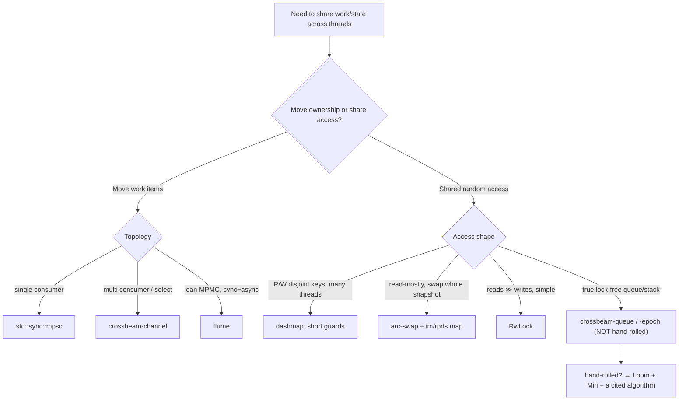

# 02 — Concurrent & Lock-Free Structures

> The throughline holds across threads too: the right structure makes *sharing* trivial.
> Most "I need `Arc<Mutex<…>>` everywhere" pain dissolves into "use a channel" or "use a
> sharded/lock-free container designed for this."

## First question: do you even need shared mutable state?

Prefer **message passing** over shared mutation. If producers create work and consumers
process it, a **channel** moves ownership across the boundary and you never touch a lock. Only
reach for a concurrent *map/structure* when threads genuinely need shared random access.

## Channels: std mpsc vs crossbeam-channel vs flume

| Channel | Topology | Notes |
|---|---|---|
| `std::sync::mpsc` | MP**S**C (one consumer) | In stdlib; historically slower; `Receiver` not cloneable (single consumer) |
| [`crossbeam-channel`](https://docs.rs/crossbeam-channel) | **MPMC** | Both `Sender` and `Receiver` clone; bounded & unbounded; `select!` over many channels; consistently beats std mpsc |
| [`flume`](https://docs.rs/flume) | **MPMC** | Lean, very low latency & small footprint; sync + async; drop-in feel; also `select` |

Comparison table: Code and Bitters, "Rust Channel Comparison"
(<https://codeandbitters.com/rust-channel-comparison/>). Both crossbeam and flume are
"mostly lock-free except possibly when an unbounded channel resizes." Practical defaults:
multi-consumer fan-out or you want `select!` → **crossbeam-channel**; want the leanest MPMC
with great async support → **flume**; trivial single-consumer and no extra dep → std mpsc.

**Bounded vs unbounded:** bounded channels give **backpressure** (sender blocks when full),
which is usually what you want in a pipeline — unbounded channels can let a fast producer OOM
you. Default to bounded with a capacity you reasoned about. See `examples/crossbeam_pipeline.rs`.

## Concurrent maps: dashmap (and the alternatives)

`Arc<Mutex<HashMap>>` serializes every access on one lock. Better options:

- [`dashmap`](https://docs.rs/dashmap) — a sharded concurrent `HashMap`: keys hash to one of N
  shards, each with its own lock, so unrelated keys don't contend. Drop-in-ish API.
  **Gotcha:** a returned `Ref`/`RefMut` *holds that shard's lock for its lifetime*. Taking a
  second guard for another key that lands on the same shard, while the first is live,
  **deadlocks**. Keep guard scopes tiny; never call back into the map while holding a guard.
- `RwLock<HashMap>` — fine when reads vastly dominate and writes are rare/short.
- [`arc-swap`](https://docs.rs/arc-swap) — for read-mostly *whole-snapshot* state: readers
  load an `Arc` lock-free; a writer swaps in a new `Arc`. Pairs beautifully with `im`/persistent
  maps (cheap to clone-then-mutate, then swap the pointer).
- `evmap`/`left-right` — wait-free reads via double-buffering when reads must never block.

Decision: many threads R/W disjoint keys → `dashmap`; read-mostly, occasional whole-state
update → `arc-swap` (+ persistent map); reads ≫ writes, simple → `RwLock`.

## Atomics & memory ordering (the floor under all of this)

`std::sync::atomic` types (`AtomicUsize`, `AtomicPtr`, …) plus an `Ordering`:

- `Relaxed` — only atomicity, no cross-thread ordering. Fine for counters/stats.
- `Acquire`/`Release` — the workhorse pair: a `Release` store *publishes* prior writes; a
  matching `Acquire` load *observes* them. This is how you build a correct flag/handoff.
- `AcqRel` — for read-modify-write (e.g. `compare_exchange`).
- `SeqCst` — total global order; the easy-but-slowest default. Don't reach for it reflexively;
  most handoffs are Acquire/Release.

`compare_exchange` (CAS) is the primitive for lock-free updates: read, compute, swap *only if
unchanged*, else retry. Which sets up the classic trap.

## The ABA problem

A lock-free stack: `head: AtomicPtr<Node>`. Thread 1 reads `head = A`, plans to CAS `head`
from `A` to `A.next`. Before it does, Thread 2 pops `A`, pops `B`, frees `A`, pushes a new node
that the allocator places **at A's old address**. Now `head == A` again (different node!), so
Thread 1's CAS **succeeds** but installs a corrupt `next`. The value went A → B → A: *ABA*. The
pointer compared equal even though the world changed. Immediate `free` also risks
**use-after-free** if another thread still holds the popped pointer.

### Don't free immediately — epoch-based reclamation

The fix is to defer reclamation until *no thread can still observe* the pointer.
[`crossbeam-epoch`](https://docs.rs/crossbeam-epoch) implements **epoch-based garbage
collection**: threads `pin()` an epoch while accessing shared structures; retired nodes are
freed only once all pinned threads have advanced past the epoch in which they were retired.
This solves both ABA (retired memory isn't reused while observable) and use-after-free without
hand-rolled hazard pointers or tagged pointers. `crossbeam` also ships ready-made lock-free
**`crossbeam-queue`** (`ArrayQueue`, `SegQueue`) and `crossbeam-deque` (work-stealing) so you
rarely write the CAS loop yourself. (crossbeam README:
<https://github.com/crossbeam-rs/crossbeam>.)

### If you must hand-roll: prove it

Lock-free code is wrong by default. Required tooling:

- **Loom** (<https://docs.rs/loom>) — exhaustively explores thread interleavings & memory
  orderings for your structure under test. Catches missing `Acquire`/`Release`.
- **Miri** — detects UB, data races, use-after-free in the abstract machine.
- Keep the structure tiny, cite a known-correct paper/algorithm, and treat any `unsafe` as a
  proof obligation. For almost all application code: **use crossbeam's queues instead.**

## Decision recap

## Sources

- Rust Channel Comparison — <https://codeandbitters.com/rust-channel-comparison/>
- crossbeam — <https://github.com/crossbeam-rs/crossbeam> · crossbeam-epoch — <https://docs.rs/crossbeam-epoch> · crossbeam-queue — <https://docs.rs/crossbeam-queue>
- flume — <https://docs.rs/flume>
- dashmap — <https://docs.rs/dashmap> · arc-swap — <https://docs.rs/arc-swap>
- Building pipelines with Crossbeam and Flume — <https://leapcell.io/blog/building-robust-concurrent-pipelines-with-crossbeam-and-flume-channels-in-rust>
- std::sync::atomic ordering — <https://doc.rust-lang.org/std/sync/atomic/enum.Ordering.html>
- Loom — <https://docs.rs/loom>
