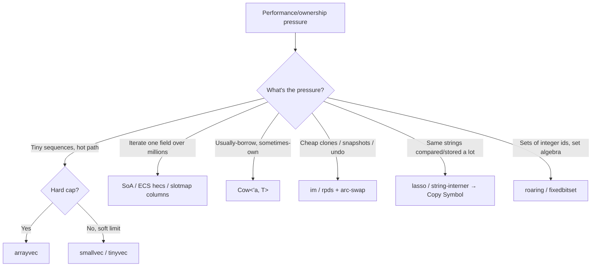

# 03 — Small, Inline & Cache-Friendly Structures

> These structures win by respecting the memory hierarchy: keep small things on the stack /
> inline, keep iterated things contiguous, and make clones cheap by sharing structure. Each is
> a real, measurable win *in a hot path* and a premature pessimization everywhere else —
> measure with `performance-profiler` before keeping the swap.

## Inline / small vectors: smallvec, tinyvec, arrayvec

All three avoid heap allocation for small sequences; they differ in spill behavior and safety.

| Crate | Capacity model | Spills to heap? | `unsafe`? | `T` bound |
|---|---|---|---|---|
| [`arrayvec`](https://docs.rs/arrayvec) | Fixed `N` | **No** — `push` past `N` panics (`try_push` → `Err`) | Internal | none |
| [`smallvec`](https://docs.rs/smallvec) | Inline `N`, then heap | **Yes** | Internal | none |
| [`tinyvec`](https://docs.rs/tinyvec) | Inline `N` (`ArrayVec`) or inline-then-heap (`TinyVec`) | `TinyVec` yes / `tinyvec::ArrayVec` no | **Zero `unsafe`** | `T: Default` |

Key facts (from mcmah309, "Should You Really Ever Use ArrayVec or SmallVec or TinyVec As Your
Go To Vec?" <https://mcmah309.github.io/posts/ArrayVec-or-SmallVec-or-TinyVec/> and the
`tinyvec` README <https://github.com/Lokathor/tinyvec>):

- **`tinyvec` is 100% safe** but pays for it by requiring `T: Default` (it initializes the
  inline storage). `smallvec`/`arrayvec` use `unsafe` internally to lift that bound.
- **`arrayvec` cannot spill** — it's for hard caps (e.g. "at most 8 children", `no_std`).
- **`smallvec` spills**, so it's the "soft limit" choice: usually tiny, but won't crash if it
  grows.

### When inline vectors actually win (and when they hurt)

✅ Win:
- Collections that are *usually* below the inline cap, in a **hot path** (parser tokens,
  per-node child lists, small argument vectors).
- A `Vec<SmallVec<[T; N]>>` where the inner vectors being inline gives **cache locality** —
  the classic real use case (the inner data sits next to its owner instead of in a scattered
  heap box).

❌ Hurt:
- The inline capacity is **always part of the struct size**, even after spilling to heap. A big
  `N` bloats every instance and every `Vec<SmallVec<…>>` slot.
- Cold/startup code: a single allocation there never mattered; you've added an `unsafe` dep and
  type complexity for nothing.

> "Using any of these types is likely a premature optimization unless justified by a measurable
> performance gain." Benchmark the hot loop, keep the swap only if the number moves. (See also
> troubles.md, "Improving SmallVec's speed by 60% and why that shouldn't matter to you"
> <http://troubles.md/improving-smallvec/>.)

## Cache locality: struct-of-arrays (SoA) & ECS

`Vec<BigStruct>` is **array-of-structs (AoS)**: iterating one field walks the whole struct's
stride, dragging unused fields (and padding) through cache. **Struct-of-arrays (SoA)** stores
each field in its own contiguous `Vec`, so iterating one field is a tight, prefetch-friendly,
SIMD-amenable scan.

- Manual SoA: split `struct P { pos, vel, hp }` into `Vec<Pos>`, `Vec<Vel>`, `Vec<Hp>` indexed
  in lockstep. Crates like [`soa_derive`](https://docs.rs/soa_derive) generate this.
- **ECS** generalizes SoA: entities are generational ids (the same generational-index idea from
  ref 01), components are columns. [`hecs`](https://docs.rs/hecs) and `bevy_ecs` are mature; a
  `slotmap` + `SecondaryMap` per component is a lightweight hand-rolled ECS. Win: iterate "all
  positions" over millions of entities touching only the position column.

Use SoA/ECS when you iterate **one or few fields over many items** in a hot loop. Don't bother
when you touch whole objects or N is small — AoS keeps a single object's fields together, which
is better for "do everything to this one item" access.

## Copy-on-write: `Cow`

[`std::borrow::Cow<'a, T>`](https://doc.rust-lang.org/std/borrow/enum.Cow.html) is `Borrowed`
*or* `Owned`. Borrow until the first mutation, then `to_mut()` clones once and you own it.

- Win: APIs that *usually* return the input unchanged but *sometimes* edit it (normalizers,
  escapers, config overlays). Callers that don't trigger the edit pay zero allocation.
- Pattern: `fn normalize(s: &str) -> Cow<str>` — return `Cow::Borrowed(s)` when already
  normalized, `Cow::Owned(fixed)` only when you had to change something.

## Persistent / immutable structures: im, rpds

When you need **cheap clones of big collections** (snapshots, undo stacks, structural sharing
across threads), deep-`clone()`ing a `Vec`/`HashMap` is O(n). Persistent structures clone in
O(1)-ish (pointer + refcount bump) and only copy the path you mutate.

- [`im`](https://docs.rs/im) — "the most important structural-sharing persistent data
  structures: Maps, Sets and Vectors using HAMT, RRB trees and B-trees." Thread-safe via `Arc`;
  `im-rc` is the single-threaded (`Rc`) variant. Cloning is cheap; edits copy only the touched
  path. (im docs: <https://docs.rs/im/latest/im/>.)
- [`rpds`](https://github.com/orium/rpds) — persistent structures where thread-sharing is
  **opt-in** (pay for `Arc` only when you need it). Leaner when single-threaded.
- Pairs with `arc-swap` (ref 02): clone the persistent map cheaply, mutate, atomically swap the
  pointer in — lock-free read-mostly shared state.

Use when copies-that-share dominate (editors, interpreters with environments, time-travel
debugging). Don't use for a collection you mutate in place and never snapshot — a plain `Vec`
is faster and simpler.

## Interning: strings & symbols

Repeatedly storing/comparing the same identifiers as `String` is wasteful: N heap copies, and
equality is a byte compare. **Intern** them: store each unique string once, hand back a `Copy`
integer **symbol**.

- [`lasso`](https://docs.rs/lasso) (fast, optional concurrent `ThreadedRodeo`) and
  [`string-interner`](https://docs.rs/string-interner) are the standard crates.
- After interning: equality is a `u32 == u32`, a symbol is `Copy` (store it in arena nodes for
  free), and storage collapses to one copy per unique string.
- Pairs with arenas (ref 01): graph/AST nodes hold `Symbol`s, not `String`s — smaller nodes,
  integer-fast comparisons. This is exactly how compilers handle identifiers.

## Bitsets: roaring & fixedbitset

For **sets of integers** (ids, row numbers, feature flags), `HashSet<u32>` wastes memory and
cache for dense or large sets.

- [`roaring`](https://docs.rs/roaring) — Roaring bitmaps: compressed bitsets that adapt their
  container per 64K block (array vs bitmap vs run). `AND`/`OR`/`XOR`/cardinality are extremely
  fast and memory is tiny even for millions of ids. The industry standard for postings/id sets.
- [`fixedbitset`](https://docs.rs/fixedbitset) — a plain dense bitset over a known range
  (petgraph uses it internally for "visited" sets). Use when ids are bounded and dense.

Use bitsets for set algebra over integer ids (graph visited-sets, inverted indexes,
permission masks). Use `HashSet` when keys aren't small integers or the set is tiny.

## Decision recap

## Sources

- ArrayVec vs SmallVec vs TinyVec — <https://mcmah309.github.io/posts/ArrayVec-or-SmallVec-or-TinyVec/>
- tinyvec — <https://github.com/Lokathor/tinyvec> · smallvec — <https://docs.rs/smallvec> · arrayvec — <https://docs.rs/arrayvec>
- "Improving SmallVec's speed…" — <http://troubles.md/improving-smallvec/>
- soa_derive — <https://docs.rs/soa_derive> · hecs — <https://docs.rs/hecs>
- Cow — <https://doc.rust-lang.org/std/borrow/enum.Cow.html>
- im — <https://docs.rs/im/latest/im/> · rpds — <https://github.com/orium/rpds>
- lasso — <https://docs.rs/lasso> · string-interner — <https://docs.rs/string-interner>
- roaring — <https://docs.rs/roaring> · fixedbitset — <https://docs.rs/fixedbitset>
