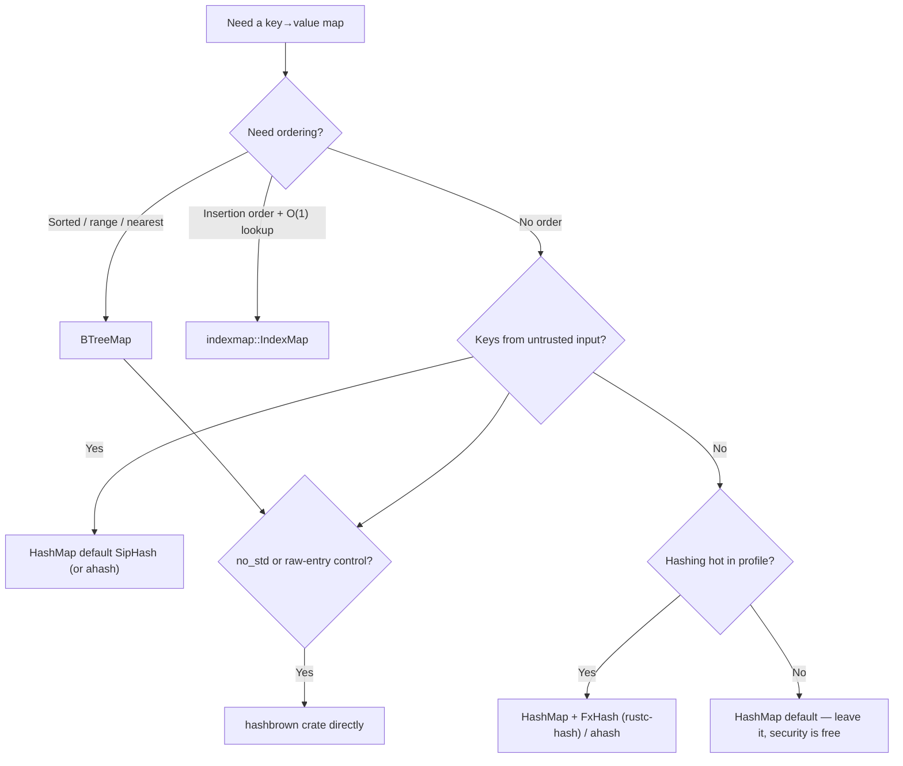

# 04 — Choosing a Map: HashMap vs BTreeMap vs hashbrown vs fxhash/ahash vs IndexMap

> Two independent axes: **container** (hash table vs ordered tree vs insertion-ordered) and
> **hasher** (security vs speed). Most people only tune one and leave free wins on the table.

## Axis 1 — container

| Container | Order | Lookup | Use when |
|---|---|---|---|
| `std::collections::HashMap` | none | O(1) avg | Default key→value; you never need order or ranges |
| `std::collections::BTreeMap` | **sorted by key** | O(log n) | You need sorted iteration, **range queries** (`range(a..b)`), `first`/`last`, or nearest-key. Also more cache-friendly for *iteration* (contiguous nodes) |
| [`indexmap::IndexMap`](https://docs.rs/indexmap) | **insertion order** | O(1) avg | You need deterministic/insertion-ordered iteration **and** fast lookup; stable output (configs, JSON round-trips), or O(1) index access alongside key access |
| [`hashbrown::HashMap`](https://github.com/rust-lang/hashbrown) | none | O(1) avg | Want SwissTable directly (the impl `std::HashMap` is built on), `no_std`, or raw-entry / custom-hasher control |

Notes:
- `std::HashMap` **is** hashbrown (Google SwissTable) under the hood since Rust 1.36; hashbrown
  is "around 2x faster than the previous std HashMap, with ~1 byte overhead per entry instead
  of 8" (<https://github.com/rust-lang/hashbrown>). You reach for the `hashbrown` crate directly
  for `no_std`, raw-entry APIs, or to pin a hasher.
- **BTreeMap is not just "the ordered HashMap."** Choose it *for* ordered/range/nearest access;
  if you never use order, HashMap is faster for point lookups.
- **IndexMap's superpower** is "hash lookup *and* a stable order *and* O(1) by-position access,"
  and removal via `swap_remove` (O(1), reorders) or `shift_remove` (O(n), preserves order).

## Axis 2 — hasher (the bigger, more-overlooked win)

`std::HashMap`'s default is **SipHash-1-3**: high quality, DoS-resistant (keyed, so an attacker
can't precompute colliding keys), but **relatively slow, especially for short keys like
integers**. The Rust Performance Book's "Hashing" chapter
(<https://nnethercote.github.io/perf-book/hashing.html>) is the canonical guidance.

| Hasher | Speed | DoS-resistant? | Use when |
|---|---|---|---|
| SipHash-1-3 (std default) | Slow-ish | **Yes** | Keys come from untrusted input (network, user) |
| [`rustc-hash` (FxHash)](https://docs.rs/rustc-hash) | Very fast (esp. integer keys) | **No** | Keys are trusted/internal; hashing is hot. `FxHashMap` is a drop-in alias |
| [`ahash`](https://docs.rs/ahash) | Very fast, hardware-accelerated | **Yes** (keyed) | Want speed *and* DoS resistance — "fast equivalent to SipHash / DoS-resistant alternative to FxHash" |
| `foldhash` | Very fast | Weaker than SipHash | hashbrown's own default; fast, not for adversarial keys |

Rules of thumb:
- **Untrusted keys** (anything an attacker controls): keep SipHash, or use `ahash` (keyed). A
  fast non-keyed hasher here is a **HashDoS vulnerability** — attackers force every key into one
  bucket, turning O(1) into O(n) and stalling the service.
- **Trusted/internal keys** + hashing shows up hot in a profile: `FxHashMap`/`FxHashSet`
  (`rustc-hash`) — this is what the Rust compiler itself uses for its internal maps. Big win for
  integer and small keys.
- Want both speed and safety: `ahash`.
- Always **profile first** — if hashing isn't hot, the default is fine and the security is free.

Swapping a hasher is a type alias, not a rewrite:

```rust
use rustc_hash::FxHashMap;          // = HashMap<K, V, FxBuildHasher>
let mut counts: FxHashMap<u32, u32> = FxHashMap::default();
// ...or generically:
use std::collections::HashMap;
type AMap<K, V> = HashMap<K, V, ahash::RandomState>;
```

## Putting both axes together



## Quick gotchas

- `HashMap` iteration order is **randomized per-process** (defense against HashDoS). Never rely
  on it; if you need order, that's the signal to use `BTreeMap` or `IndexMap`.
- `BTreeMap` requires `Ord`, not `Hash`. `HashMap`/`IndexMap` require `Hash + Eq`.
- `IndexMap::swap_remove` is O(1) but **reorders** (moves the last element into the hole);
  `shift_remove` preserves order at O(n). Pick deliberately.
- For **concurrent** maps, none of the above are thread-safe for writes — see ref 02 (`dashmap`,
  `RwLock`, `arc-swap`).

## Sources

- Rust Performance Book — Hashing — <https://nnethercote.github.io/perf-book/hashing.html>
- hashbrown — <https://github.com/rust-lang/hashbrown>
- rustc-hash (FxHash) — <https://docs.rs/rustc-hash>
- ahash — <https://docs.rs/ahash>
- indexmap — <https://docs.rs/indexmap>
- std BTreeMap — <https://doc.rust-lang.org/std/collections/struct.BTreeMap.html>
