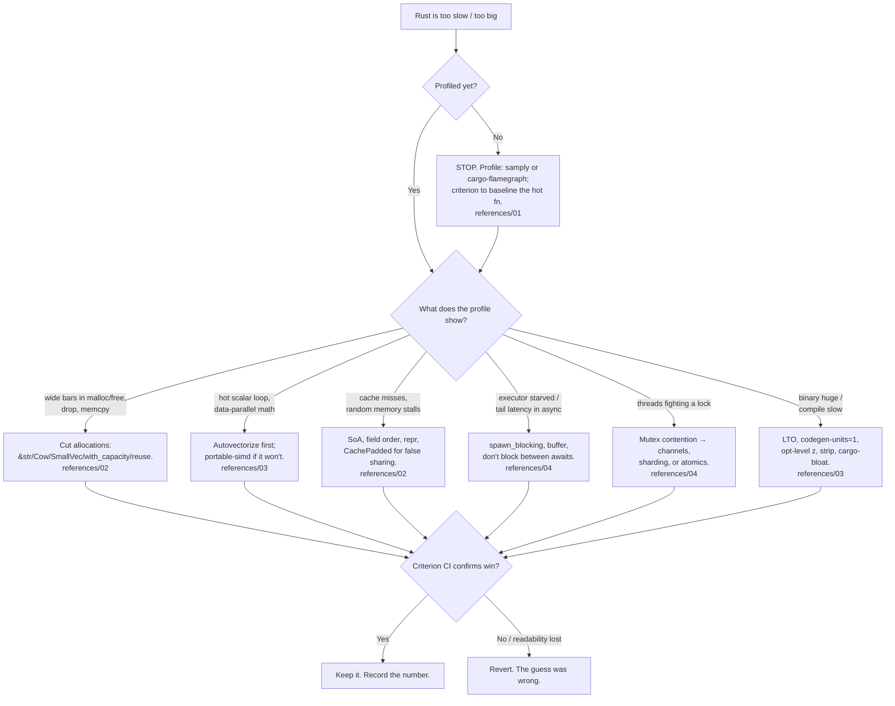

# rust-performance-and-idioms

The skill for making Rust *fast* without making it ugly. The thesis, and the
only non-negotiable rule:

> **Measure first, then make it fast.** A profiler tells you which 3% of the
> code matters; the other 97% should stay readable. Every tip below is paired
> with a *when NOT to do it*, because the fastest way to ruin a Rust codebase is
> to pessimize readability chasing a micro-gain a benchmark never confirmed.

Optimization without a before/after number is a guess wearing a lab coat. This
skill makes you take the measurement first, change one variable, and keep the
change only if Criterion's confidence interval agrees.

## When to Use

✅ **Use for**:
- A Rust hot path is too slow and you need to know *where* and *why*
- Allocation pressure: too many `clone`/`to_string`/`collect`/short-lived `Vec`s
- Deciding `&str` vs `String`, `Cow`, `SmallVec`, arena, or `with_capacity`
- Iterator-chain vs loop, SIMD (portable-simd / autovectorization), `target-feature`
- Cache-friendly data layout (struct-of-arrays, field ordering, `#[repr]`, false sharing)
- `Box<dyn Trait>` vs generics, where `#[inline]` actually pays
- Async perf: a blocked executor, `spawn_blocking`, buffering, two-runtime cost
- `Arc<Mutex>` contention → channels / sharding / atomics
- Binary too big or compiles too slow (LTO, `codegen-units`, `opt-level`, `strip`, `cargo-bloat`)
- A review wants idiomatic *and* fast: newtype, `impl Trait`, `let-else`, `matches!`, `?`-errors
- Justifying and documenting `unsafe`, checked with Miri

❌ **NOT for**:
- Teaching ownership / borrowing / lifetimes from scratch → `rust-with-claude-code`
- GPUI / pd-console rendering, layout, theme specifics → `gpui-rust-console`
- macOS app packaging / notarization → `rust-app-distribution`
- Non-Rust profiling, or "rewrite this Python in Rust" scoping

## Decision Points



The loop is always the same: **profile → hypothesize one cause → change one
thing → re-measure → keep or revert.** Skipping the first or last box is how
codebases accumulate ugly code that isn't even faster.

## Core Capabilities

| Capability | The move | Load |
|---|---|---|
| Profile | `samply record`, `cargo flamegraph`, `perf`, Instruments; read the wide bars | `references/01-profiling-and-benching.md` |
| Bench | Criterion (CI + regression), `#[bench]` on nightly, `black_box`, throughput | `references/01-profiling-and-benching.md` |
| Cut allocations | `&str`/`Cow`/`SmallVec`, `with_capacity`, reuse buffers, arena | `references/02-allocation-and-layout.md` |
| Zero-cost iterators | When chains beat loops (and when they don't), avoid intermediate `Vec` | `references/02-allocation-and-layout.md` |
| Cache layout | SoA vs AoS, field ordering, `#[repr(C)]`/`align`, false sharing → `CachePadded` | `references/02-allocation-and-layout.md` |
| SIMD | Autovectorization + `target-feature`/`target-cpu`; portable-simd on nightly | `references/03-simd-and-codegen.md` |
| Dispatch & inlining | `Box<dyn>` vs generics, monomorphization cost, `#[inline]` where it pays | `references/03-simd-and-codegen.md` |
| Binary size / compile time | `lto`, `codegen-units`, `opt-level`, `panic=abort`, `strip`, `cargo-bloat` | `references/03-simd-and-codegen.md` |
| Async perf | Don't block the executor; `spawn_blocking`/`rayon`; buffer; two-runtime cost | `references/04-async-and-contention.md` |
| Contention | `Arc<Mutex>` → channels, sharding, `RwLock`, atomics, `CachePadded` | `references/04-async-and-contention.md` |
| Idioms | newtype, `impl Trait`, `let-else`, `matches!`, exhaustive match, `?`-errors | `references/05-idioms-cheatsheet.md` |
| Unsafe done right | When justified, the `// SAFETY:` invariant doc, Miri-checked | `references/05-idioms-cheatsheet.md` |

## Anti-Patterns (Novice vs Expert)

### `clone()`-spam to silence the borrow checker
**Novice**: "The borrow checker complained, so I added `.clone()`. It compiles now."
**Expert**: Each `.clone()` on `String`/`Vec`/`HashMap` is a heap allocation +
`memcpy` you may not need. First reach for a borrow (`&str`, `&[T]`), then `Cow`
when ownership is conditional, then restructure so the data has one owner. Clone
deliberately, not reflexively. In the worked example below, deleting one
`.collect::<Vec<String>>()` and one `String`-per-word **nearly doubled
throughput** (1.84 ms → 0.99 ms, measured).
**When cloning is correct**: small `Copy`-ish data, or when a borrow would force
a lifetime tangle that costs more readability than the allocation costs cycles.
**Detection**: `grep -n '\.clone()' src/` in hot modules; a flamegraph with fat
`malloc`/`free`/`drop_in_place` bars (`references/02`).

### Premature `unsafe` for speed
**Novice**: "Bounds checks are slow, so I'll use `get_unchecked` everywhere."
**Expert**: The optimizer elides most bounds checks already when it can prove
the index is in range (iterate, or hoist the check). `unsafe` buys you a few
percent *if a profile proved bounds checks are the bottleneck* — and it buys you
UB risk forever. Prefer iterators (no indices to check), then `chunks_exact`
(the compiler trusts the length), then slicing once up front. Reach for `unsafe`
last, behind a safe API, with a `// SAFETY:` comment stating the upheld
invariant, and run it under `cargo +nightly miri test`.
**When unsafe is correct**: FFI, a measured hot loop where the bound genuinely
can't be proven, lock-free structures — always Miri-checked.
**Detection**: `unsafe` blocks with no `// SAFETY:` comment; `get_unchecked`
introduced without a flamegraph showing bounds checks mattered (`references/05`).

### Premature SIMD (hand-written intrinsics first)
**Novice**: "This loop does math, so I'll hand-write AVX2 intrinsics."
**Expert**: First make the *scalar* loop autovectorizable — contiguous slices,
no early exits, a length the compiler can see (`chunks_exact`), and let LLVM emit
the vectors. Confirm with `-C target-cpu=native` and a flamegraph/asm check.
Reach for `std::simd` (portable, nightly) only when autovectorization provably
fails, and remember a binary built for AVX2 *won't run* on a CPU without it
unless you runtime-dispatch (`is_x86_feature_detected!`). AVX2 only covers ~75%
of consumer CPUs in the wild.
**When explicit SIMD is correct**: the autovectorizer can't see the pattern
(shuffles, horizontal reductions, bit manipulation) and the loop is provably hot.
**Detection**: `arch::x86_64::_mm256_*` intrinsics with no benchmark; a SIMD path
with no scalar fallback or feature detection (`references/03`).

### `Arc<Mutex<T>>` as the default sharing primitive
**Novice**: "Two threads need the data, so `Arc<Mutex<T>>`."
**Expert**: A mutex on a hot path serializes your threads and, under contention,
ping-pongs the cache line between cores. Prefer **message passing** (one owner,
`mpsc`/`crossbeam` channels), **sharding** (N locks over N buckets so threads
rarely collide), `RwLock` only when reads vastly dominate, or a plain `Atomic`
for a counter. This is the *same* bug `gpui-rust-console` calls its #1
render-loop staller: a producer thread holding a mutex the consumer needs.
**When `Arc<Mutex>` is correct**: low-frequency shared config, coarse-grained
state touched rarely, prototypes before you've measured contention.
**Detection**: a `Mutex` locked inside a tight loop; `perf`/Instruments showing
time in `__psynch_mutexwait`; threads scaling sub-linearly (`references/04`).

### Blocking the async executor
**Novice**: "It's inside an `async fn`, so it's async."
**Expert**: `async` ≠ non-blocking. A CPU-bound loop, a `std::fs` read, or a
`std::thread::sleep` between `.await`s parks the whole worker thread and starves
every other task on it — the classic source of latency spikes. Rule of thumb:
**no more than ~10–100 µs of work between `.await` points.** Move blocking IO to
`spawn_blocking`, CPU-bound work to `rayon` or a bounded `spawn_blocking` pool
(it can hit ~500 threads — don't flood it with compute), and never call
`block_on` inside an async task.
**When inline work is fine**: genuinely tiny synchronous work between awaits.
**Detection**: `std::fs`, `std::net`, `reqwest::blocking`, or long compute in an
`async fn`; Tokio's `tokio-console` showing tasks with long poll times
(`references/04`).

### Guessing release-profile knobs
**Novice**: "I set `opt-level = 3` so it's optimized."
**Expert**: The defaults leave money on the table. For speed, add `lto = "thin"`
(often `+10–20%`) and `codegen-units = 1`; for size, `opt-level = "z"`,
`panic = "abort"`, `strip = true`, then use `cargo bloat` / `cargo llvm-lines`
to find the generic instantiations bloating you. But these trade compile time
and occasionally *hurt* speed — so benchmark the binary you actually ship.
**When defaults are fine**: dev builds, CI where compile time dominates, code
that isn't size- or latency-constrained.
**Detection**: a `[profile.release]` with only `opt-level` set; a CLI binary
shipping 30 MB of un-stripped symbols (`references/03`).

## Quality Gates

```
□ A profile (samply / cargo-flamegraph) named the hot spot BEFORE any change
□ A criterion baseline exists; every claimed win cites its before/after numbers + CI
□ Optimized code returns identical output to the original (a test asserts it)
□ Each clone/to_string in a hot path is deliberate, not a borrow-checker reflex
□ SIMD paths have a scalar fallback + runtime feature detection (or pinned target-cpu)
□ No Mutex held across an .await; no blocking IO / heavy compute on an async worker
□ Every unsafe block has a // SAFETY: invariant note and passes `cargo +nightly miri test`
□ Release profile knobs (lto/codegen-units/opt-level/strip) chosen by measurement, not cargo-culted
□ Readability was not sacrificed for an unmeasured micro-gain (revert if so)
□ python3 scripts/validate_skill.py  → 0 errors
```

## Worked Example: allocation discipline, measured

Full runnable crate in `examples/wordcount/` (`cargo test --release && cargo
bench --bench wordcount`). Two word counters return **identical** counts; only
allocation behavior differs, so the benchmark isolates that one variable.

**The smell** (naive): for a 50k-token corpus drawn from a 20-word lexicon,
`.split_whitespace().map(|w| w.to_string()).collect::<Vec<String>>()` heap-
allocates ~50,000 short `String`s plus one 50k-element `Vec`, then keys the map
by owned `String`.

**The fix** (disciplined): lowercase once (unchanged — not the variable),
iterate `split_whitespace()` lazily (no intermediate `Vec`), and key the map by
`&str` with a borrowed probe (`get_mut` then `insert` only on first sighting), so
only ~20 words ever become owned `String`s.

**The measurement** (`rustc 1.94`, Apple silicon, `opt-level=3` + `lto="thin"` +
`codegen-units=1`, Criterion `--measurement-time 5`):

| Benchmark | Median | Throughput | Speedup |
|-----------|--------|------------|---------|
| `naive` | 1.844 ms | 176 MiB/s | baseline |
| `disciplined` | **0.993 ms** | **328 MiB/s** | **1.86× (−46%)** |

Tight CIs (`[1.838, 1.852]` vs `[0.991, 0.994]` ms, p < 0.05): a real win, same
result, no readability lost. **When NOT to bother**: if this ran once at startup
over 200 bytes, the 0.85 ms saved is invisible and the borrowed-probe is
marginally more code — profile first; this function earned it because it's hot.

## Reference Files

| File | Consult When |
|------|--------------|
| `references/01-profiling-and-benching.md` | Choosing a profiler (samply/flamegraph/perf/Instruments/DHAT), writing a criterion bench, `black_box`, reading flamegraphs, statistical honesty |
| `references/02-allocation-and-layout.md` | Cutting allocations (`&str`/`Cow`/`SmallVec`/`with_capacity`/arena), iterator vs loop, SoA, field ordering, `#[repr]`, false sharing |
| `references/03-simd-and-codegen.md` | Autovectorization + `target-feature`/`target-cpu`, portable-simd, `Box<dyn>` vs generics, `#[inline]`, LTO/codegen-units/opt-level/strip, `cargo-bloat` |
| `references/04-async-and-contention.md` | Executor starvation, `spawn_blocking` vs `rayon`, buffering, two-runtime cost, `Arc<Mutex>` contention → channels/sharding/atomics |
| `references/05-idioms-cheatsheet.md` | newtype, `impl Trait` returns, `let-else`, `matches!`, exhaustive match, `?`-friendly errors, builders, unsafe + `// SAFETY:` + Miri |

## Examples

| Example | Walks Through |
|---------|---------------|
| `examples/wordcount/` | A measured before/after: deleting per-word allocation nearly doubles throughput; how to prove it with criterion |

## Scripts

| Script | Purpose |
|--------|---------|
| `scripts/validate_skill.py` | Self-check: frontmatter, required references/examples exist, no phantom citations |

## Sources

The references cite primary material: The Rust Performance Book
(nnethercote.github.io/perf-book), the Rust API Guidelines
(rust-lang.github.io/api-guidelines), the Cargo & rustc books, criterion docs,
the portable-simd project, `johnthagen/min-sized-rust`, Alice Ryhl's async
writing (ryhl.io), crossbeam's `CachePadded`, and the Miri project. Every
benchmark number in this skill was produced by the runnable crate in
`examples/`; reproduce before trusting.
