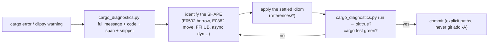

# rust-with-claude-code

How to write Rust *with* Claude in this repo and not stall: capture the real constraint,
apply the settled idiom, verify with the same loop the agent uses. Grounded in the actual
crates — `core/pd-console`, `core/kernel/pd-anchor`, `core/harbor-card-rs`, and the
`lib/*-ffi.ts` koffi loaders — not generic Rust advice.

## When to Use

✅ **Use for**:
- Borrow-checker / lifetime / move errors in any PD Rust crate
- Object-safe async on a `dyn` trait (the boxed-future idiom)
- Adding or testing a cdylib C-ABI export the TS daemon calls via koffi
- Writing pane/surface tests (the three-state, runtime-free model)
- Getting the real `cargo`/CI gate right and sharing errors with Claude productively

❌ **NOT for**:
- GPUI rendering, layout, theme, scroll, focus → `gpui-rust-console`
- The TypeScript daemon's *logic* (routes, business rules) — only the FFI seam is here
- Generic non-Rust toolchains or non-PD Rust projects with different conventions

## The Diagnose → Reshape → Verify Loop



The capture step is load-bearing: paste the **full** rendered diagnostic (with the error
code and `note:`/`help:` lines), not the first line. Claude solves the *constraint shape*;
`scripts/cargo_diagnostics.py` distills exactly that into a `paste_to_claude` field.

## Task Branches

| Branch | Do | Load |
|--------|----|------|
| `borrow` | Fix a borrow/lifetime/move error | `references/borrow-checker.md`, `examples/fix-a-borrow-error.md`, `scripts/cargo_diagnostics.py` |
| `async` | Async method on a `dyn` trait | `references/ffi-and-async.md` |
| `ffi` | Add/test a cdylib C-ABI export | `references/ffi-and-async.md`, `templates/ffi_export.rs.tmpl`, `examples/add-an-ffi-export.md` |
| `test` | Pane/surface tests, parity vectors | `references/testing-and-ci.md`, `templates/async_pane_test.rs.tmpl` |
| `collaborate` | Error-sharing, push-back, conventions | `references/claude-collaboration.md` |
| `diagnose` | Capture compiler output for Claude | `scripts/cargo_diagnostics.py` |

## The Settled Idioms (so Claude proposes them by default)

| Topic | Answer | Why |
|-------|--------|-----|
| Errors | `anyhow::Result` + `.context(...)` on every `?`; no `.unwrap()` outside tests | readable error chains |
| Async on `dyn` | hand-rolled `Pin<Box<dyn Future + Send + 'a>>`, **not** `#[async_trait]` | object-safe, zero proc-macro/crate |
| Cross-thread | `mpsc` channels (producer owns state), **not** `Arc<Mutex<T>>` | a mutex stalls the GPUI renderer |
| Async tests | `#[tokio::test]`, never `#[test]` on async fn | `#[test]` never polls the future |
| Strings | `&'static str` / `SharedString` / `Cow<'static,str>`; `"x".into()` over `String::from` | cheap, intentional |
| FFI export | `catch_unwind` + null/len/utf8/parse guards + fail-closed + caller-frees + `# Safety` | a panic across C is UB |

## Anti-Patterns

### Pasting only the first line of a borrow error
**Novice**: copies `error[E0502]: cannot borrow ...` and nothing else.
**Expert**: pastes the full rendered block — the `note:`/`help:` lines name which borrow is
live and where it ends, which is the exact info that selects the right reshape.
**Detection**: Claude proposing lifetime annotations to "fix" a borrow it can't see fully.
Use `cargo_diagnostics.py`'s `paste_to_claude`.

### `#[async_trait]` on a trait that must stay object-safe
**Novice**: adds `#[async_trait]` so the trait can have `async fn`.
**Expert**: hand-roll `fn refresh<'a>(...) -> Pin<Box<dyn Future<Output=Result<()>> + Send + 'a>>`
and `Box::pin(async move { ... })`. Keeps `Box<dyn Pane>` working with no extra crate.
**Detection**: an `#[async_trait]` import in a crate that builds `Vec<Box<dyn Trait>>`.

### FFI export without `catch_unwind` / null guards
**Novice**: writes `#[no_mangle] extern "C"` that `serde_json::from_str(...).unwrap()`s.
**Expert**: wrap the body in `catch_unwind`, guard null/len/utf8/parse, fail **closed**
(`{"ok":false}`, never null), `# Safety` doc, caller frees. A panic across the C boundary is
undefined behavior — often silent corruption, not a clean crash.
**Timeline**: ADR-0054 made the Rust kernel canonical; `core/kernel/pd-anchor/src/ffi.rs`
is the reference. **Detection**: `unwrap()`/`expect()` reachable inside an `extern "C"` fn.

### `RUST_MIN_STACK` for a gpui compile error
**Novice**: "gpui macros overflow the stack — set `RUST_MIN_STACK=16777216`."
**Expert**: it's a compile-time `recursion_limit`, fixed by `#![recursion_limit = "512"]`
in `main.rs`. `RUST_MIN_STACK` resizes a *runtime* stack and does nothing here. CI sets
neither. **Detection**: `RUST_MIN_STACK` in a build script or CI for a *compile* error.

## Quality Gates

```
□ Full diagnostic captured (cargo_diagnostics.py) before asking for a fix — not line 1
□ Borrow fix reshapes the access (borrow-checker.md), does not lengthen a lifetime to silence
□ Async dyn method is a hand-rolled boxed future; no #[async_trait]
□ FFI export: catch_unwind + null/len/utf8/parse guards + fail-closed + caller-frees + # Safety
□ FFI tested in-process (no dylib build); malformed input fails closed, never panics
□ Async tests use #[tokio::test]; pane tests prove empty/error/populated
□ cargo check + cargo clippy clean (a NEW clippy warning is a regression)
□ python3 scripts/cargo_diagnostics.py run --crate <dir>  → ok:true
□ python3 scripts/validate_skill.py  → 0 errors
□ Commit explicit paths — never git add -A (ADR 0001)
```

## Reference Files

| File | Consult When |
|------|--------------|
| `references/borrow-checker.md` | The four reshapes (read-then-mutate, self-in-async, mutate-while-iterating, disjoint fields), what to paste, clippy signal vs noise |
| `references/ffi-and-async.md` | cdylib crate-type, the four FFI iron rules, the koffi loader (`void*`/decode/free/byteLength), in-process FFI tests, object-safe boxed futures |
| `references/testing-and-ci.md` | Three-state pane tests, `#[tokio::test]`, runtime-free block-on, the real CI jobs, parity vectors (ADR-0054) |
| `references/claude-collaboration.md` | Session startup, error-sharing protocol, the autonomous-edit invocation, push-back list, git discipline |

## Scripts

| Script | Purpose |
|--------|---------|
| `scripts/_envelope.py` | Shared stdin/stdout script-io envelope (imported by the others) |
| `scripts/cargo_diagnostics.py` | Run `cargo check --message-format=json` → paste-ready digest (`diagnostics.parse` / `run` / `parse`) |
| `scripts/validate_skill.py` | Skill self-check: frontmatter, refs, schema, no phantom citations, script selftests |

## Schemas

| File | Used By |
|------|---------|
| `schemas/script-io.schema.json` | The Request/Response envelope every script wraps stdin/stdout against |

## Templates

| Template | Output |
|----------|--------|
| `templates/ffi_export.rs.tmpl` | A fail-closed `#[no_mangle] extern "C"` export + in-process FFI tests |
| `templates/async_pane_test.rs.tmpl` | Pane tests: sync view-state + `#[tokio::test]` refresh + runtime-free boxed-future check |

## Examples

| Example | Walks Through |
|---------|---------------|
| `examples/fix-a-borrow-error.md` | An E0502 fixed via the capture-and-verify loop with real `lane_pane.rs` shape |
| `examples/add-an-ffi-export.md` | Adding a cdylib export end to end: Rust side, koffi side, parity vector |
