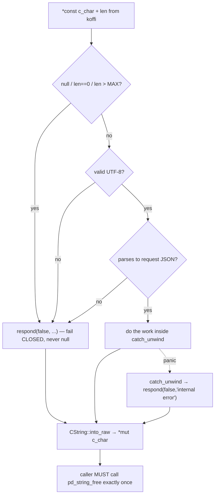

# Rust ↔ TypeScript FFI (cdylib + koffi) and Object-Safe Async

> Sources: `core/kernel/pd-anchor/src/ffi.rs` (the C ABI), `core/kernel/pd-anchor/Cargo.toml`
> and `core/harbor-card-rs/Cargo.toml` (the cdylib crate-type), `lib/macaroon-ffi.ts`
> (the koffi loader). ADR-0054. These are the canonical patterns — cite them, don't invent.

## Why FFI at all: the kernel is canonical, TS calls it

Port Daddy's security primitives (macaroon verify, harbor cards) have a **canonical Rust
implementation** in `core/kernel`, exposed over a C ABI. The TypeScript daemon loads the
compiled dylib via [koffi](https://koffi.dev) and calls it. A byte-parity TS fallback
exists for source installs / CI (where the dylib isn't built), locked by shared test
vectors so the two paths return *identical* results. The FFI is a trust/perf upgrade,
never a behavior change.

## The cdylib crate-type

A crate that's both used from Rust *and* loaded over C ABI declares two library kinds
(`pd-anchor/Cargo.toml`):

```toml
[lib]
crate-type = ["rlib", "cdylib"]   # rlib: in-Rust use + tests; cdylib: the C ABI dylib
```

`cdylib` produces `libpd_anchor.dylib` (macOS) / `.so` (Linux). `rlib` keeps the crate
usable from other Rust crates and from its own `#[cfg(test)]` tests. You want both — see
the in-process FFI test trick below.

## The four iron rules of a `#[no_mangle] extern "C"` export

Every export in `ffi.rs` obeys these. Break one and you get undefined behavior, not a
compile error — the borrow checker can't save you across the C boundary.



1. **Wrap the whole body in `catch_unwind`.** A Rust panic unwinding across the FFI
   boundary is UB. `ffi.rs::pd_macaroon_verify_json` does `catch_unwind(|| ...)` and
   `.unwrap_or_else(|_| respond(false, "internal error"))`. *Always.*
2. **Guard null / length / utf8 / parse before touching the data.** `if req.is_null() ||
   len == 0 || len > MAX_REQUEST_BYTES { return respond(false, ...) }`, then
   `str::from_utf8`, then `serde_json::from_str` — each with a clean error JSON. A bound
   (`MAX_REQUEST_BYTES = 256 * 1024`) rejects pathological sizes *before* allocating.
3. **Fail closed, never null.** Every reachable path returns a `{"ok":false,"reason":...}`
   JSON string; null is reserved for a catastrophic allocation failure. `respond()` even
   falls back to a NUL-free static error string if `CString::new` hits an interior NUL, so
   the documented "null is unreachable" contract actually holds.
4. **The caller owns the returned string.** You hand out `CString::into_raw()`; the caller
   *must* call `pd_string_free` exactly once per non-null pointer. `pd_string_free` does
   `drop(CString::from_raw(ptr))`. Forgetting it leaks; double-free is UB.

Mark every export `# Safety` and document the pointer contract — clippy's
`missing_safety_doc` will flag it, and the doc is the human contract koffi upholds.

## The koffi side (`lib/macaroon-ffi.ts`)

```ts
const koffi = require('koffi');
const lib = koffi.load(path);
// Return an opaque pointer so we can BOTH decode and free it:
const verify = lib.func('void* pd_macaroon_verify_json(const char* req, size_t len)');
const free   = lib.func('void pd_string_free(void* ptr)');
const ptr = verify(req, Buffer.byteLength(req));   // byteLength, not .length (UTF-8!)
try {
  const out = koffi.decode(ptr, 'char', -1);       // -1 = read until NUL
  return JSON.parse(out);
} finally {
  free(ptr);                                        // ALWAYS, in finally
}
```

Load-bearing details, each a real comment in `macaroon-ffi.ts`:

- Declare the return as `void*` (opaque), **not** `char*` — koffi would auto-decode-and-
  forget a `char*`, leaving you no pointer to `free`. You need the raw pointer to free it.
- `koffi.decode(ptr, 'char', -1)` reads the NUL-terminated string; do it inside `try`, free
  inside `finally`.
- Pass `Buffer.byteLength(req)` as `len`, not `req.length` — JS `.length` is UTF-16 code
  units; the Rust side reads `len` *bytes*.
- A **non-null pointer that's a garbage verdict** vs a **null pointer** are different
  failures: null = catastrophic kernel fault (the loader returning null for a *clean* dylib
  absence is separate). On a null from a *loaded* dylib, log loudly and fall back — don't
  degrade silently.
- The dylib search path is overridable via `PD_ANCHOR_DYLIB` for tests; the loader caches
  the `dlopen` and exposes `kernelAvailable()` / `kernelLoadError()` for diagnostics.

## Field-name skew across the boundary

The TS macaroon serializes `signature`; the Rust struct expects `signature_hex`. The koffi
layer has a `toRustMacaroon()` that renames just that field (`macaroon-ffi.ts`). The
*values* are identical (parity vectors prove it); only the field name differs. When you add
an FFI struct, diff the serde field names against the TS type — a silent rename is a
parse-fail-closed at runtime, easy to miss.

## Test the FFI surface from Rust without a real `dlopen`

`ffi.rs` keeps a `#[cfg(test)] fn verify_via_ffi(req_json) -> String` that calls the
`extern "C"` function in-process (CString in, CStr out, `pd_string_free` after). This
exercises the *exact* exported entry point — null guards, catch_unwind, the free contract —
in plain `cargo test`, no dylib build, no koffi. Its tests assert valid grants authorize,
protected branches reject, and **malformed input fails closed (never panics)**:

```rust
for bad in ["", "not json", "{}", "{\"macaroon\":1}"] {
    let ptr = unsafe { pd_macaroon_verify_json(CString::new(bad).unwrap().as_ptr(), bad.len()) };
    assert!(!ptr.is_null());                 // never null
    /* parse out, assert ok == false */
    unsafe { pd_string_free(ptr) };
}
```

Copy this idiom for any new export — `templates/ffi_export.rs.tmpl` scaffolds it.

## Object-safe async without `async-trait` (the pd-console idiom)

Separately from FFI, the console's `trait Pane` needs async methods on a `dyn` object. The
in-tree answer is a **hand-rolled boxed future**, not the `async-trait` crate:

```rust
fn refresh<'a>(&'a mut self, daemon: &'a DaemonClient)
    -> std::pin::Pin<Box<dyn std::future::Future<Output = Result<()>> + Send + 'a>>
{
    Box::pin(async move { /* ... */ Ok(()) })
}
```

`async fn` in a trait isn't object-safe pre-1.75 and even after has dyn-compat caveats;
`async-trait` works but adds a proc-macro and a hidden `Box::pin`. Writing the
`Pin<Box<dyn Future + Send + 'a>>` by hand keeps the trait `Box<dyn Pane>`-able with zero
dependency and makes the lifetime explicit. When Claude suggests `#[async_trait]`, push
back: "we box the future by hand to stay object-safe and crate-free."
