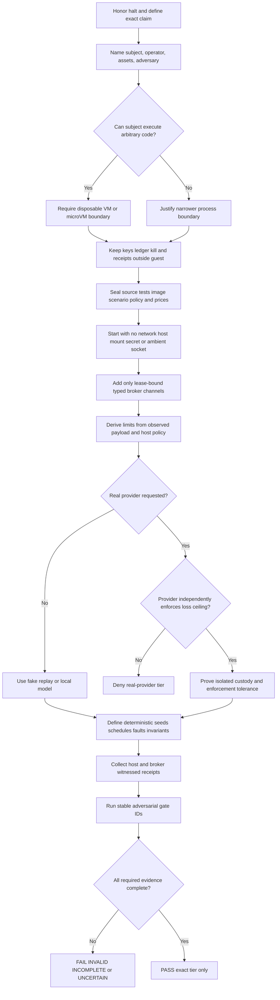

# Sandboxed Adversarial Test Harness / Drydock Safety Engineering

Design a proving ground whose safety does not depend on the code being tested. The
subject may be buggy, malicious, confused, recursively agentic, or silent. The
controller outside it must still bound effects, resources, authority, and evidence.

## Non-Negotiable Halt Gate

This skill designs and audits the laboratory. It does not authorize launching the
subject. Obey any operator or incident halt before all other steps. During a halt,
limit work to inert source inspection, schemas, fixtures, models, and documents. Do
not start the daemon, UI, agent backend, test suite, workflow, or provider canary to
“see what happens.” A design review is not a run lease.

## Use This For

- Designing a VM or microVM laboratory for arbitrary code or agent runtimes.
- Moving integration tests off the developer/CI host and into disposable guests.
- Defining a typed broker for model, fixture, artifact, or simulated remote effects.
- Proving protocol exposure and actual financial exposure as separate properties.
- Building deterministic fault, race, crash, retry, and multi-worker simulations.
- Defining host-observed receipts and promotion gates that a guest cannot forge.
- Auditing an existing sandbox claim before it gains credentials, network, or money.

## Do Not Use This For

- Ordinary unit, product, or UX correctness review.
- Training or fine-tuning agents; use `agent-rl-sandbox-trainer` after containment.
- Claiming a worktree, path check, container, Seatbelt profile, seccomp filter, or
  proxy variable is a complete hostile-code boundary by itself.
- Executing pull-request-controlled configuration, setup, transforms, or tests on
  the host merely because the product binary runs in a guest.
- Calling an internal reservation ledger a hard provider bill cap.

## Expertise Map

| Question | Required expertise | Load |
|---|---|---|
| Which language and process may hold each authority? | TCB minimization, cross-language protocol, release independence, fail-cheap packaging | `references/implementation-language-and-fail-cheap-controls.md` |
| What belongs outside the adversary's control? | TCB design, virtualization, kernel isolation, device topology | `references/isolation-mechanisms-macos-linux.md` |
| Can any effect bypass the broker? | Capability security, protocol framing, network and artifact mediation | `references/isolation-mechanisms-macos-linux.md` |
| Can the bill exceed the operator's consent? | Integer accounting, concurrency, provider quota semantics, reconciliation | `references/spend-custody-and-accounting.md` |
| Can a race or crash be replayed? | Deterministic simulation, fault injection, state exploration, safety/liveness | `references/deterministic-simulation-and-formal-models.md` |
| Can a crash orphan a body or multiply spawns? | Durable admission, identity/body separation, process witnesses, scoped breakers, backend handoff | `references/agent-lifecycle-and-crash-storms.md` |
| Who can truthfully attest what happened? | Supply-chain provenance, witness classes, append-only receipts | `references/provenance-receipts-and-evidence.md` |
| Which attacks must the gate cover? | SSRF, traversal, exfiltration, resource, authority, billing, replay, teardown | `references/threat-classes-and-adversarial-recipes.md` |

If one person cannot answer all five questions, that is a review-composition need,
not permission to blur the answers. Record the missing expertise and block the tier
that depends on it.

## Drydock Review Process

### 1. State the proposition

Write one falsifiable sentence: “Exact subject digest X, under scenario Y and tier
Z, cannot exceed effects E, resources R, protocol exposure P, or provider loss F;
the named external witnesses can reconstruct every terminal path.” Avoid “safe.”

### 2. Draw the trusted computing base

List the transitive closure of components trusted to enforce or report the claim.
The subject, its dependencies, its tests, and its agent are untrusted. The controller,
broker, signing key, ledger, halt state, and final verdict must be outside the guest
and inaccessible from guest-writable storage. Minimize this set.

While an operator halt is active, this skill can produce static D0 design and
validation only. Every dynamic tier is `NOT_PROVISIONED` or `BLOCKED`, never PASS.
Building D1 in a separate Drydock project needs its own later authorization; the
existence of this skill does not authorize execution of the subject.

Choose implementation languages by authority, not fashion. The Drydock default is
a Rust controller/watchdog/broker/transition core, a tiny out-of-process Swift
Virtualization.framework adapter on macOS, upstream Firecracker plus a Rust adapter
on Linux, and a read-only TypeScript/React evidence viewer. Rust reduces
memory-unsafe TCB risk; it does not supply isolation. Read
`references/implementation-language-and-fail-cheap-controls.md` before adding a
language, process, provider adapter, database writer, UI mutation path, or retry.

### 3. Choose isolation by adversary strength

- Pure inert data or a total function may use a process boundary if the narrower
  claim is explicit.
- Arbitrary code, package hooks, test configuration, shell, native modules, agent
  tools, or a daemon require a disposable VM or microVM.
- Namespaces, Landlock, seccomp, cgroups, Seatbelt, and path guards are defense in
  depth. They do not turn the same host identity into an independent jailer.

Record devices and mounts by enumeration. For hostile runs, empty network and
directory-sharing device lists are the baseline. “No route” must be proven from
host configuration, not inferred from a failed guest request.

### 4. Seal every executable input and exclude the canonical checkout

Content-address the guest image, source tree, test bundle, configuration, scenario,
policy, price catalog, fixture set, and controller build. Treat submitted Jest
configuration, transforms, setup, shell hooks, and tests as executable adversary
input. Run them inside a disposable guest or second test-runner guest, never on the
developer or CI host.

Fetch the exact remote commit into a dedicated bare source vault and materialize it
through a fresh linked worktree. Never package, test, stage, commit, or promote from
the canonical checkout. It must remain an exact clean projection of the live
`origin/main` tree and be absent from the guest. Guest work stays in guest-local
worktrees; approved output may enter only a fresh host linked review worktree on a
non-default branch. Record before/after canonical integrity receipts, but rely on
path and authority absence for prevention.

### 4.5 Account for every agent body before launch

Containment does not prove how many workers exist. When the subject can launch,
retry, resume, or replace an agent-like process, require one external durable
admission writer before every ingress. Separate the durable agent node, admitted
run, expiring body generation, backend session, host process/VM witness,
transcript, and capability set.

Reserve global and scoped capacity before asynchronous launch. Start every
controller boot with admission closed until all nonterminal runs and platform
handles reconcile. Treat a PID as one field in a host witness, never as identity.
Set automatic agent-birth retries and child depth to zero in the first tier. A
durable safety breaker survives restart, reboot, deployment, and calendar reset.
Read `references/agent-lifecycle-and-crash-storms.md` before designing an agent
launcher, process registry, retry, startup recovery, remote session, or backend
handoff.

### 5. Make channels absent before making them filtered

Start with no network device, no shared home, no canonical socket, no credential,
no production remote, and no writable host mount. Add only run-scoped typed
channels. Every channel names request/response byte limits, concurrency, deadline,
idempotency, replay, cancellation, destination, and receipt behavior.

### 6. Derive authority from what the broker observes

The guest may request less authority; it never declares the billable input or the
maximum used for admission. The broker resolves or receives the actual bounded
payload, recomputes digests and sizes, inventories media and tools, and derives
provider-specific conservative token and fee bounds. Unknown input kinds or stale
prices deny real dispatch.

### 7. Prove two different spend bounds

1. **Protocol-authority ceiling:** durable broker reservation limits what the
   broker is allowed to send.
2. **Financial-loss ceiling:** an isolated provider account, project, key, or
   payment rail independently refuses charges above the approved amount, including
   a measured worst-case enforcement lag.

Without proof 2, real-provider execution is ineligible. Use fake, replay, or local
models. Read `references/spend-custody-and-accounting.md` before writing equations.

### 8. Build Trial Basin as a deterministic laboratory

Make virtual time, random values, provider responses, message ordering, retries,
crashes, cancellation, and fault schedules explicit seeded inputs. Assert both
safety (“nothing bad happens”) and liveness (“required terminal or recovery state
is eventually reached under named fairness assumptions”). Preserve the seed,
schedule, event trace, and minimized counterexample.

Use a small formal model for reservation, cancellation, settlement, and teardown state
machines. Model checking explores the design; it does not prove that the concrete
hypervisor or runtime implements the model.

### 9. Label evidence by witness

Use at least these classes:

- `HOST_OBSERVED`: VM, device, mount, process, resource, or lifecycle fact from the controller.
- `BROKER_OBSERVED`: framed request, payload size, decision, dispatch, or byte count.
- `PROVIDER_RECONCILED`: provider-side quota, usage, invoice, or rejection evidence.
- `GUEST_ASSERTED`: probe, log, test result, or claim produced inside the subject.
- `MODEL_CHECKED`: finite-model property and exact model/configuration.
- `REPLAYED`: exact seed, schedule, and fixtures reproduced the same observation.

A signature authenticates a statement and signer; it does not upgrade
`GUEST_ASSERTED` into `HOST_OBSERVED`.

### 10. Gate promotion by stable attacks and complete receipts

Give each gate a durable ID. Include hostile specimens for isolation, network,
resource exhaustion, broker protocol, spend races, false evidence, provenance,
artifact import, teardown, and controller mutation. A gate records exact input
digests, witness-class observation, expected terminal outcome, residual, and replay
instructions.

Use exact verdicts: `PASS`, `FAIL`, `INVALID`, `INCOMPLETE`, or `UNCERTAIN`.
Infrastructure failure never becomes PASS or “neutral success.” PASS applies only
to the exact subject, scenario, controller, policy, and capability tier evaluated.

## Capability Tiers

| Tier | Maximum authority | Promotion rule |
|---|---|---|
| T0 Static | no guest process, network, credential, or spend | schema and source review |
| T1 Deterministic | fake services in a disposable guest | repeatable safety/liveness scenarios |
| T2 Replay | recorded inputs, still no external network | exact trace replay and external receipts |
| T3 Canary | one real operation under provider-enforced custody | per-run human approval and reconciled tolerance |
| T4 Worker | one worker on fixture systems; quarantined output | separate review after T3 |
| T5 Crew | multiple workers under one aggregate envelope | independent adversarial program |
| T6 Federation | cross-host custody and settlement | deferred until composition is proven |

Promotion increases evidence, never ambient authority. Passing one tier does not
authorize the next.

## Output Contract

Produce one review using `templates/output-template.md` with:

- exact proposition and tier;
- subject and immutable input identities;
- TCB and excluded components;
- VM, device, mount, and network topology;
- typed effect and capability manifest;
- protocol-exposure calculation and financial-custody proof or explicit absence;
- deterministic scenario, seeds, invariants, and fault schedule;
- durable lifecycle states, global reservation scopes, process/VM witness,
  retry owner, breaker reset contract, and backend-continuation proof when agents
  can be launched;
- stable adversarial gate matrix;
- evidence grouped by witness class;
- residual risks and counterclaims; and
- exact verdict with the next permitted action.

The legacy `schemas/harness-spec.schema.json` and
`scripts/containment_audit.mjs` check five policy-shape classes only. They are a
useful T0 lint, not containment evidence, VM evidence, spend proof, or a deployment
gate. Never promote because that script returns `pass: true`.

## Anti-Patterns

### Same-UID Convenience Called Containment

**Novice:** A worktree, path guard, Seatbelt profile, or process wrapper is “the sandbox.”

**Expert:** Arbitrary code shares too much host authority. Put it behind a VM or
microVM and treat host controls as defense in depth.

**Timeline:** Appears during prototyping, survives because tests pass, fails when a
native module, shell, inherited descriptor, or overlooked path bypasses convention.

### Host Executes The Submitted Test Harness

**Novice:** Run Jest, configuration, and setup on the host against a daemon in a VM.

**Expert:** Pull-request-controlled tests are code. Stage inert bytes and execute
the entire test runner inside a disposable guest.

**Timeline:** Looks efficient in CI, then a configuration file or transform gains
host code execution before the supposedly isolated subject starts.

### Clean Main As A Social Convention

**Novice:** Ask agents to avoid the main checkout and add a pre-commit hook.

**Expert:** Make the canonical checkout absent from guests and invalid in every
packer, broker, and promotion schema. Fetch through a bare source vault, author in
worktrees only, and admit output only into a new linked review worktree. Hooks are
friendly diagnostics, not enforcement.

**Timeline:** Main stays clean during cooperative testing, then one wrong working
directory, inherited `GIT_DIR`, or path alias stages unrelated operator bytes and
turns source provenance into guesswork.

### In-Memory Roster Called Global Accounting

**Novice:** Counts children in a process-local map, writes the PID later, and
restarts a worker when a heartbeat disappears.

**Expert:** Atomically reserves global capacity in a durable external ledger,
witnesses boot/process-start/nonce/sandbox identity before `RUNNING`, and keeps
admission closed after restart until every old body is adopted, terminated,
settled, lost, or quarantined.

**Timeline:** The normal path respects its limit, then a crash erases the count
while detached children survive. Startup retries create another generation and a
crash-plus-spawn loop multiplies processes and bills.

### Backoff Called A Spawn Safety Boundary

**Novice:** Adds exponential delay to recursive or crash-triggered spawning.

**Expert:** Denies all but the atomically reserved number of births, gives one
layer ownership of retries, persists attempt/ancestry limits, and opens a durable
breaker. Full-jitter backoff only desynchronizes a later, already bounded retry.

**Timeline:** Delay makes the first graph look calm, then restart resets the
counter or 1,000 distinct requests bypass exact idempotency and all eventually run.

### Guest Self-Attestation

**Novice:** A failed `curl 127.0.0.1:9876` proves the host daemon was unreachable.

**Expert:** Guest loopback is not host loopback. Prove absent host mounts, devices,
routes, and mappings externally; label guest probes `GUEST_ASSERTED`.

**Timeline:** Produces reassuring logs immediately, then collapses under a
compromised guest that lies or tests the wrong namespace.

### Internal Ledger Called A Hard Bill Cap

**Novice:** Reserve five dollars locally, therefore no provider can charge more.

**Expert:** Reservation limits broker authority. Only isolated provider-enforced
custody plus measured enforcement lag bounds actual financial loss.

**Timeline:** Works in mocks, then delayed usage reporting, concurrent requests, or
quota propagation allows overshoot.

### One Language Everywhere

**Novice:** Rewrites the controller, Apple adapter, UI, guest, and subject in Rust
and calls the result safer.

**Expert:** Keeps one Rust implementation for trusted state and receipt logic,
uses a mechanical Swift helper for Apple's native VM API, confines rich web UI to
read-only evidence, and measures every process/channel added to the TCB.

**Timeline:** A uniform prototype feels elegant, then unsafe FFI, duplicated native
policy, or a WebView command bridge quietly becomes the broadest authority path.

### Presentation As Containment

**Novice:** Treats a gallery, `chroot`, `sandbox-exec`, or a same-UID wrapper as
evidence that hostile code was contained.

**Expert:** Uses the gallery only to inspect evidence, labels fixtures honestly,
and requires an approved external controller's host receipt for containment.

**Timeline:** The specimen looks boxed in while its process can still inherit host
paths, hooks, credentials, sockets, or network authority.

### Guest-Declared Billing Inputs

**Novice:** Trust `inputTokens`, `inputBytes`, or `maxOutput` in the guest request.

**Expert:** The broker measures payloads and derives conservative provider-specific
bounds; host policy supplies maxima.

**Timeline:** Honest clients agree in tests, malicious or buggy clients understate
inputs in production and defeat admission accounting.

### Random Chaos Without Replay

**Novice:** Kill processes randomly until something fails.

**Expert:** Control entropy, virtual time, order, and fault schedules; preserve a
seed and minimized counterexample; test safety and liveness.

**Timeline:** Finds an exciting flake, then consumes days and money because nobody
can reproduce or distinguish it from infrastructure noise.

### Signed Claims Treated As Truth

**Novice:** The guest signed a PASS receipt, so the run passed.

**Expert:** Signatures prove origin and integrity. Trust comes from witness position,
observed fields, isolation, and downstream verification.

**Timeline:** Looks rigorous until a compromised subject signs a perfectly authentic lie.

## References

| File | Load When |
|---|---|
| `references/implementation-language-and-fail-cheap-controls.md` | Selecting languages/processes, separating offline and canary packages, designing durable state, retries, UI authority, or a release-independent TCB. |
| `references/isolation-mechanisms-macos-linux.md` | Choosing VM, microVM, device, network, filesystem, kernel, and process boundaries. |
| `references/spend-custody-and-accounting.md` | Designing broker reservation, provider custody, settlement, refunds, retries, or real canaries. |
| `references/agent-lifecycle-and-crash-storms.md` | Designing spawn admission, durable identity/body/run joins, PID/VM witnesses, crash recovery, scoped breakers, or backend handoff. |
| `references/deterministic-simulation-and-formal-models.md` | Designing Trial Basin seeds, virtual time, faults, schedule exploration, safety, and liveness. |
| `references/provenance-receipts-and-evidence.md` | Sealing inputs and deciding which witness may assert each receipt field. |
| `references/threat-classes-and-adversarial-recipes.md` | Building the complete hostile-specimen and failure matrix. |
| `templates/output-template.md` | Writing the integrated Drydock review and promotion verdict. |
| `tests/activation.md` | Evaluating skill activation and rejection behavior. |
| `examples/sample-input.json` | Inspecting the paired legacy T0 policy-lint input used by the abbreviated example. |
| `examples/expected-output.md` | Seeing an abbreviated review with honest limits. |
| `schemas/harness-spec.schema.json` | Using the legacy five-class T0 policy-lint input. |
| `scripts/containment_audit.mjs` | Running legacy policy-shape lint only, never containment proof. |
| `agents/openai.yaml` | Configuring a specialist only when agent fan-out is permitted by operator policy. |

## Skill Bundle Index

- `SKILL.md`: activation, decision process, evidence classes, tiers, and anti-patterns.
- `README.md` and `CHANGELOG.md`: bundle orientation and version history.
- `references/`: implementation language, fail-cheap controls, isolation, spend,
  durable agent lifecycle, simulation, provenance, and adversarial recipes.
- `templates/output-template.md`: integrated review artifact.
- `tests/activation.md`: positive, negative, and boundary activation prompts.
- `examples/`: abbreviated legacy and Drydock examples.
- `schemas/harness-spec.schema.json` and `scripts/containment_audit.mjs`: legacy T0 lint.
- `agents/openai.yaml`: optional specialist descriptor, subject to local fan-out policy.
