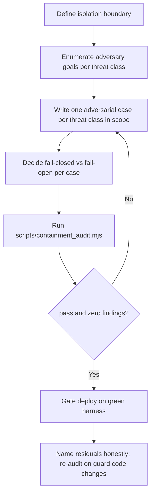

# Sandboxed Adversarial Test Harness

Prove a sandbox contains untrusted or AI-authored code under active attack — not just that the code's own tests pass.

## Use This For

- Gating a fleet output sink, worktree, or trust gate (ADR-0093's event→spawn trust substrate) before it holds real agent-triggered actions.
- Verifying the confirmed SSRF and path-traversal fixes on `lib/fleet/url-guard.ts` / `lib/fleet/path-guard.ts` actually hold against obfuscated payloads, not just the one exploit that was found.
- Defining containment invariants for a new sandbox (filesystem, network egress, secrets, process/resource limits) before it runs its first untrusted payload.
- Deciding whether a sandbox's failure semantics are fail-closed or fail-open, and refusing to ship a fail-open design.
- Unblocking Phase 4E/4F hardening on the V4 roadmap, which is stalled behind exactly this harness existing.

## Do Not Use This For

- Training, fine-tuning, or QLoRA-adapting an agent's behavior — that is `agent-rl-sandbox-trainer`; this skill only proves the box the training happens in is sound.
- Writing the trust-gate classification or allowlist logic itself — that is `fleet-event-spawn-trust`; this skill tests whether that logic holds under attack.
- Reviewing the code's own correctness or business logic — a sandbox can contain buggy code perfectly well; containment and correctness are orthogonal.

## Containment-Proving Process

1. Define the isolation boundary explicitly: filesystem jail root, network egress policy, what secrets (if any) the sandboxed code can reach, process/resource limits. Name each dimension; do not leave any implicit.
2. Enumerate what an adversary inside the sandbox actually wants, per threat class: `ssrf` (reach metadata/loopback/internal hosts), `path-traversal` (escape the jail root), `secret-exfil` (move a credential out via any channel), `resource-exhaustion` (fork bombs, memory/disk bombs), `side-effect-write` (write outside the intended output surface, e.g. cron, launch agents, git hooks).
3. Write at least one adversarial case per in-scope threat class. Each case names the invariant it asserts, not the exploit's mechanics — "outbound fetch to 169.254.169.254 is refused pre-socket," not "test SSRF."
4. For every case and for the harness as a whole, decide fail-closed vs fail-open. There is no threat class where fail-open is correct; an ambiguous or unresolvable check must default to deny.
5. Run `scripts/containment_audit.mjs` against the harness spec. It audits the spec's design — coverage per threat class, allowlist-vs-denylist shape, default-egress direction, fail modes — before any live execution happens.
6. Gate deployment on `pass: true` and an empty `findings` array. A non-passing harness is a blocker, the same as a failing test suite, not an FYI.
7. Name residual risks the harness cannot yet close (DNS rebinding past a literal-IP guard, TOCTOU between a realpath check and the write, malicious same-UID agent) explicitly in the report. Re-audit whenever the underlying guard code changes.

## Output Contract

- **Isolation boundary**: named filesystem/network/secrets/process dimensions and what enforces each.
- **Harness spec**: JSON matching `schemas/harness-spec.schema.json` — egress policy, path policy, secret handling, and adversarial cases per threat class.
- **Containment report**: `{ pass, coverageByThreatClass, findings, recommendations }` from the audit script.
- **Gating recommendation**: pass/block decision plus any residual risks carried forward.

Use `scripts/containment_audit.mjs` to compute coverage and flag missing threat-class coverage, denylist-based policies, default-allow egress, and fail-open modes deterministically.

## Anti-Patterns

### Testing The Code, Not The Box

**Novice**: "The agent's own unit tests pass, so the sandbox is safe."
**Expert**: A sandbox's job is to contain code regardless of whether that code is correct, buggy, or actively hostile. Write cases that attack the isolation boundary itself — an adversary who controls the payload, not the happy-path input the code's author imagined.
**Detection**: Every "test" in the harness is really a correctness test for the sandboxed code, and none of them assume the code is trying to escape.

### Denylist-Based Egress Or Path Filtering

**Novice**: "Block `169.254.169.254`, `127.0.0.1`, and `../` in the path string."
**Expert**: Denylists have catastrophic recall — decimal/octal/hex IP literals, DNS rebinding, open redirects, symlinks, and URL-encoding all evade a string-match blocklist. Use allowlists with canonicalized (realpath) checks for paths and exact-host allowlists with proper IP-literal classification for egress.
**Detection**: `egressPolicy.mode` or `pathPolicy.mode` is `denylist`, or the guard code does `if (url.includes('169.254'))` / `if (path.includes('..'))`.

### Fail-Open On Ambiguity

**Novice**: "If we can't resolve the hostname or the symlink target, just let it through — don't block a legitimate request by mistake."
**Expert**: If containment cannot be proven for a given input, the only sound default is deny. An unresolvable check is not evidence of safety; it's evidence the harness hasn't decided what to do yet.
**Detection**: Any adversarial case or the harness-wide `failMode` is `fail-open`, or an unknown/unrecognized input classification defaults to the most permissive tier instead of the least.

## References

| File | Load When |
| --- | --- |
| `references/threat-classes-and-adversarial-recipes.md` | Need the five threat classes, containment invariants, and concrete attack payloads (SSRF to metadata, path traversal via `../` and symlinks, DNS secret exfil). |
| `references/isolation-mechanisms-macos-linux.md` | Need to pick what actually enforces an isolation dimension on macOS or Linux, or how to wire fail-closed gating into deploy. |
| `examples/expected-output.md` | Need a finished containment-audit example against a real fleet output-sink scenario. |
| `templates/output-template.md` | Need a reusable containment-audit template. |
| `schemas/harness-spec.schema.json` | Need to validate a harness spec before running the audit script. |
| `scripts/containment_audit.mjs` | Need deterministic coverage and policy-shape auditing of a harness spec. |
| `agents/openai.yaml` | Need a subagent descriptor for delegated containment-harness design. |

<!-- BEGIN BUNDLE INDEX (auto: index_references.py) -->

## Skill Bundle Index

*Every file in this skill, and when to open it. Regenerate with the first-party
skill architect: `python3 ../skill-architect/scripts/index_references.py . --fix`. <!-- phantom-ok: declared cross-skill tool -->*

**root**
- [`CHANGELOG.md`](CHANGELOG.md) — Sandboxed Adversarial Test Harness — Changelog — - Initial skill creation - Core process defined - Reference files and deterministic containment audit script added
- [`README.md`](README.md) — Sandboxed Adversarial Test Harness — Procedural guidance for designing an adversarial test harness that proves a sandbox contains untrusted or AI-authored code and agent actions

**`agents/`**
- [`agents/openai.yaml`](agents/openai.yaml) — openai (data/schema)

**`examples/`**
- [`examples/expected-output.md`](examples/expected-output.md) — Example Output: Sandboxed Adversarial Test Harness — Scenario: gating the fleet's webhook and file output sinks (ADR-0093 §5) before wiring untrusted inbound triggers (Phase 2 webhook receiver,
- [`examples/sample-input.json`](examples/sample-input.json) — sample input (data/schema)

**`references/`**
- [`references/isolation-mechanisms-macos-linux.md`](references/isolation-mechanisms-macos-linux.md) — Isolation Mechanisms — macOS And Linux — Use this when choosing what actually enforces an isolation dimension, not just what policy describes it.
- [`references/threat-classes-and-adversarial-recipes.md`](references/threat-classes-and-adversarial-recipes.md) — Threat Classes And Adversarial Recipes — Use this when writing `adversarialCases` for a harness spec — each recipe below is a concrete, runnable attack, not a description of a risk

**`schemas/`**
- [`schemas/harness-spec.schema.json`](schemas/harness-spec.schema.json) — harness spec.schema (data/schema)

**`scripts/`**
- [`scripts/containment_audit.mjs`](scripts/containment_audit.mjs)

**`templates/`**
- [`templates/output-template.md`](templates/output-template.md) — Containment Audit: [Sandbox/Surface Name] — - Filesystem: [jail root path] — [allowlist/denylist mode] - Network: [default deny/allow] — [allowlisted hosts, if any] - Secrets: [fake-cr

<!-- END BUNDLE INDEX -->
