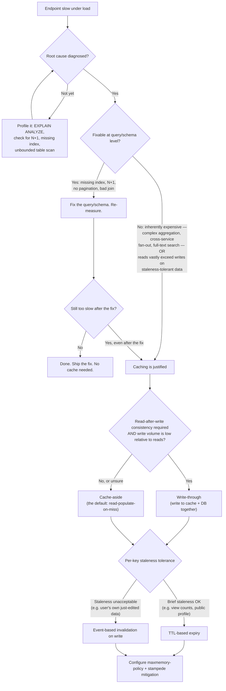

# Scalable DB Caching Strategy

Decide whether a slow, scaling database-backed endpoint needs a cache layer at all, where to put it, and which pattern to use — before reaching for Redis.

## When to Use

✅ **Use for**:
- "This endpoint is slow under load — should we add Redis or fix the query?"
- "We're scaling 10x — where in the stack should a cache layer go?"
- "Should we cache this query result, or add an index / fix the N+1 instead?"
- "Cache-aside or write-through for this feature?"
- "Reviewing a caching proposal before it ships" (granularity, eviction, staleness)

❌ **NOT for**:
- Implementing Redis invalidation mechanics, pub/sub invalidation buses, or write-behind queues in detail → `cache-strategy-invalidation-expert`
- Multi-tier CDN / browser cache / edge cache design, `Cache-Control` header tuning → `caching-strategies`
- In-process memoization of pure functions or CPU-level caching (that's not a DB scaling concern)
- Fixing the query itself once you've decided that's the right move → standard query/index/ORM optimization skills (e.g. `postgresql-optimization`)

---

## Core Process

The central discipline: **diagnose before you cache**. A cache layer hides the cost of a bad query — it doesn't remove it. Every decision below happens in order.

### Step 1: Diagnose, don't assume

Before proposing a cache, profile the actual query: `EXPLAIN ANALYZE` (Postgres/MySQL), check for N+1 patterns in the ORM logs, and look for missing indexes or unbounded `SELECT *` scans. If any of these are present, **fix them first** — add the index, batch the N+1 into one query, add pagination or a `LIMIT`. Re-measure. Caching a badly-written query only defers the reckoning to a cache-miss stampede later, and it hides a cost that will resurface the moment the cache is cold (deploy, restart, eviction) or the working set outgrows memory.

### Step 2: Decide if caching is still justified

Caching is the right tool when, *even after query optimization*, one of these holds:
- The computation is inherently expensive: complex aggregation, cross-service fan-out, expensive full-text search.
- Read volume vastly exceeds write volume for data that tolerates some staleness.

If neither holds, don't cache — the query fix was the whole answer.

### Step 3: Pick the write pattern

| Pattern | How it works | When it's worth the tradeoff |
|---|---|---|
| **Cache-aside** (lazy loading) | App checks cache; on miss, reads DB and populates cache; subsequent reads hit cache until TTL/invalidation | Default choice. Use unless you have a specific reason to write-through. |
| **Write-through** | Write to cache and DB synchronously on every write | Only when read-after-write consistency matters *and* write volume is low relative to reads — it trades write latency for guaranteed freshness. |
| **Write-behind** | Write to cache, flush to DB asynchronously | Rarely justified outside specialized high-throughput systems. It introduces a durability gap (cache dies before flush → data loss) that most apps can't tolerate. Don't reach for this by default. |

### Step 4: Pick the invalidation strategy — per key, not globally

- **TTL-based expiry**: simplest; fine when brief staleness is acceptable (a public profile's view count).
- **Event-based invalidation**: explicitly delete/update the cache key when the underlying row changes; necessary when staleness is unacceptable (a user viewing their own just-saved edit).
- A well-designed cache layer **mixes both per key** based on actual staleness tolerance for that data — it does not pick one strategy globally and apply it everywhere.

### Step 5: Guard against stampede and unbounded growth before shipping

- **Cache stampede (thundering herd)**: when a hot key expires, many concurrent requests can miss simultaneously and hammer the DB at once. Mitigate with a short-lived lock / single-flight pattern (only one request repopulates the cache; others wait briefly or serve stale) or probabilistic early expiration (refresh slightly before actual TTL, staggered per key) — never a hard synchronized expiry across all keys.
- **Eviction policy**: always configure `maxmemory-policy` (e.g. `allkeys-lru`) explicitly. Don't assume keys will naturally expire before memory pressure hits — that assumption is how Redis becomes an unbounded memory leak.

See `references/stampede-and-eviction.md` for concrete lock/single-flight and probabilistic-expiry code patterns, and `references/query-fix-first.md` for the Step 1 diagnostic checklist in more depth.

---

## Anti-Patterns

### Anti-Pattern: Caching a Bad Query

**Novice**: "This endpoint is slow, let's stick a Redis cache in front of it."
**Expert**: If the query is slow because of a missing index or an N+1, caching hides the cost instead of removing it. The DB call is still expensive — it just runs less often, until a deploy, restart, or eviction empties the cache and every request piles onto the DB at once (a self-inflicted stampede). Fix the query/index/pagination first; only cache what's left after optimization.
**Detection**: A caching PR with no accompanying `EXPLAIN ANALYZE` output or query-plan discussion, on an endpoint that has never been profiled.

### Anti-Pattern: Caching at the Wrong Granularity (Whole-Response Caching)

**Novice**: "Cache the whole API response — simplest thing that works."
**Expert**: If only one sub-query inside that response is actually expensive, caching the whole response forces cheap, frequently-changing data to go stale on the same TTL as the expensive part, for no reason. Cache at the granularity of the actual expensive operation (the specific query or computation), not the whole response, whenever the two diverge.
**Detection**: A single cache key backing a composite response where most fields come from cheap, fast-changing lookups.

### Anti-Pattern: Unbounded Cache Key Growth

**Novice**: "We don't need an eviction policy, keys will expire on their own via TTL."
**Expert**: Caching per-user or per-query-parameter results without an eviction policy turns Redis into an unbounded memory leak the moment TTLs are long, keys are high-cardinality (e.g. keyed on arbitrary query params), or write volume outpaces expiry. Redis's own default (`noeviction`) makes writes start failing once memory is full, rather than gracefully evicting.
**Timeline**: This bites teams hardest right after a traffic-growth event — the exact moment caching was supposed to help — because key cardinality grows with traffic just as fast as hit rate does.
**Detection**: No `maxmemory-policy` set in the Redis config, or it's left at the default.

### Anti-Pattern: Reaching for Write-Behind by Default

**Novice**: "Write-behind is the 'advanced' pattern, so it must be the best choice for a high-traffic feature."
**Expert**: Write-behind (write to cache, async flush to DB) introduces a durability gap: if the cache process dies before the flush, the write is silently lost. It's justified only in specialized high-throughput systems that have already built compensating durability (write-ahead logs, replayable event streams). For a typical scaling web app, cache-aside or write-through cover the real requirements without the data-loss risk.
**Detection**: A design doc proposing write-behind with no discussion of what happens when the cache node crashes mid-flush.

---

## References

Consult these for deep dives — they are NOT loaded by default:

| File | Consult When |
|------|-------------|
| `references/query-fix-first.md` | You need the concrete diagnostic checklist for Step 1 — how to tell a missing index from an N+1 from an unbounded scan, before proposing a cache. |
| `references/stampede-and-eviction.md` | You're implementing Step 5 — need runnable single-flight lock / probabilistic-early-expiration patterns, or want `maxmemory-policy` guidance by workload shape. |

For deeper general caching theory, multi-tier (browser/CDN/edge) architecture, or Cache-Control header design, use `caching-strategies`. For Redis invalidation implementation detail (pub/sub buses, key-tagging schemes, write-behind queue mechanics), use `cache-strategy-invalidation-expert`.
