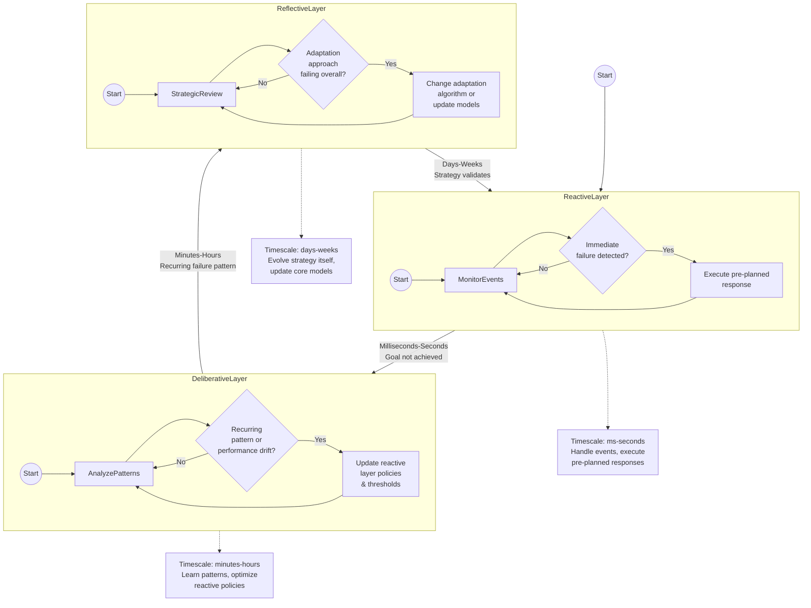

# Hierarchical Feedback Loop Layers

```mermaid
flowchart TD
    Start((Start)) --> ReactiveLayer

subgraph ReactiveLayer["ReactiveLayer"]
        ReactiveStart((Start)) --> MonitorEvents
        MonitorEvents --> DetectFailure{"Immediate<br/>failure detected?"}
        DetectFailure -->|Yes| ExecutePreplanned["Execute pre-planned<br/>response"]
        DetectFailure -->|No| MonitorEvents
        ExecutePreplanned --> MonitorEvents
end

subgraph DeliberativeLayer["DeliberativeLayer"]
        DeliberativeStart((Start)) --> AnalyzePatterns
        AnalyzePatterns --> PatternFound{"Recurring<br/>pattern or<br/>performance drift?"}
        PatternFound -->|Yes| UpdatePolicies["Update reactive<br/>layer policies<br/>& thresholds"]
        PatternFound -->|No| AnalyzePatterns
        UpdatePolicies --> AnalyzePatterns
end

subgraph ReflectiveLayer["ReflectiveLayer"]
        ReflectiveStart((Start)) --> StrategicReview
        StrategicReview --> StrategyFailing{"Adaptation<br/>approach<br/>failing overall?"}
        StrategyFailing -->|Yes| EvolvStrategy["Change adaptation<br/>algorithm or<br/>update models"]
        StrategyFailing -->|No| StrategicReview
        EvolvStrategy --> StrategicReview
end

    ReactiveLayer -->|Milliseconds-Seconds<br/>Goal not achieved| DeliberativeLayer
    DeliberativeLayer -->|Minutes-Hours<br/>Recurring failure pattern| ReflectiveLayer
    ReflectiveLayer -->|Days-Weeks<br/>Strategy validates| ReactiveLayer

Annotation1["Timescale: ms-seconds<br/>Handle events, execute<br/>pre-planned responses"]
ReactiveLayer -.-> Annotation1

Annotation2["Timescale: minutes-hours<br/>Learn patterns, optimize<br/>reactive policies"]
DeliberativeLayer -.-> Annotation2

Annotation3["Timescale: days-weeks<br/>Evolve strategy itself,<br/>update core models"]
ReflectiveLayer -.-> Annotation3
```
