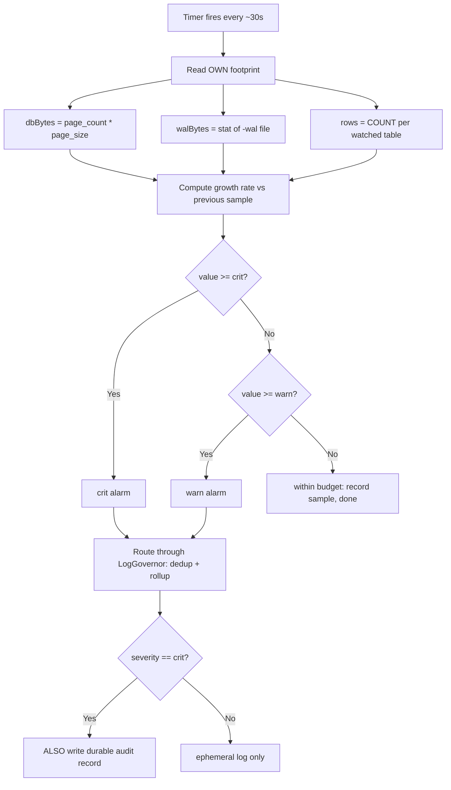
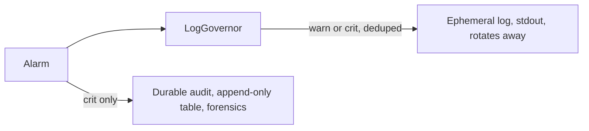

# Self-Monitoring Resource Alarms

Make a service watch its OWN resource footprint and alarm *before* it becomes an
incident — instead of discovering the runaway when the disk is already full.

## When to Use

✅ **Use for**:
- A long-running daemon/service that owns a data store (SQLite, embedded KV,
  append-only log, a table) that could grow without bound.
- Adding a background footprint sampler: own DB bytes, WAL bytes, per-table row
  counts, and **growth rate between samples**.
- Wiring graduated warn/crit alarms through a dedup governor so a sustained
  breach reports once per window, not once per sample.
- Splitting alarms into an ephemeral **log** signal and a durable **audit** record.
- Installing global `unhandledRejection` / `uncaughtException` (or language
  equivalent) handlers so a crash is never silent.
- Per-tenant footprint metering in a multi-tenant service; or protecting a dev
  laptop from a dev-build daemon that bloats its own store.
- Auditing an existing service for the pull-only / whole-disk monitoring gap.

❌ **NOT for**:
- Whole-host / cluster infra monitoring — use Prometheus, Grafana, node_exporter.
- Request-level APM / distributed tracing — use OpenTelemetry.
- External uptime / synthetic probes.
- One-shot "how full is the disk" reporting with no alarm loop.

---

## The Core Insight

Two failures put a real daemon at **313 GB written with zero alarm**:

1. **Pull-only view** — the resource status was computed *only when a human
   opened a panel*. Between opens, nobody was watching.
2. **Wrong subject** — it measured *whole-disk percent free*, not the daemon's
   *own* DB/WAL/table growth. A store that quintupled never tripped anything
   until the entire volume was nearly full.

The fix is a **push** sampler that measures **your own footprint** on a timer,
alarms on **level and rate**, and routes every alarm through a governor so the
alarm can never become the spam it exists to catch.

---

## Core Process



Two sinks, on purpose — the log is ephemeral, the audit survives rotation:



### Step 1 — Measure your OWN footprint, never whole-disk

Read what *you* wrote, behind an injected `MetricSources` interface so it is
testable with no filesystem:

- `dbBytes()` → `page_count * page_size` (SQLite pragma), or your store's own
  size API. **Not** `statvfs` / disk-free.
- `walBytes()` → size of the write-ahead log (`0` if checkpointed away).
- `rowCount(table)` → row count for each watched table.

Wrap each read in a `safe()` fallback so one failing source cannot abort the
whole sample.

### Step 2 — Compute growth rate between samples

Keep the previous sample. `ratePerSec = (value - prevValue) / dtSec`. A store
still *under* its ceiling but climbing megabytes/second is a runaway — the rate
alarms before the level does. Persist the rate with every alarm.

### Step 3 — Graduated warn/crit thresholds

Absolute ceilings on *your* footprint (not percentages of a shared disk):
`warn` = comfortable headroom above steady state, `crit` = the largest footprint
you can tolerate before harm. See `references/threshold-tuning.md` for baselining.

### Step 4 — Route every alarm through a dedup governor

The alarm fires on every sample while the breach persists. Without governing,
that is thousands of identical lines — the alarm becomes the disk-eater. Use a
`LogGovernor`: first `burst` occurrences per window emit, the rest are counted
and collapsed into one rollup (`…and 4,312 more in 5m`). **The dedup key must be
low-cardinality** (`resource_threshold_crossed:db_bytes:crit`) — never embed a
timestamp or id, or the governor cannot collapse anything.

### Step 5 — Split ephemeral log vs. durable audit

Log the alarm (governed) so an operator sees it live. **Also** write crit alarms
to a durable, append-only audit sink so the record survives log rotation for
post-incident forensics. A crit that only ever hit a rotated stdout capture is
un-diagnosable — that is how the first incidents stayed mysterious.

### Step 6 — Drive it in the background + install failure-visibility handlers

`setInterval(sample, 30_000)` (call `unref()` so it never keeps the process
alive), and in the same bootstrap register global `uncaughtException` /
`unhandledRejection` handlers that log **and** durably audit. A crash with no
durable trace is the same blind spot as a footprint with no sampler.

Full copy-paste code for all six steps: `references/reference-implementation.md`.

---

## The Two Horizons

- **Multi-tenant** — meter footprint **per tenant**, keyed by tenant id (a
  structured field you control, safe to embed in the dedup key). Graduated
  thresholds become quota tiers (warn = approaching plan limit, crit = hard cap),
  and the same meter feeds usage-based billing.
- **Dev-on-dev** — the original 313 GB victim was a dev laptop. Ship the monitor
  **enabled by default in dev builds** with tighter ceilings, route alarms where
  a developer actually sees them, and treat a dev crit as a release blocker.

Details in `references/threshold-tuning.md`.

---

## Anti-Patterns

### Anti-Pattern: The Pull-Only Resource View

**Novice**: "We expose a `/status` endpoint that computes DB size, WAL size, and
row counts. Resource monitoring is done."
**Expert**: A status endpoint computes those numbers *only when something calls
it*. Between calls — which, for an internal daemon, may be *never* until after
the incident — nobody is watching. Monitoring is a **push** activity: a timer
samples on its own and alarms without a human in the loop. A pull-only view is a
report, not a monitor. Convert it: keep the endpoint for humans, but add a
background sampler that raises alarms whether or not anyone is looking.
**Timeline**: A dev-latest daemon exposed exactly this pull-only view and wrote
313 GB before anyone opened the panel. The alarm that would have caught it (a
background sampler) did not exist until after the post-mortem.
**Detection**: `scripts/audit_self_monitoring.py` flags `pull-only` — footprint
reads with no periodic driver (`setInterval`/cron/scheduler) near them.

### Anti-Pattern: Measuring the Whole Disk Instead of Your Own Footprint

**Novice**: "We alarm when the disk is over 90% full. That covers storage
runaways."
**Expert**: Whole-disk percent is the wrong subject. On a big shared volume,
your service can 5x its own store — a genuine runaway — while the disk sits at
40%, so nothing trips until you have co-tenanted yourself off a cliff or the
whole volume is nearly full. Alarm on **your own bytes**: `page_count *
page_size`, WAL bytes, per-table row counts, and their growth rate. Whole-disk
is a backstop, not the primary signal.
**Timeline**: The 313 GB write storm grew the daemon's own DB and an unrotated
stdout capture. Whole-disk monitoring never fired because the volume had room —
the *daemon's own footprint* was the thing exploding, and that was unmeasured.
**Detection**: audit flags `wrong-subject` — `statvfs`/disk-free probes present
but no own-footprint read.

### Anti-Pattern: The Ungoverned Alarm Becomes the Spam

**Novice**: "When we cross the threshold we log an error every sample so it's
impossible to miss."
**Expert**: A sustained breach with a 30s sampler logs an error every 30s
forever — and a threshold *for storage growth* that itself writes unbounded log
lines is a self-inflicted version of the very runaway it watches for. Route
alarms through a dedup governor: emit the first `burst` per window, collapse the
rest into a single rollup that still reports the true count. You lose redundant
bytes, never the fact that it kept happening.
**Timeline**: The same repo had `bosun_heartbeat_write_failed` and
`semantic_resolution_failed` incidents — a failing op in a tight loop logging a
full error object each time: 7,000+ identical lines, a 255 MB stdout capture,
a bloated DB. Patched narrowly twice; the *class* only closed when governed
logging became a first-class primitive.
**Detection**: audit flags `ungoverned-loop-logging` — `.error(` inside a loop
with no governor in the file.

### Anti-Pattern: No Global Failure-Visibility Handlers

**Novice**: "We try/catch around our handlers, so errors are covered."
**Expert**: A rejected promise with no `.catch`, or a throw in a timer/microtask,
escapes every local try/catch. Without a process-level `unhandledRejection` /
`uncaughtException` handler it prints to a maybe-unrotated stderr and can take
the process down with **no durable record** — the crash and the storage runaway
share one blind spot: *no one is watching the thing that actually failed*.
Register global handlers once at bootstrap that log **and** durably audit, then
decide crash-only-restart vs. best-effort-continue deliberately.
**Timeline**: Node treats an unhandled rejection as a hard crash (default since
Node 15, 2020). Services carried from older defaults often never added the
handlers, so post-Node-15 upgrades turned silent rejections into silent exits.
**Detection**: audit flags `no-global-handlers` when no such registration exists.

---

## Bundle Contents

| Path | What it is |
|------|-----------|
| `references/reference-implementation.md` | Copy-paste `LogGovernor` + `SelfMonitor` + wiring (all 6 steps). Consult when implementing. |
| `references/threshold-tuning.md` | Baselining warn/crit, growth-rate windows, cadence, the two horizons, ephemeral-vs-durable, testing. Consult when tuning or testing. |
| `scripts/audit_self_monitoring.py` | Structured code-symbol scan for the four gaps. Run to audit a service: `python3 scripts/audit_self_monitoring.py <dir>` (exit 1 on any HIGH gap — CI-friendly). |

---

## Quick Audit

```bash
python3 scripts/audit_self_monitoring.py path/to/service --json
```

Reports: `no-footprint-monitor`, `pull-only`, `wrong-subject`,
`ungoverned-loop-logging`, `no-global-handlers`. Fix HIGH gaps first, then
implement using `references/reference-implementation.md`.

---

## References

Consult these for deep dives — they are NOT loaded by default:

| File | Consult When |
|------|-------------|
| `references/reference-implementation.md` | Writing the sampler, governor, durable sink, and background driver |
| `references/threshold-tuning.md` | Choosing thresholds, growth-rate rules, multi-tenant metering, dev-on-dev, testing without a filesystem |
