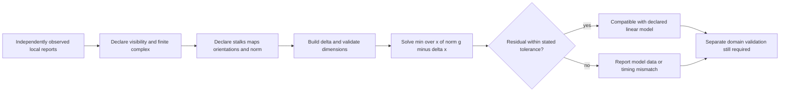
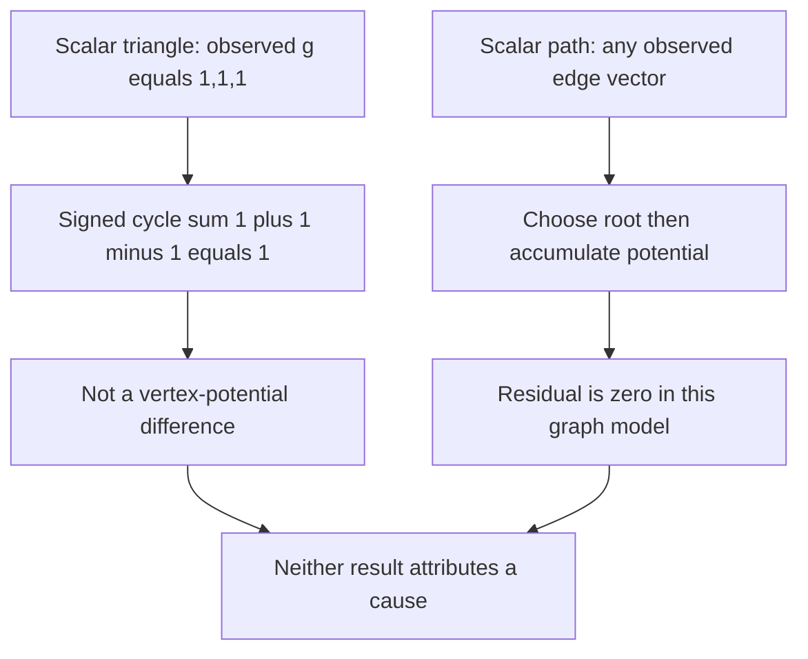

# Sheaf cohomology for modeled compatibility checks

State the finite base complex, orientations, stalk dimensions, restriction maps, coefficient field, metric, observation coverage, and objective before computing a residual. A calculation can report compatibility with that representation. It cannot establish safety, authenticity, freshness, capacity, settlement, intent, a responsible agent, or permission for an external effect.

## Reproducible setup

For a linear cochain model `delta:C0 -> C1` and independently observed `g in C1`, report

$$r=\min_x \|g-\delta x\|=\|g-\delta\hat{x}\|.$$

The norm and tolerance are part of the result. If `g` is first defined as `delta x`, then `r=0` by construction; it is not an empirical test. A residual can result from measurement noise, stale versions, missing observations, different units, orientation errors, restriction-map errors, or an inadequate model.

For a finite cochain complex with maps `delta0` from `C0` to `C1` and `delta1` from `C1` to `C2`, the selected sheaf has

$$H^1=\ker(\delta_1)/\operatorname{im}(\delta_0),\qquad \dim H^1=\dim C^1-\operatorname{rank}(\delta_1)-\operatorname{rank}(\delta_0),$$

provided `delta1 delta0=0`. A constant scalar connected graph without faces has `dim H1=beta1`; this does not extend to arbitrary stalk dimensions or restriction maps.

## Bounded follow-up, not automatic repair

A residual support can suggest which observed coordinates to inspect. Ranking coordinates by residual energy/cost is a **local heuristic**; it is neither an optimal min-cut theorem nor a guarantee that one action reduces `beta1` or drives a residual to zero. Any data correction, schedule change, fence, payment, or other effect requires its own authority and independently verified domain rules.

## Navigation

- [Cellular sheaf model and dimensions](references/cellular-sheaves-for-engineers.md)
- [Observed residual and settlement boundary](references/h1-as-settlement-obstruction.md)
- [Energy and numerical monitoring limits](references/dirichlet-energy-implementation.md)
- [Hansen–Ghrist source scope](references/hansen-ghrist-2021.md)
- [Finite triangle and path walkthrough](references/practical-walkthrough.md)
- [Repair-ranking hypotheses](references/active-repair-and-triadic-cohomology.md)
- [Source access and fixture limits](references/source-access-and-fixtures.md)

The included [finite helper](examples/finite_sheaf_checks.py) and receipt fixture validate matrix identities only. They do not connect to a runtime or authorize a response.
