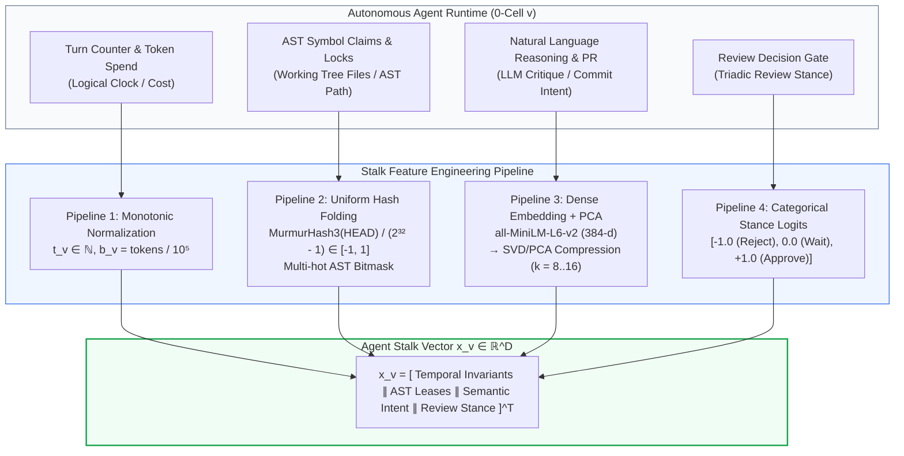

# Sheaf Cohomology for Swarm Legibility and Active Control

## When to Use

- Agents are coordinating asynchronously under partial visibility (gossip meshes, network partitions, intermittent consensus) and you need to determine if an irreconcilable global inconsistency exists.
- An autonomous fleet (e.g. Port Daddy with Coxswain, Cartographer, Lookout, Quartermaster) emits assertions, AST code claims, capacity vectors, or RoundContract receipts, and an operator wants to know:
  1. **Is the swarm globally consistent?** ($r = 0$)
  2. **If inconsistent ($r > 0$), where is the fault?** (CR-2 electrical flow cycle localization)
  3. **Is the failure a local 3-party contract bug or a systemic macro-partition?** (CR-5 Legibility Ratio $\mathcal{L}(g)$)
  4. **What is the minimum-cost intervention to restore consensus?** (CR-4 Optimal Repair Min-Cut)

**NOT for**:
- Simple full-visibility peer-to-peer checks where every pair directly compares roots (cohomology is strictly redundant with $O(|E|)$ pairwise comparisons here).
- Cut-edge / single-bridge network splits where no redundant cycles exist (cohomology provably cannot bind without a cycle; the severed link remains dark).
- Abstract topological analysis without observed data (computing $\dim H^1$ of the abstract sheaf independent of data was the legacy 2026-08 wrong turn).
- Pure text sentiment analysis of agent chat without algebraic stalks or typed contracts.

---

## The Rosetta Stone: From Swarm Primitives to Cellular Sheaves

How to map real Port Daddy and Drydock runtime objects into cellular sheaves:

| Swarm / Drydock Primitive | Sheaf-Theoretic Concept | Algebraic Role |
|---|---|---|
| **AgentNode** (durable identity, obligations) | **0-Cell (Vertex $v \in V$)** | Base site vertex holding private state stalk $\mathcal{F}(v)$ |
| **WorkNode** (bounded intent slice in Round DAG) | **0-Cell / Subgraph** | Epistemic task state evaluated in round |
| **Direct Peer Channel / Dependency / AST Claim** | **1-Cell (Directed Edge $e \in E$)** | Directed 1-simplex $u \to v$ with boundary $\partial e = v - u$ |
| **Triadic Join (Producer + Dissenter + Manager)** | **2-Cell (Triangle $\tau \in F$)** | 2-simplex with boundary $\partial \tau = e_{uv} + e_{vw} - e_{uw}$ |
| **Hyperedge (Multi-parent Join in Hypertree)** | **Simplicial Complex / Nerve** | Multi-way join decomposed into 2-simplices |
| **State Vector (Capacity, Epoch, Claim, Hash)** | **Stalk Vector $x_v \in \mathbb{R}^D$** | Numerical state emitted by AgentNode |
| **Shared Interface / AST Code Region Clip** | **Restriction Map $P_e: \mathbb{R}^D \to \mathbb{R}^S$** | Coordinate-subset selection of shared fields |
| **Reported Disagreement on Edge** | **Observed 1-Cochain $g_e \in C^1$** | $g_e = P_e x_u - P_e x_v$ (or reported discrepancy) |
| **Relayed Gossip Across Cycle (Partition)** | **Visibility: RELAYED ($R$)** | Pairwise blind; global completion residual binds around cycle |
| **Severed Channel (No Data)** | **Visibility: SEVERED ($S$)** | Free block in completion; provably dark (honest silence) |

---

## Practical Stalk Feature Engineering in Real Swarms

In real-life agent swarms (e.g., Port Daddy / Harbor), the stalk vector $x_v \in \mathbb{R}^D$ is assembled via four deterministic pipelines rather than a black-box embedding:



### Heterogeneous Restriction Mapping ($P_{v \trianglelefteq e}$)
When agent roles have different internal state spaces (e.g., Frontend $D_u = 6$ vs. Backend $D_v = 6$), the restriction map $P_{v \trianglelefteq e} \in \{0, 1\}^{d_e \times D_v}$ is a rectangular Boolean selection matrix extracting shared interface variables:
$$P_{u \trianglelefteq e} = \begin{bmatrix} I_{d_e \times d_e} & 0_{d_e \times (D_v - d_e)} \end{bmatrix}$$
The coboundary operator then evaluates $g_e = P_{v \trianglelefteq e} x_v - P_{u \trianglelefteq e} x_u$, enabling embarrassingly parallel coordinate-wise solves in $< 2$ milliseconds without LLM calls.

---

## Core Theorems & Formulas

### 1. Three-Tier Visibility & The Completion Residual (R6 / CR-1)
Every edge $e$ in the swarm belongs to one visibility class:
- **`COMPARED` ($C$)**: Direct check ran; pairwise baseline sees $g_e$; known to global detector.
- **`RELAYED` ($R$)**: Both endpoints' signed reports reached the supervisor via gossip, but direct edge check never ran; pairwise is blind; $g_e$ is known.
- **`SEVERED` ($S$)**: No data; free block in the completion.

The completion residual on known edges $K = C \cup R$ is:
$$r = \min_{x} \| g_K - (\delta_K x) \|_2 = \| \Pi_K g_K \|_2$$
where $\Pi_K$ is the orthogonal projector onto $\text{coker}(\delta_K) = \ker(\delta_K^T)$.
- **Soundness**: $r > 0 \iff$ no global assignment explains the known data. Furthermore, for any injected lie $\varepsilon_K$, $\|\varepsilon_K\|_2 \ge r$ (exact minimum lie).
- **Single-edge lie closed form**: For a lie of size $s$ on edge $e$, $r = |s|\sqrt{1 - R_{\text{eff}}(e)}$ where $R_{\text{eff}}(e)$ is the effective resistance.

### 2. Localization via Electrical Current (CR-2)
For a single equivocator $q$, the per-edge residual vector $\rho = \Pi_K \varepsilon_K$ satisfies:
$$\text{supp}(\rho) \subseteq \bigcup \{ \text{cycles of } G_K \text{ passing through } q \}$$
The maximum-residual edge lies on a cycle through the equivocator with zero false-positives under bounded noise ($2\|\eta_K\| < \max_f \|(\Pi \varepsilon)_f\|$).

### 3. Active Cohomological Repair (CR-4)
Given $r > 0$ and edge intervention costs $w(e) > 0$ (cost of forced sync or claim fencing):
- Residual energy per edge: $E(e) = \|\rho_e\|_2^2$.
- The greedy controller selects $e^* = \arg\max_{e} E(e)/w(e)$ and fences/reconciles it.
- Collapses the residual $r \to 0$ in at most $\beta_1(G_K)$ rounds.

### 4. Simplicial Hodge Decomposition & Swarm Legibility Ratio (CR-5)
On 2-complexes with triadic joins $\tau = (u,v,w)$ and boundary operator $\delta_1: C^1 \to C^2$:
$$g = \underbrace{\delta_0 x}_{\text{gauge gradient}} + \underbrace{h}_{\text{harmonic } \in H^1} + \underbrace{\delta_1^* \psi}_{\text{triadic curl}}$$
The **Swarm Legibility Ratio**:
$$\mathcal{L}(g) = \frac{\|h\|_2^2}{\|h\|_2^2 + \|\delta_1^* \psi\|_2^2} \in [0, 1]$$
- $\mathcal{L}(g) \approx 0$: **Micro failure** — a specific 3-party review join or work-unit contract failed ($\delta_1 g \neq 0$). Intervene locally.
- $\mathcal{L}(g) \approx 1$: **Macro failure** — all local triangles are consistent ($\delta_1 g = 0$), but a non-contractible partition cavity exists. Intervene on cross-cluster bridges.

---

## Python Reference Implementation

> [!IMPORTANT]
> **Do not use PySheaf for cohomology.** PySheaf maintainers explicitly confirm PySheaf cannot compute cohomology. Use the verified NumPy/SciPy linear algebra block below.

```python
import numpy as np

def completion_residual(delta_K, g_K):
    """Computes completion residual r = ||Pi_K g_K||_2."""
    xhat, _, _, _ = np.linalg.lstsq(delta_K, g_K, rcond=None)
    resid = g_K - delta_K @ xhat
    r = float(np.linalg.norm(resid))
    return r, resid

def simplicial_hodge_decomposition(delta_0, delta_1, g):
    """
    Decomposes g = delta_0 x + h + delta_1^* psi
    Returns: grad_comp, h, curl_comp, legibility_ratio
    """
    # 1. Gradient component (gauge)
    xhat, _, _, _ = np.linalg.lstsq(delta_0, g, rcond=None)
    grad_comp = delta_0 @ xhat
    w = g - grad_comp

    # 2. Curl component (triadic frustration)
    if delta_1.shape[0] > 0:
        psi_hat, _, _, _ = np.linalg.lstsq(delta_1.T, w, rcond=None)
        curl_comp = delta_1.T @ psi_hat
    else:
        curl_comp = np.zeros_like(w)

    # 3. Harmonic component (cohomology class)
    h = w - curl_comp

    # 4. Swarm Legibility Ratio
    norm_h_sq = float(np.sum(h ** 2))
    norm_curl_sq = float(np.sum(curl_comp ** 2))
    denom = norm_h_sq + norm_curl_sq
    L = norm_h_sq / denom if denom > 1e-12 else 0.0

    return grad_comp, h, curl_comp, L

def greedy_cohomological_repair(delta_0, edges, g, costs=None):
    """Selects minimum-cost edges to fence until r == 0."""
    nE = len(edges)
    if costs is None:
        costs = {e: 1.0 for e in edges}

    repaired = []
    active_mask = np.ones(nE, dtype=bool)
    current_g = g.copy()

    while True:
        act = np.where(active_mask)[0]
        if len(act) == 0:
            break
        A = delta_0[act, :]
        b = current_g[act]
        xh, _, _, _ = np.linalg.lstsq(A, b, rcond=None)
        res = b - A @ xh
        r = float(np.linalg.norm(res))
        if r < 1e-9:
            break
        energies = np.zeros(nE)
        for idx, val in zip(act, res):
            energies[idx] = val ** 2
        ratios = [energies[i] / costs[edges[i]] if active_mask[i] else 0.0 for i in range(nE)]
        best_idx = int(np.argmax(ratios))
        repaired.append(edges[best_idx])
        active_mask[best_idx] = False

    return repaired
```

---

## Decision Logic for the Swarm Supervisor (Coxswain / Operator)

```mermaid
flowchart TD
    A[Ingest Observed Cochain g_K on Known Edges] --> B[Compute Completion Residual r = ||Pi_K g_K||]
    B --> C{r < 1e-9?}
    C -- yes --> D[ALL QUIET: Swarm is Globally Consistent]
    C -- no --> E[Obstruction Confirmed: Inconsistency Certified]
    E --> F[Compute Simplicial Hodge Decomposition]
    F --> G[Calculate Legibility Ratio L]
    G --> H{L < 0.2?}
    H -- yes --> I[MICRO FAILURE: Triadic Review Join or WorkContract Violated]
    I --> J[Triage: Inspect Failed Triangle tau; Re-run Producer-Dissenter-Manager Round]
    H -- no --> K{L > 0.8?}
    K -- yes --> M[MACRO FAILURE: Network Partition Cavity]
    M --> N[Triage: Identify Cut Bridges; Execute CR-4 Optimal Repair Min-Cut]
    K -- no --> P[HYBRID FAILURE: Mixed Local Frustration & Macro Cavity]
    P --> N
    N --> Q[Active Remediation: Synchronize or Fence Edge e* = argmax E/w]
    Q --> R[Re-evaluate Residual until r = 0]
```

---

## Comparative Proof: Why Acyclic Trees (LangGraph/CrewAI) Are Mathematically Blind

A foundational theorem in multi-agent coordination explains why standard hierarchical manager trees silently fail when agents hallucinate or duplicate work:

### The Tree Blindness Invariant ($\Pi_{\text{tree}} \equiv 0$)
Let $G_{\text{tree}} = (V, E)$ be any connected acyclic directed graph with $|V|$ agents and $|E| = |V| - 1$ communication channels.
1. The 0-coboundary operator $\delta_0: C^0(V) \to C^1(E)$ has dimension $(|V| - 1) \times |V|$.
2. Because $G_{\text{tree}}$ is connected, $\ker(\delta_0) = \text{span}(\mathbf{1}_{|V|})$, so $\dim \ker(\delta_0) = 1$.
3. By the rank-nullity theorem, $\operatorname{rank}(\delta_0) = |V| - \dim \ker(\delta_0) = |V| - 1 = |E|$.
4. Therefore, $\delta_0$ has **full row rank**. The column space $\operatorname{im}(\delta_0)$ spans the entire edge space $C^1(E) = \mathbb{R}^{|E|}$.
5. The orthogonal complement (cokernel) is trivial:
   $$\operatorname{coker}(\delta_0) = \ker(\delta_0^T) = \{ \mathbf{0} \}$$
6. Consequently, the orthogonal projector onto $\operatorname{coker}(\delta_0)$ is the zero operator:
   $$\Pi_{\text{tree}} = I_{|E|} - \delta_0 (\delta_0^T \delta_0)^{-1} \delta_0^T \equiv 0$$
7. For **any** observed edge cochain $g \in C^1(E)$ (including conflicting AST locks, divergent commit hashes, or blatant hallucinations):
   $$r_{\text{tree}} = \| \Pi_{\text{tree}} g \|_2 = \| \mathbf{0} \|_2 \equiv 0.0000 \quad \text{(unconditionally)}$$

**Conclusion**: In any acyclic hierarchy, any contradiction between agents is trivially absorbed as an unobserved gauge transformation in the vertex potentials $\hat{x}$. The manager is mathematically incapable of detecting the contradiction from edge data.

### The Simplicial Complex Resolution ($\beta_1 \ge 1$)
Adding closed review contracts (e.g., triadic review triangles $v_0 \to v_1 \to v_3 \to v_0$) creates non-trivial 1-cycles:
$$\beta_1(G) = |E| - |V| + 1 \ge 1 \implies \dim \ker(\delta_0^T) \ge 1$$
The orthogonal projector $\Pi_K$ projects $g_K$ onto this circulation subspace. Around any cycle $\gamma$:
$$\oint_\gamma g = \sum_{e \in \gamma} g_e \neq 0 \implies r = \| \Pi_K g_K \|_2 > 0$$
The contradiction **cannot be gauge-absorbed** and generates an instantaneous scalar alarm $r(t) > 0$.

---

## Live TypeScript Swarm Simulation (`swarm_live_demo.ts`)

A standalone, zero-dependency reference implementation is provided in `packages/cohomology-of-swarms/code/swarm_live_demo.ts`. Running:
```bash
node --experimental-strip-types packages/cohomology-of-swarms/code/swarm_live_demo.ts
```
simulates 5 agents across 5 epochs:
- **Epoch 0–1 (Consensus)**: $r = 0.0000$, $r_{\text{tree}} = 0.0000$.
- **Epoch 2 (Overlapping AST Lock & Commit Fork)**: $r = 0.7564$, whereas $r_{\text{tree}} = 0.0000$ (Tree is blind). Max energy edge: `SecDev<->AuthDev` ($E = 0.2861$).
- **Epoch 3 (QA Critic Hallucination & Equivocation)**: $r = 45.2714$, whereas $r_{\text{tree}} = 0.0000$. Max energy edge: `SecDev->QA` ($E = 1024.56$).
- **Epoch 4 (CR-4 Min-Cut Greedy Repair)**: Fences rogue lease and quenches contradiction, driving $r \to 0.0000$.

---

## Multidisciplinary Foundations

| Discipline & Skill | Role in Sheaf Cohomological Swarms |
|---|---|
| **Simon & Newell (1971)** (`simon-and-newell-human-problem-solving-theory-1971`) | Models agent problem spaces (states, operators, goal tests). Cochain differences $g_e$ measure operator non-commutativity between branching search paths. |
| **Manager-Driven Teams** (`manager-driven-team-orchestrator`) | Dynamic role assignment by round. Triadic joins (2-cells) ensure the manager never accepts worker assertions without peer cross-verification. |
| **Context Economics** (`context-economics-for-agent-swarms`) | Tokens as COGS ($b_v = \text{tokens}/10^5$). Compaction loss is bounded as Gaussian topological noise ($\|\eta_K\|$), separated from structural lies by the spectral gap. |
| **Algorithmic Game Theory** (`nisan-et-al-2007-algorithmic-game-theory`) | Truthful revelation mechanism design. In a simplicial complex, truth-telling is a dominant strategy equilibrium because any lie $\varepsilon$ satisfies $\|\varepsilon\| \ge r$, pinpointing the deviator with zero false positives. |
| **FIPA Ontology & Protocols** (`fipa-00086-ontology-service`, `agent-conversation-protocols`) | Types communicative acts (`PROPOSE`, `ASSERT_LOCK`, `REVIEW`) into algebraic stalks and restriction maps over shared domain predicates. |
| **Structured Logging** (`structured-logging-design`) | W3C trace contexts and correlation IDs map directly to simplicial edge receipts. |

---

## References

1. **Hanks, J., Riess, H., & Hale, M. (2025).** "Distributed Multi-agent Coordination over Cellular Sheaves." *arXiv:2504.02049*.
2. **Seely, J. et al. (2026).** "Learning Multi-Agent Coordination via Sheaf-ADMM." *ICML 2026*.
3. **Ghrist, R. & Riess, H. (2026).** "Cellular Sheaves of Lattices and the Tarski Laplacian for Distributed Optimization."
4. **Hansen, J. & Ghrist, R. (2019).** "Toward a Spectral Theory of Cellular Sheaves." *Journal of Applied and Computational Topology*, 3(4):315–358.
5. **Robinson, M. (2020).** "Assignments to sheaves of pseudometric spaces." *Compositionality*, arXiv:1805.08927.
6. **Curiositech / Port Daddy (2026).** Harbor Results Compendium R6, Theorems CR-1 through CR-5 (`skills/harbor-results/scripts/sheaf_consistency_radius.py`, `sheaf_repair_and_2complex.py`).

