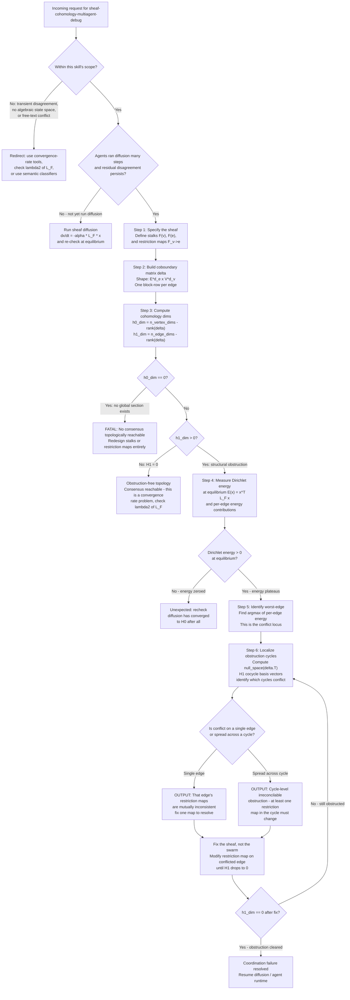

# Diagram 1: flowchart

```mermaid
flowchart TD
  A[Incoming request for sheaf-cohomology-multiagent-debug] --> B{Within this skill's scope?}
  B -->|No: transient disagreement,\nno algebraic state space,\nor free-text conflict| C[Redirect: use convergence-rate tools,\ncheck lambda2 of L_F,\nor use semantic classifiers]
  B -->|Yes| D{Agents ran diffusion many steps\nand residual disagreement persists?}
  D -->|No - not yet run diffusion| E[Run sheaf diffusion\ndx/dt = -alpha * L_F * x\nand re-check at equilibrium]
  D -->|Yes| F["Step 1: Specify the sheaf\nDefine stalks F(v), F(e),\nand restriction maps F_v->e"]
  F --> G[Step 2: Build coboundary matrix delta\nShape: E*d_e x V*d_v\nOne block-row per edge]
  G --> H["Step 3: Compute cohomology dims\nh0_dim = n_vertex_dims - rank(delta)\nh1_dim = n_edge_dims - rank(delta)"]
  H --> I{h0_dim == 0?}
  I -->|Yes: no global section exists| J[FATAL: No consensus topologically reachable\nRedesign stalks or restriction maps entirely]
  I -->|No| K{h1_dim > 0?}
  K -->|No: H1 = 0| L[Obstruction-free topology\nConsensus reachable - this is a convergence\nrate problem, check lambda2 of L_F]
  K -->|Yes: structural obstruction| M["Step 4: Measure Dirichlet energy\nat equilibrium E(x) = x^T L_F x\nand per-edge energy contributions"]
  M --> N{Dirichlet energy > 0\nat equilibrium?}
  N -->|No - energy zeroed| O[Unexpected: recheck\ndiffusion has converged\nto H0 after all]
  N -->|Yes - energy plateaus| P[Step 5: Identify worst-edge\nFind argmax of per-edge energy\nThis is the conflict locus]
  P --> Q["Step 6: Localize obstruction cycles\nCompute null_space(delta.T)\nH1 cocycle basis vectors\nidentify which cycles conflict"]
  Q --> R{Is conflict on a single edge\nor spread across a cycle?}
  R -->|Single edge| S[OUTPUT: That edge's restriction maps\nare mutually inconsistent\nfix one map to resolve]
  R -->|Spread across cycle| T[OUTPUT: Cycle-level irreconcilable\nobstruction - at least one restriction\nmap in the cycle must change]
  S --> U[Fix the sheaf, not the swarm\nModify restriction map on conflicted edge\nuntil H1 drops to 0]
  T --> U
  U --> V{h1_dim == 0 after fix?}
  V -->|No - still obstructed| Q
  V -->|Yes - obstruction cleared| W[Coordination failure resolved\nResume diffusion / agent runtime]
```
