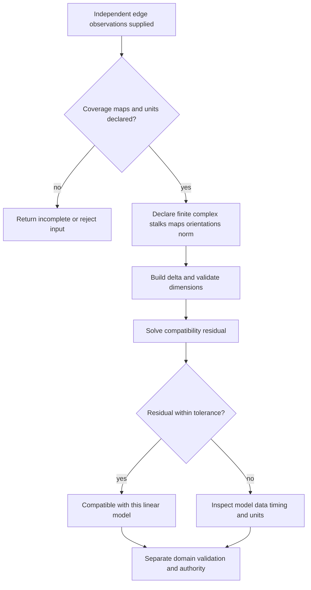

# Diagram: scoped residual review

```mermaid
flowchart TD
  A[Independent edge observations supplied] --> B{Coverage maps and units declared?}
  B -->|no| C[Return incomplete or reject input]
  B -->|yes| D[Declare finite complex stalks maps orientations norm]
  D --> E[Build delta and validate dimensions]
  E --> F[Solve compatibility residual]
  F --> G{Residual within tolerance?}
  G -->|yes| H[Compatible with this linear model]
  G -->|no| I[Inspect model data timing and units]
  H --> J[Separate domain validation and authority]
  I --> J
```
