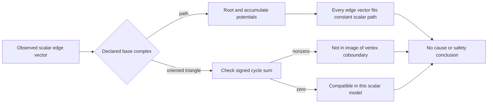

# Diagram: same calculation, different declared complex

```mermaid
flowchart LR
  A[Observed scalar edge vector] --> B{Declared base complex}
  B -->|path| C[Root and accumulate potentials]
  C --> D[Every edge vector fits constant scalar path]
  B -->|oriented triangle| E[Check signed cycle sum]
  E -->|nonzero| F[Not in image of vertex coboundary]
  E -->|zero| G[Compatible in this scalar model]
  D --> H[No cause or safety conclusion]
  F --> H
  G --> H
```
