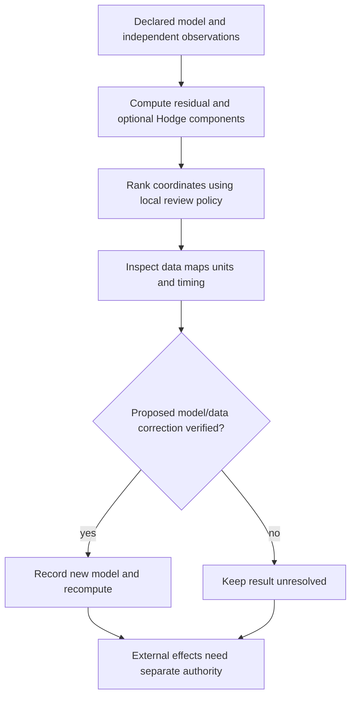

# Hodge decomposition and review-ranking hypotheses

## Finite Hodge statement

For a finite-dimensional cochain complex with stated inner products,

$$C^1=\operatorname{im}(\delta_0)\oplus\mathcal{H}^1\oplus \operatorname{im}(\delta_1^*)$$

is an orthogonal decomposition in the declared metric. The harmonic space $\mathcal{H}^1$ is isomorphic to the quotient cohomology `ker(delta1)/im(delta0)`; it represents that quotient after the metric is fixed. Metrics must be positive definite. For degree metrics `Wk` and `W{k+1}`, use the adjoint `A*=Wk^-1 A.T W{k+1}`; a plain transpose is correct in Euclidean orthonormal bases. The components are algebraic projections. Calling them “micro” or “macro” is an application interpretation that needs separately collected evidence; no ratio threshold establishes a cause, intent, severity, or action.

## Triadic example

For the scalar triangle with `delta1=(1,1,-1)` and independently observed `g=(0,3,0)`, the gradient is `(-1,2,1)` and residual is `(1,1,-1)`. With a filled face, that residual is coexact; with the same vertices/edges but no face, it is harmonic. The observed data are unchanged. This demonstrates that the declared complex changes the decomposition.

## Repair ranking is not a theorem

A reviewer may compute residual coordinate energies and combine them with a locally supplied inspection cost. The resulting sort order is a hypothesis-generating triage list. It is not a min-cut theorem, does not locate a causal actor, cannot promise a one-step reduction in cycle rank, and never itself executes a correction. Test proposed changes against the finite model and separately obtain the authority needed for any effect.

