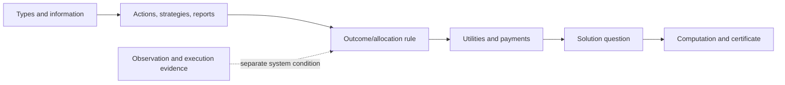
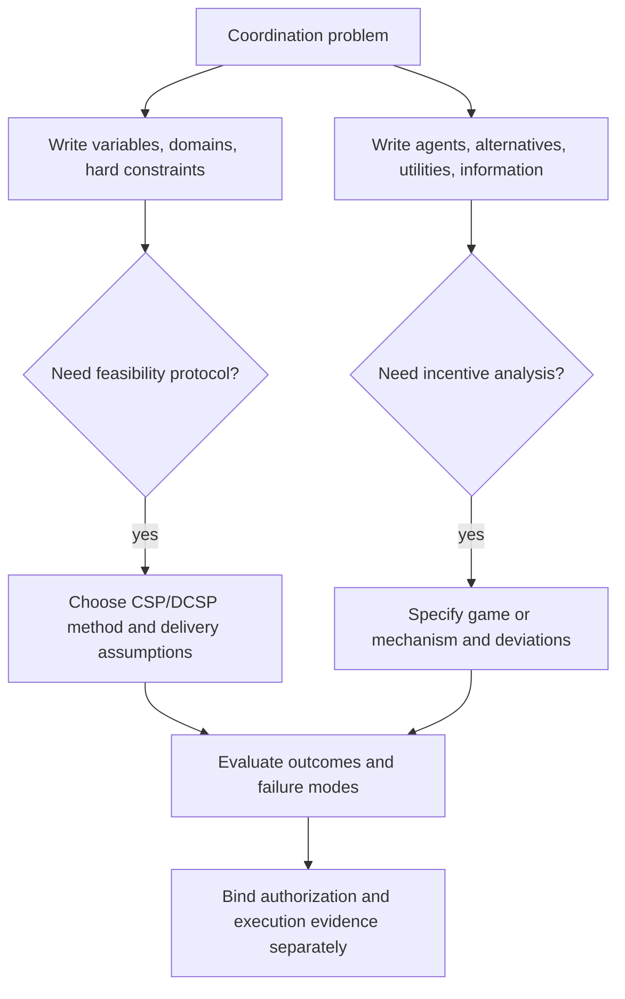

# Multi-agent foundations: model before choosing a method

Use this skill to turn an informal coordination claim into an inspectable model. It draws on Shoham and Leyton-Brown's foundations text; textbook results apply only with their stated representation and theorem hypotheses.

## A five-part modeling pass

1. **Representation.** State players or variable owners, domains/actions, constraints, information sets, utilities and timing. A task graph is not automatically an extensive-form game; a capability catalog is not automatically a CSP.
2. **Question.** Name whether the task is feasibility, candidate verification, finding one equilibrium, enumerating equilibria, or searching for a property. These can have different complexity.
3. **Conditions.** Check finite domains, perfect recall, zero-sum relation, quasilinear utility, priors, a credible signal/mediator, and message-delivery assumptions as applicable.
4. **Method and certificate.** Keep a deviation table, LP dual/primal condition, nogood trace, potential descent trace, or an explicit statement that the output is heuristic.
5. **Operational boundary.** Authentication, authorization, real-world outcome observation, payment collection, and external effect completion are not granted by a game/CSP theorem.

## Constructed sanity check

Two workers report costs 2 and 5 for one job. “Allocate to the lower report and pay the second report” is only a fixture until types, quasilinear utilities, allocation feasibility, payment collection, and verification of job completion are specified. It illustrates what a truthfulness analysis needs; it is not a procurement guarantee.

## References

- [Representation and tractability](references/representation-and-tractability.md): normal/extensive/sequence forms, CE, congestion and stochastic-game boundaries.
- [Computational equilibrium complexity](references/computational-equilibrium-complexity.md): verify versus find versus property-search, zero-sum LP and general-sum limits.
- [Distributed constraint solving](references/distributed-constraint-solving.md): filtering, nogoods and ABT under finite CSP/message conditions.
- [Bounded rationality and cooperation](references/bounded-rationality-cooperation.md): automata, fictitious play, Minimax-Q and potential-game scope.
- [Mechanism impossibilities](references/mechanism-design-impossibilities.md): Arrow, Gibbard–Satterthwaite, Myerson–Satterthwaite, AGV, Roberts and VCG conditions.
- [Mechanism design in constrained reality](references/mechanism-design-constrained-reality.md): contracts, bribes, mediators, verified scheduling, bandwidth, multicast, matching and observability.
- [Source model and theorem conditions](references/source-model-and-theorem-conditions.md): primary-source map and reusable theorem worksheet.
- [Diagram index](diagrams/INDEX.md): three complementary model worksheets.
