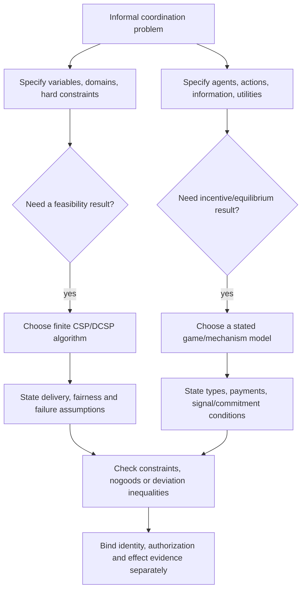

# Multiagent model worksheet

```mermaid
flowchart TB
  P[Informal coordination problem] --> F[Specify variables, domains, hard constraints]
  P --> G[Specify agents, actions, information, utilities]
  F --> QF{Need a feasibility result?}
  G --> QI{Need incentive/equilibrium result?}
  QF -->|yes| C[Choose finite CSP/DCSP algorithm]
  QI -->|yes| M[Choose a stated game/mechanism model]
  C --> A[State delivery, fairness and failure assumptions]
  M --> B[State types, payments, signal/commitment conditions]
  A --> V[Check constraints, nogoods or deviation inequalities]
  B --> V
  V --> X[Bind identity, authorization and effect evidence separately]
```

Feasibility and incentives can both matter. Neither branch establishes authentication, authority, or execution completion.
