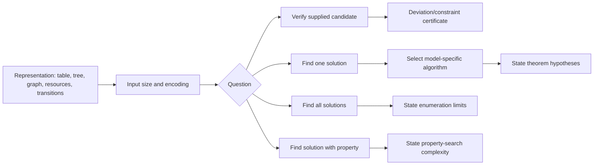

# Model and solution-question worksheet

```mermaid
flowchart LR
  R[Representation: table, tree, graph, resources, transitions] --> I[Input size and encoding]
  I --> Q{Question}
  Q --> V[Verify supplied candidate]
  Q --> O[Find one solution]
  Q --> A[Find all solutions]
  Q --> P[Find solution with property]
  V --> C[Deviation/constraint certificate]
  O --> H[Select model-specific algorithm]
  A --> E[State enumeration limits]
  P --> K[State property-search complexity]
  H --> S[State theorem hypotheses]
```

A claim about verification, existence, finding, enumeration, or a property-search must name a distinct question and input representation.
