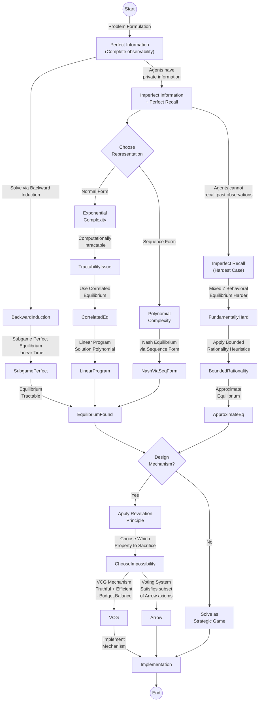

# Information Structure & Equilibrium Tractability States

```mermaid
flowchart TD
    Start((Start)) -->|Problem Formulation| PerfectInfo

    PerfectInfo["Perfect Information<br/>(Complete observability)"]
    PerfectInfo -->|Solve via Backward Induction| BackwardInduction
    BackwardInduction -->|Subgame Perfect Equilibrium<br/> Linear Time| SubgamePerfect

    PerfectInfo -->|Agents have<br/>private information| ImperfectInfo

    ImperfectInfo["Imperfect Information<br/>+ Perfect Recall"]
    ImperfectInfo --> RepresentationChoice{"Choose<br/>Representation"}

    RepresentationChoice -->|Normal Form| NormalFormComp["Exponential<br/>Complexity"]
    RepresentationChoice -->|Sequence Form| SequenceForm["Polynomial<br/>Complexity"]

    SequenceForm -->|Nash Equilibrium<br/>via Sequence Form| NashViaSeqForm

    NormalFormComp -->|Computationally<br/>Intractable| TractabilityIssue
    TractabilityIssue -->|Use Correlated<br/>Equilibrium| CorrelatedEq
    CorrelatedEq -->|Linear Program<br/>Solution Polynomial| LinearProgram

    ImperfectInfo -->|Agents cannot<br/>recall past observations| ImperfectRecall

    ImperfectRecall["Imperfect Recall<br/>(Hardest Case)"]
    ImperfectRecall -->|Mixed ≠ Behavioral<br/>Equilibrium Harder| FundamentallyHard

    SubgamePerfect -->|Equilibrium<br/>Tractable| EquilibriumFound
    LinearProgram --> EquilibriumFound
    NashViaSeqForm --> EquilibriumFound

    FundamentallyHard -->|Apply Bounded<br/>Rationality Heuristics| BoundedRationality
    BoundedRationality -->|Approximate<br/>Equilibrium| ApproximateEq

    EquilibriumFound --> MechanismDesign{"Design<br/>Mechanism?"}
    ApproximateEq --> MechanismDesign

    MechanismDesign -->|Yes| RevealTruth["Apply Revelation<br/>Principle"]
    RevealTruth -->|Choose Which<br/>Property to Sacrifice| ChooseImpossibility
    ChooseImpossibility -->|VCG Mechanism<br/> Truthful + Efficient<br/>- Budget Balance| VCG
    ChooseImpossibility -->|Voting System<br/> Satisfies subset<br/>of Arrow axioms| Arrow

    MechanismDesign -->|No| DirectSolution["Solve as<br/>Strategic Game"]

    VCG -->|Implement<br/>Mechanism| Implementation
    Arrow --> Implementation
    DirectSolution --> Implementation

    Implementation --> End((End))
```
