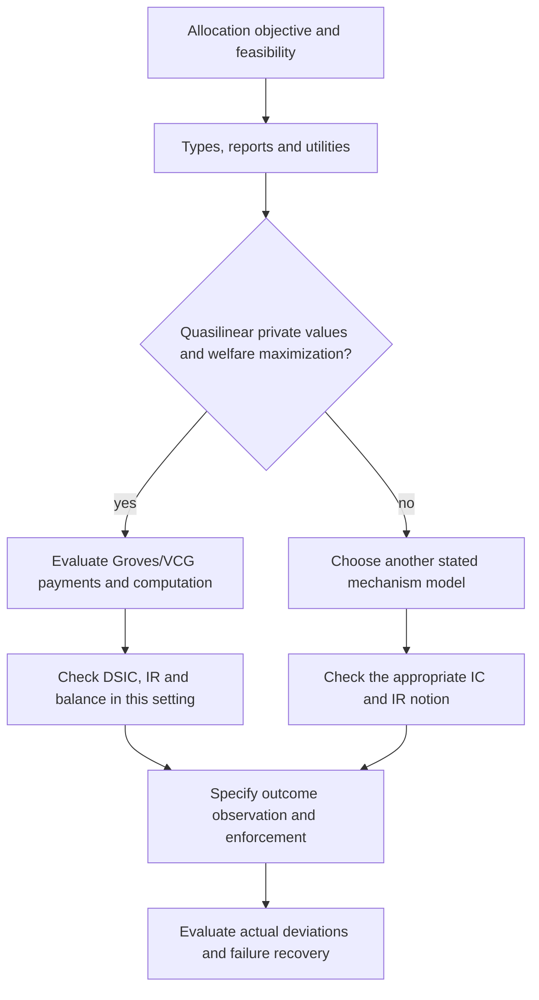

# Mechanism preconditions

```mermaid
flowchart TB
  O[Allocation objective and feasibility] --> T[Types, reports and utilities]
  T --> Q{Quasilinear private values and welfare maximization?}
  Q -->|yes| V[Evaluate Groves/VCG payments and computation]
  Q -->|no| D[Choose another stated mechanism model]
  V --> B[Check DSIC, IR and balance in this setting]
  D --> I[Check the appropriate IC and IR notion]
  B --> E[Specify outcome observation and enforcement]
  I --> E
  E --> R[Evaluate actual deviations and failure recovery]
```

VCG is a conditional construction, not a default branch; budget behavior and participation conditions must be checked in the stated setting.
