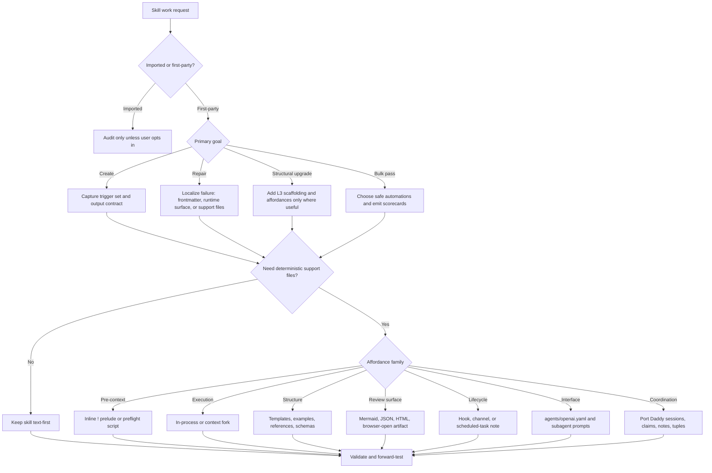

# Skill Architect

The doctrine skill for turning skill ideas into runtime-correct, validator-clean, expert-grade bundles.

## NOT for

- Generic coding help unrelated to skills.
- Writing one-off prompts with no intention of reuse.
- Pretending a new MCP server, plugin, or channel is "just a skill" when it is actually a different primitive.

## Source Hierarchy

Resolve disagreements in this order:

1. Official Claude Code docs for runtime truth.
2. Repo validators and migration scripts for local authoring constraints.
3. Workgroup source-of-truth rules for shared skills, then repo-local doctrine
   for L1/L2/L3, CTA, ShadowBox contrast, Mermaid selection, and affordance
   discipline.

Do not blur platform capability with repo convention. A feature can be valid in Claude Code and still be the wrong default for this library.

If a workgroup copy exists, treat it as authoritative. Merge useful local
deltas into that copy first, then mirror validated results into repo-local and
user-level skill locations.

## Non-Negotiables

- Treat imported or third-party skills as read-only unless the user explicitly opts them into mutation.
- Update `CHANGELOG.md` for every first-party skill mutation in this repo.
- Keep both `metadata.provenance` and `metadata.authorship` present on first-party skills so dossiers and UI chrome can attribute ownership cleanly.
- Keep `SKILL.md` lean; move depth into `references/`, `scripts/`, `templates/`, `examples/`, or `assets/`.
- Add `agents/openai.yaml` for first-party skills that are meant to be browsed,
  chipped, synced, or distributed beyond a one-off local draft.
- Use the smallest affordance set that materially improves execution. Optional features are not badges.
- When a skill will delegate work, include concrete subagent prompt assets under
  `agents/` and explicit ownership, cost, validation, and handoff contracts.
- In Port Daddy repos, coordinate skill mutations with sessions, notes,
  file claims/locks, tuples when useful, and handoff evidence.
- Do not weaken the validator to accept bad structure. Fix the skill instead.

## Primary Decision Tree



## Runtime Truths You Must Encode Correctly

### Official skill surface

- Skill `name` may use lowercase letters, numbers, and hyphens only, up to 64 characters. Numbers are allowed.
- `description` and `when_to_use` are combined and truncated in the skill listing at 1,536 characters.
- `allowed-tools` pre-approves tools while the skill is active; it does not restrict the full tool set.
- `disable-model-invocation: true` makes the skill user-invoked only.
- `user-invocable: false` hides the skill from the `/` menu while still allowing model invocation.
- `paths` limits automatic loading to matching files.
- `shell` controls `!` preprocessing shell choice and only matters when the runtime actually uses native shell preprocessing.

### String substitution and preprocessing

- Supported substitutions include `$ARGUMENTS`, indexed `$ARGUMENTS[N]`, `$0`, `$1`, `${CLAUDE_SESSION_ID}`, and `${CLAUDE_SKILL_DIR}`.
- Inline `!command` and fenced ````!` blocks are preprocessing. They execute before Claude sees the rendered skill content.
- `${CLAUDE_SKILL_DIR}` is the canonical way to reference bundled scripts or files from preprocessing commands.
- Use `!` only when runtime state genuinely matters. Do not add shell preludes decoratively.

### Skill lifecycle

- Skill descriptions stay available for discovery.
- Invoked skill bodies persist in-session after invocation.
- On compaction, Claude reattaches the most recent invocation of each skill, keeping up to the first 5,000 tokens per skill with a combined 25,000-token budget.
- This means overloaded `SKILL.md` files silently lose the tail during long sessions. Keep core logic early and keep the file lean.

### Subagents and forks

- `context: fork` runs the skill as a task prompt inside a subagent context.
- The forked subagent does not inherit the parent conversation history.
- The `agent` field selects which subagent configuration executes the task.
- Subagents with a `skills` field preload full skill content at startup; they do not inherit skills from the parent conversation.
- Plugin subagents ignore `hooks`, `mcpServers`, and `permissionMode`.

### Hooks, channels, scheduled tasks

- Hooks are valid runtime features for skills and agents, but in this repo they should usually be recorded under `metadata.runtime` unless a distribution copy truly needs native top-level `hooks`.
- Channels are research-preview MCP push integrations into a running local session. They are not a skill frontmatter field.
- Scheduled tasks are adjacent automation surfaces, not skill frontmatter. Distinguish local/Desktop, cloud/web, and `/loop`.

## Canonical Frontmatter for This Repo

Keep top-level frontmatter minimal in `some_claude_skills`:

- `name`
- `description`
- `license`
- `allowed-tools`
- `metadata`

Everything custom belongs under `metadata`, especially:

- `category`
- `tags`
- `pairs-with`
- `badge`
- `provenance`
- `authorship`
- deprecation or privacy flags
- runtime intent such as hooks, channels, scheduled-task notes, model/fork preference, or review-surface choice

For first-party skills, default `metadata.authorship.maintainers` to the owning library or team, and capture `metadata.authorship.authors` only when the original author signal is known. Only surface native top-level runtime keys in a distribution copy when the runtime behavior depends on them. Record the intent in `metadata.runtime` first so the repo copy stays clean.

## L1, L2, L3: The Upgrade Standard

- **L1**: objects, inputs, states, constraints, failure boundaries, environment.
- **L2**: conceptual distinctions, mechanisms, categories, vocabulary, discriminations.
- **L3**: cues, thresholds, tradeoff logic, expert recovery moves, sequencing, contrastive judgment, mental simulation.

Weak skills stop at L1 or L2. Real structural-upgrade work adds L3 without drowning the skill in textbook prose.

When extracting expertise:

- Use concrete cases and near misses.
- Ask what a novice would overlook.
- Ask what cue changed the expert's mind.
- Capture minority expert rationale when experts disagree.
- Prefer contrastive examples over generic "best practices" prose.
- Shibboleth: if a proposed affordance sounds impressive but does not change runtime behavior, review quality, or determinism, it probably does not belong.

## Structural Upgrade Target Shape

First-party skills should usually converge toward:

- Decision points
- Failure modes
- Worked examples
- Quality gates
- Explicit NOT-for boundaries
- Mermaid only when it clarifies structure better than prose
- Support files only when they improve determinism, reuse, or evaluation
- `agents/openai.yaml` when the skill should appear cleanly in UI skill lists,
  chips, or user-level catalogs
- Subagent prompt assets when delegation is a normal path, not an edge case
- Schemas when plans, reports, scorecards, or contracts must be machine-checked
- Visual decision boards or HTML reports when human review changes execution
- Eval fixtures when scripts, validators, or activation boundaries need proof

The point is not ceremony. The point is reusable judgment.

## Affordance Selection

Choose explicitly across these families:

| Family | Options | Use when |
|---|---|---|
| `preContext` | none, inline `!`, preflight script | runtime state must be sampled before reasoning |
| `executionMode` | in-process, `context: fork`, parallel agents | isolation or independent reasoning materially helps |
| `structure` | none, references, templates, examples | shape or knowledge would otherwise bloat `SKILL.md` |
| `reviewSurface` | none, markdown, JSON, Mermaid, HTML, browser-open | a specific artifact improves inspection or handoff |
| `automation` | none, script, hook | a deterministic action is better than prose |
| `runtimeAdjacency` | none, channel note, scheduled-task note | the skill participates in a broader automation surface |
| `interface` | none, `agents/openai.yaml`, icons/assets | the skill is browsed, selected, or synced as a product surface |
| `coordination` | none, Port Daddy notes/claims/tuples/channels | multiple agents, sessions, or mirrors must stay coherent |

Guidelines:

- Default to in-process.
- Default to no browser-open artifact unless a human really benefits.
- Use templates when output regularity matters.
- Use examples when trigger boundaries or output shape are subtle.
- Use references when depth is real and not always needed.
- Use Port Daddy primitives when a skill is edited inside a Port Daddy worktree
  or synced across workgroup, repo, and user-level locations.
- Concrete Port Daddy primitives include `pd status`, `pd briefing`,
  `pd salvage`, `pd session start`, `pd note`, file claims/locks, and tuples.

## Visual Artifacts and Mermaid

Mermaid is not just flowcharts. Choose the type by information shape:

- `sequenceDiagram` for protocols and turn-taking
- `stateDiagram-v2` for lifecycle and status transitions
- `flowchart` for branching decisions
- `erDiagram` or `classDiagram` for structured relationships
- `journey`, `timeline`, `gantt`, `mindmap`, `gitGraph`, `pie`, `quadrantChart`, `xychart-beta`, `sankey-beta`, or `architecture-beta` when those shapes fit better

Rules:

- Validate Mermaid after writing it.
- Prefer stable Mermaid types first.
- Render or open previews only when visual inspection changes the quality of the review.
- For many skills, raw Mermaid in `SKILL.md` is enough.

## Bulk Upgrade Playbook

When upgrading many skills:

1. Recover first from the best existing source: structural proposal, worktree bundle, then CTA overlay.
2. Skip imported, deprecated, wrapper, or explicitly protected skills.
3. Normalize frontmatter before adding new structure.
4. Run safe structural passes before creative writing passes.
5. Add support files only with heuristics that are low-risk at scale:
   - reference indexes
   - scorecards
   - `agents/openai.yaml` for first-party discoverability
   - subagent prompt assets for delegated workflows
   - schemas for machine-checked contracts
   - visual decision board templates for user-approved work
   - deterministic audit scripts and small eval fixtures
   - explicit templates/examples for meta-skills and strongly structured skills
6. In Port Daddy repos, record the migration in a session note, claim the skill
   paths, and emit a tuple or handoff when another mirror must be updated.
7. Validate every changed skill and revert on failure.
8. Emit machine-readable scorecards so progress is inspectable.

## Quality Gates

- Runtime claims match current Claude docs.
- Repo copies use canonical top-level frontmatter only.
- Imported bundles were not mutated without permission.
- First-party skills carry both `metadata.provenance` and `metadata.authorship`.
- Description is specific and has a strong NOT-for clause.
- `SKILL.md` stays under 500 lines or pushes depth into support files.
- References are indexed and loaded conditionally, not by "read everything first".
- L1, L2, and L3 are present where the task warrants them.
- Mermaid type matches the information shape and validates.
- Scripts, templates, examples, hooks, channels, scheduled-task notes, and browser-open artifacts are justified, not ornamental.
- `agents/openai.yaml` is present for first-party distributed skills and matches
  the current skill purpose.
- Subagent assets have narrow scopes, explicit input/output contracts, no-revert
  rules, and validation gates.
- Machine-readable contracts have schemas or deterministic validators when drift
  would be costly.
- Workgroup, repo-local, and user-level skill copies are synced or explicitly
  documented as intentionally divergent.
- `CHANGELOG.md` reflects the change.
- The skill was forward-tested with positive and negative trigger cases.

## Runtime Resources

Load only what the decision in front of you needs:

- `references/claude-code-runtime.md`: official runtime surface, frontmatter, string substitution, preprocessing, lifecycle, and docs URLs.
- `references/channels-and-scheduling.md`: how channels, local tasks, remote tasks, and `/loop` relate to skills.
- `references/subagent-design.md`: fork semantics, subagent preload rules, isolation, and permission considerations.
- `references/expertise-elicitation.md`: ACTA, CDM, ShadowBox, and L3 extraction methods.
- `references/description-guide.md`: activation and trigger writing.
- `references/activation-debugging.md`: undertrigger, overtrigger, and collision diagnosis.
- `references/self-contained-tools.md`: scripts, templates, examples, assets, and tool bundling decisions.
- `references/visual-artifacts.md`: Mermaid type selection, validation, and browser-open guidance.
- `references/scoring-rubric.md`: scorecard dimensions for structural-upgrade triage.
- `references/advanced-structure-and-sync.md`: agents/openai.yaml, subagent
  assets, schemas, visual review surfaces, eval fixtures, and Port Daddy-grounded
  workgroup/repo/user-level sync rules.
- `templates/skill-scorecard.json`: machine-readable per-skill scorecard skeleton.
- `templates/runtime-export-frontmatter.yaml`: projecting repo intent into a Claude-runtime export copy.
- `templates/visual-decision-board.md`: human review board for choices that must
  be approved before execution.
- `templates/skill-sync-plan.md`: workgroup/repo/user-level sync plan shape.
- `schemas/skill-sync-plan.schema.json`: machine-checkable sync plan contract.
- `examples/structural-upgrade-example.md`: concrete first-party upgrade pattern.
- `examples/runtime-export-example.md`: when to keep data in `metadata.runtime` versus surfacing native keys.
- `agents/openai.yaml`: UI metadata example for a first-party distributed skill.
- `agents/cross-evaluator.md`: independent evaluator prompt for cross-checking
  structural upgrades.
- `agents/affordance-planner.md`: subagent prompt for choosing support assets.
- `agents/sync-coordinator.md`: subagent prompt for workgroup/repo/user-level sync.
- `scripts/validate_skill.py`: canonical repo validator.
- `scripts/check_self_contained.py`: detect phantom references and orphaned support files.
- `scripts/validate_mermaid.py`: validate Mermaid structure.
- `scripts/audit_skill_operating_system.py`: heuristic audit for advanced
  affordances such as UI metadata, subagent assets, and phantom support files.
- `scripts/init_skill.py`: scaffold a repo-conformant skill directory.
