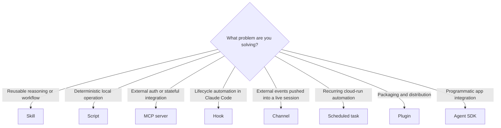

# Claude Extension Taxonomy

Choose the lightest extension primitive that solves the real problem.

## The Current Taxonomy

## Quick Comparison

| Primitive | Use when | Do not use when |
|---|---|---|
| Skill | You need reusable reasoning, instructions, checklists, or domain expertise | The main need is auth, lifecycle automation, or deterministic computation |
| Script | The same operation should run deterministically and locally | You need external credentials or long-lived state |
| MCP server | You need auth, remote IO, shared state, or protected credentials | A short local script is enough |
| Hook | A Claude Code lifecycle event should trigger deterministic logic | The problem is really a reusable reasoning playbook |
| Channel | External systems must push events into a running local session | A polling or scheduled solution is enough |
| Scheduled task | Work should recur on a timer in the web/cloud surface | The work is inherently local, interactive, or ad hoc |
| Plugin | You need namespacing, bundling, or distribution | You only need a private local skill |
| Agent SDK | You are embedding Claude Code capabilities into an application or CI system | A plain local skill or plugin is enough |

## Important Nuances

- Custom commands are effectively skills in Claude Code.
- Skills can instruct Claude how to use hooks, channels, or scheduled tasks, but that does not make those features part of the skill itself.
- Plugins package other extension types; they are not the behavior itself.
- Channels and scheduled tasks solve different problems:
  - channels react to pushed events in a live local session
  - scheduled tasks run recurring work in a fresh cloud sandbox

## Repo Stance

In `some_claude_skills`, default to:

1. skill
2. script
3. MCP server
4. hook
5. channel or scheduled task

Only climb the stack when the lower primitive is insufficient.
