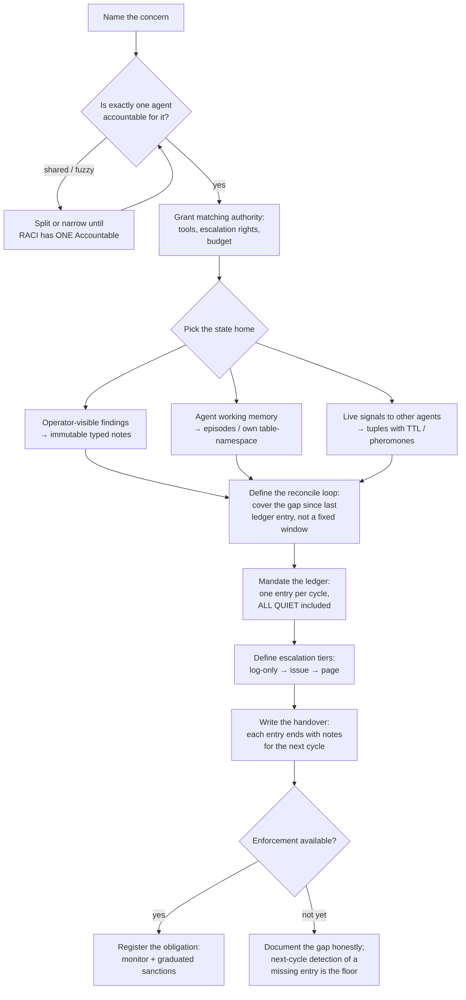

# Solely Responsible Agent: Design One Owner Per Concern

Things nobody owns, nobody does. An error message can flood a project's
message traffic for weeks with a dozen agents active — because every
agent's job description says "do your task," and no agent's says "read
the traffic." This skill designs agents whose entire identity is one
concern of one project: the avatar, the officer of the watch, the test
warden. One agent, one concern, exclusive ownership, durable state,
mandatory logging, real enforcement.

## Philosophy

**Responsibility = scope + authority + state + ledger + enforcement.**
Miss any one and the responsibility is decorative:

- Scope without exclusivity → shared accountability, which disappears
  ("each assumes the other is watching").
- Authority withheld → the responsibility trap: blame rolls downhill,
  control stays up.
- No private state → the agent starts blind every run; it can detect
  events but never *trends*.
- No mandatory ledger → a silent agent is indistinguishable from a
  dead one.
- No enforcement → the obligation is a prompt suggestion. Prompts are
  suggestions; code is enforcement.

The strongest precedent is 400 years old: the ship's **officer of the
watch** has exclusive scope (this watch period), real authority (can
alter course, must wake the captain per standing orders), a mandatory
append-only log (the deck log, signed, never torn out, admissible as
evidence), and a handover ceremony (brief the relief, record it).

## Design Process

### Step details

1. **Name the concern as a question.** "Did anything land in this
   project's logs that a human would want to know?" is ownable.
   "Help with quality" is not. The agent's telos is the question; its
   ledger is the running answer.
2. **One Accountable.** RACI's hard rule. If two agents could both
   plausibly own it, neither does. Carve until exclusive.
3. **Authority matches scope.** A watcher that cannot open an issue or
   page the operator is responsibility-without-authority. Grant the
   minimum tools that let it discharge the duty end-to-end.
4. **State home by audience** (the three-audience rule):
   - *Operator must read it* → immutable, typed, append-only notes.
   - *The agent itself needs it next run* → episodic memory or its own
     table/schema namespace (database-per-agent, enforced at the
     storage or API layer, not by politeness).
   - *Other agents should react now* → tuple space with TTL, or
     evaporating pheromones for ambient urgency.
5. **Reconcile, don't poll windows.** Cover `last-ledger-entry .. now`.
   A missed cycle widens the next window instead of creating a blind
   spot (level-triggered, like a Kubernetes controller).
6. **The ledger is the proof of life.** One entry per cycle, no
   exceptions. ALL QUIET is a valid entry; absence of an entry is
   itself a finding for the next cycle.
7. **Escalation in tiers**, by class not occurrence: 347 identical
   errors is one finding with a count. Tier 1 log-only, Tier 2 durable
   issue (deduped by title), Tier 3 page the human.
8. **Handover.** Each entry ends with what the next cycle should look
   at first. The log exists so the relief doesn't start blind.
9. **Enforcement.** Best: a daemon-side obligation monitor evaluates
   "ledger entry exists for every cycle" and sanctions on a graduated
   ladder (warn → throttle → slash → exile, per Ostrom). Until that
   exists, say so in the contract — an honestly-documented gap beats a
   pretended guarantee.

## Anti-Patterns (shibboleths)

### Responsibility Without Authority
**Novice**: "Add a watcher agent that reports problems to a channel."
**Expert**: A report nobody is obliged to read is the original bug
with extra steps. The watcher must own the escalation surface the
human actually looks at (issues, pages), and its contract must forbid
silent-channel-only output.
**Timeline**: Pub/sub-findings-channels were the 2024-25 default in
agent fleets; teams that audited them found operators never read
them, and retooled to edit-in-place PR comments and deduped issues.

### Shared Accountability
**Novice**: "qa, code-reviewer, and the new sentinel all watch for
errors — defense in depth!"
**Expert**: Defense in depth is for *controls*, not *accountability*.
Three agents who could each plausibly own a concern means each
assumes another saw it. Exactly one Accountable; others may be
Consulted or Informed.
**Timeline**: RACI has enforced "one A per row" since the 1950s;
LLM-agent fleets rediscovered the responsibility vacuum around 2025.

### The Stateless Watchman
**Novice**: "The agent runs every hour and checks the last hour of
logs."
**Expert**: Fixed windows + no state = blind spots on missed runs and
no trend detection (it can see an error, never a *flood that started
Tuesday*). Reconcile from the last ledger entry, and persist working
memory so run N+1 knows what run N was monitoring.
**Timeline**: Stateless cron-prompt agents were the 2024 pattern;
database-backed stateful agents (MemGPT→Letta lineage) made private
persistent memory the norm by 2026.

### Prompt-Only Obligation
**Novice**: "The prompt says it MUST write a log entry every run."
**Expert**: Prompts are suggestions; code is enforcement. The floor is
making a missing entry *detectable* (next cycle flags it); the bar is
a daemon-side monitor that evaluates the obligation and sanctions the
agent's durable identity (one that survives re-registration).
**Timeline**: 2026's accountability work (commitment stores, oracle-
backed closure, non-forgeable actor ids) exists precisely because
prompt-level obligations failed quietly at scale.

## Worked Example: officer-of-the-watch (port-daddy)

The first instantiation of this pattern. Motivating incident: "File
not found: ollama/qwen2.5-coder" errors flooded the project's MESSAGE
TRAFFIC UI for weeks, unread, while a dozen task-focused agents worked
around them.

- **Concern**: "Did anything land in logs/traffic a human would want
  to know?" — owned by exactly one ship.
- **Cadence**: `0 */4 * * *` — six 4-hour maritime watches/day; each
  covers the gap since the last deck-log entry.
- **State**: deck log = immutable `pd note` rows prefixed
  `watch-log:` (operator-visible ledger); tuples for live handover
  signals; GitHub issues (label `watch:finding`, deduped by title)
  as the escalation surface.
- **Ledger rule**: every watch writes an entry, ALL QUIET included.
- **Honest gaps**: episodic memory was read-only over HTTP at design
  time (deck log uses notes instead); the obligation monitor
  (ADR-0041) wasn't built (missing-entry detection by the next watch
  is the documented floor).

Full contract: `fleet/ships/officer-of-the-watch.md` in the
port-daddy repo. Read it before instantiating an avatar elsewhere —
it is the reference implementation of this skill.

## Expanding existing agents into sole owners

Read [references/role-expansion-playbook.md](references/role-expansion-playbook.md)
when promoting an existing agent. The test: rewrite its telos as an
ownable question, name its ledger, name its state home, and delete
every overlapping duty from other agents' prompts.

## Quality Gates

- [ ] The concern is phrased as a question one agent can own
- [ ] RACI check: no other agent's prompt plausibly covers this concern
- [ ] Authority granted matches the duty (tools, escalation rights)
- [ ] All three state audiences mapped (operator / self / other agents)
- [ ] Reconcile loop covers gap-since-last-entry, not fixed windows
- [ ] Ledger entry mandatory every cycle, ALL QUIET included
- [ ] Escalation tiers defined; findings grouped by class with counts
- [ ] Each ledger entry ends with handover notes
- [ ] Enforcement stated honestly: monitor + sanctions, or documented gap
- [ ] The agent reports — repair is dispatched, not done from the watch

## References

- [references/sole-responsibility-patterns.md](references/sole-responsibility-patterns.md)
  — load when you need the underlying literature: MAPE-K, Kubernetes
  reconcile/ownership, BDI belief bases, naval command & deck logs,
  ICS, RACI, single-writer, commitment-based MAS, MemGPT/Letta memory
  tiers, event sourcing, escalation/handover protocols. Cited.
- [references/port-daddy-state-surfaces.md](references/port-daddy-state-surfaces.md)
  — load when instantiating in port-daddy (or any pd-daemon repo):
  the full inventory of writable state surfaces (notes, tuples,
  episodes, transcripts, inbox, pheromones, graph edges), trigger
  mechanisms, accountability ADRs (0040/0041/0045/0050), and the
  gaps that need new code.
- [references/role-expansion-playbook.md](references/role-expansion-playbook.md)
  — load when converting an existing agent (test-hunter, spark,
  spider, gardener…) into a true sole owner.

## NOT-FOR Boundaries

**This skill should NOT be used for**:
- One-shot task agents (no standing concern → no avatar; just dispatch)
- Choosing orchestration topology for a fleet (use multi-agent-coordination)
- Writing or auditing skills themselves (use skill-architect)
- General prompt engineering or agent persona writing
- Incident *response* runbooks (this designs the watcher, not the firefighter)
