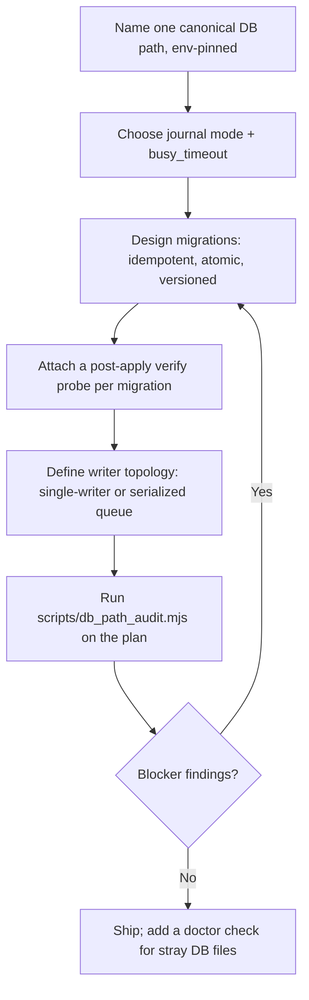

# SQLite Durable Agent State

Design local SQLite state for multi-agent daemons and CLIs that survives `brew upgrade`, npm reinstall, concurrent writers, and crashes — and recover when it already hasn't.

## Use This For

- Picking a canonical SQLite path for a daemon/CLI pair, pinned by one env var, before the first line of storage code is written.
- Choosing journal mode (WAL vs DELETE) and `busy_timeout` for a daemon with a CLI, a snapshot exporter, and a web API all touching the same DB.
- Designing idempotent, atomic migrations with a real post-apply verification probe instead of trusting a migration-history "applied" row.
- Reviewing a `pd-fleet.yml`, ADR, or storage design doc before it reintroduces a Cellar-path, per-worktree, or per-tool-default DB regression.
- Diagnosing an already-fragmented multi-`.db` mess where CLI/snapshot/export tooling see different counts for the same entity.

## Do Not Use This For

- General relational schema design, indexing strategy, or query tuning — that's data modeling, not durability engineering.
- Postgres/MySQL server-based durability, where WAL, replication, and connection pooling mean something structurally different.
- Deciding whether SQLite is the right engine versus a client-server DB — this skill assumes SQLite is already the choice for a local, mostly-single-daemon store.

## Durability Design Loop

1. Name exactly one canonical path, resolved by every reader and writer through the same env var (e.g. `PORT_DADDY_DB`). No per-tool fallback default — that is how CLI/snapshot/export tooling end up reading three different files.
2. Choose journal mode: `WAL` for a single writer with concurrent readers (the common daemon shape); `DELETE`/`TRUNCATE` only for a genuinely single-connection tool.
3. If `WAL`, set `PRAGMA busy_timeout` (2000-5000ms floor) on every connection open. WAL gives reader/writer concurrency, not writer/writer concurrency — without a timeout, contention becomes `SQLITE_BUSY` crash-loops, not graceful waits.
4. Write migrations as idempotent, transaction-wrapped SQL. If a "migration" spans two SQLite files (hot + tiering), treat the cross-file write as non-atomic by default and design an intent log or single-file merge — this is the literal WAL+WAL crash-loop failure mode.
5. Attach a post-apply verification probe to every migration that queries the actual target table/column, not the migration-history table. `migration repair --status applied` (or any equivalent) only rewrites history bookkeeping; it never runs SQL.
6. Declare writer topology explicitly: `single-writer`, `queue`, or `serialized`. More than one writer with no strategy is how upserts silently vanish across concurrent, non-serialized writes.
7. Run `scripts/db_path_audit.mjs` on the assembled plan before shipping. Any blocker finding means don't ship yet.

## Output Contract

`scripts/db_path_audit.mjs` returns:

- `pass` — boolean; false if any `blocker`-severity finding exists.
- `summary` — candidate/canonical path counts, migration verification counts, writer strategy, blocker/warning counts.
- `findings[]` — `{ severity: "blocker"|"warning", code, message, detail }` per issue, keyed to a stable `code` (e.g. `CELLAR_PATH_STORAGE`, `PATH_FRAGMENTATION`, `WAL_NO_BUSY_TIMEOUT`, `MIGRATION_NO_VERIFY`, `CONCURRENT_WRITERS_UNSAFE`).
- `recommendations[]` — concrete next actions, not restatements of the findings.

Use `scripts/db_path_audit.mjs` to validate a `db-plan.schema.json`-shaped plan before shipping a daemon path change or migration.

## Anti-Patterns

### Cellar/Version Path As Home

**Novice**: Lets the DB default resolve inside a Homebrew Cellar, an `nvm`/`pyenv` version directory, or `node_modules` because that's where the running binary already lives.
**Expert**: Pins the canonical path to a dotfile-home or app-support directory via a single env var, independent of the installed tool's version — so `brew upgrade`/reinstall never touches it.
**Detection**: The raw candidate path string (not the self-declared `kind` field) matches `/Cellar/`, a version-manager `versions/` segment, `node_modules/`, or a cache/tmp/worktree directory.

### Migration History Is Not Migration

**Novice**: Runs `migration repair --status applied` (or equivalent) after a migration mismatch and treats the green output as proof the schema changed.
**Expert**: Runs the migration SQL directly, then queries the actual target table/column to confirm it exists before trusting the history table's "applied" state.
**Detection**: A migration entry has no `postVerify` probe, or the probe only re-reads the migrations/history table instead of the target schema object.

### WAL Makes Concurrency Free

**Novice**: "We're in WAL mode, so the daemon and three CLIs can all write whenever they want."
**Expert**: Sets `busy_timeout` and routes writes through one process or a serialized queue; WAL buys reader/writer concurrency, not writer/writer concurrency.
**Detection**: `writerTopology` lists more than one writer with no `single-writer`/`queue`/`serialized` strategy, or `busyTimeoutMs` is 0/unset while `journalMode` is `wal`.

## References

| File | Load When |
| --- | --- |
| `references/durable-path-and-wal-discipline.md` | Choosing a canonical path, journal mode, busy_timeout, or designing a migration and its verification probe. |
| `references/fragmented-multidb-recovery.md` | The fragmentation already happened: diagnosing scattered `.db` files and planning a safe consolidation. |
| `examples/expected-output.md` | Need a finished, filled-in audit report and consolidation note for a realistic scenario. |
| `templates/output-template.md` | Need a reusable template for a db-plan review or consolidation writeup. |
| `schemas/db-plan.schema.json` | Need to validate a `--input` plan's shape before running the script. |
| `scripts/db_path_audit.mjs` | Need deterministic path/WAL/migration/writer-topology scoring. |
| `agents/openai.yaml` | Need a subagent descriptor for delegated durable-state review. |

<!-- BEGIN BUNDLE INDEX (auto: index_references.py) -->

## Skill Bundle Index

*Every file in this skill, and when to open it. Auto-generated; run `scripts/index_references.py --fix`.*

**root**
- [`CHANGELOG.md`](CHANGELOG.md) — SQLite Durable Agent State — Changelog — - Initial skill creation - Core process defined - Reference files and deterministic db_path_audit.mjs script added
- [`README.md`](README.md) — SQLite Durable Agent State — Procedural guidance and a deterministic auditor for local SQLite state that must survive package upgrades, concurrent writers, and crashes.

**`agents/`**
- [`agents/openai.yaml`](agents/openai.yaml) — openai (data/schema)

**`examples/`**
- [`examples/expected-output.md`](examples/expected-output.md) — Example Output: SQLite Durable Agent State — A daemon's storage plan is under review before a release.
- [`examples/sample-input.json`](examples/sample-input.json) — sample input (data/schema)

**`references/`**
- [`references/durable-path-and-wal-discipline.md`](references/durable-path-and-wal-discipline.md) — Durable Path Selection And Journaling Discipline — Use this when choosing where a daemon's SQLite file lives, which journal mode it runs in, and how migrations get applied and verified.
- [`references/fragmented-multidb-recovery.md`](references/fragmented-multidb-recovery.md) — Diagnosing And Consolidating An Already-Fragmented Multi-DB Mess — Use this when the damage is already done: several `.db` files exist, different tools report different counts for "the same" data, and nobody

**`schemas/`**
- [`schemas/db-plan.schema.json`](schemas/db-plan.schema.json) — db plan.schema (data/schema)

**`scripts/`**
- [`scripts/db_path_audit.mjs`](scripts/db_path_audit.mjs)

**`templates/`**
- [`templates/output-template.md`](templates/output-template.md) — SQLite Durable State Review — [db name] — - Env pin: `[ENV_VAR_NAME]` - Canonical path: `[path]` - Non-canonical/fossil paths found: `[path list, or none]` | Setting | Value | Ration

<!-- END BUNDLE INDEX -->
