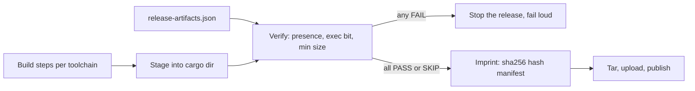

# Stage Release Artifact

A release cargo is the directory that gets tarred, uploaded, and installed:
every binary, script, and asset a user's `brew install` or `curl | bash`
depends on. The recurring failure mode is not that a build *fails* -- it's
that a build *succeeds* while one artifact that should have landed in the
cargo silently doesn't, and nobody notices until an installer breaks in
production. This skill teaches the pattern that closes that gap: a single
declarative manifest naming every required artifact, one verify step that
fails loud instead of dropping silent, and one imprint step that
content-hashes the sealed cargo so downstream consumers can prove what they
received matches what was built.

**Grounding incident** (this repo, `.github/workflows/release.yml`):
`pd-bosun`, the daemon's out-of-process supervisor, shipped absent from the
release tarball for multiple releases. `brew install port-daddy` succeeded;
the daemon installed with no watchdog; a dead daemon never restarted. The
fix that shipped was one hand-added line:

```bash
test -s dist/pd-bosun
```

That line is correct and it is also the anti-pattern this skill exists to
retire: it covers exactly one artifact, was added only *after* that
artifact broke in production once, and the next artifact added to the
release (a new signing helper, a new platform binary) gets no such
protection unless someone remembers to hand-write another line for it.

## When to use

- You're staging build output from one or more toolchains (Bun/TypeScript,
  Cargo, a shell script, a signing step) into a single release cargo.
- A release has shipped with a missing, empty, or non-executable binary
  before -- or you want to guarantee it never will.
- You're adding a new required artifact to an existing release process and
  want its presence enforced from day one, not after the first outage.
- You want a checksum manifest for a sealed cargo so a brew formula,
  installer, or operator can verify what they received.
- You're wiring artifact verification into a CI/CD release job and want the
  gate to be a single command with a clean exit code, not a pile of
  `if [ ! -f ... ]` steps.

## Core capabilities

### The declarative-manifest pattern

Name every required artifact **once**, in one file, as data -- not as N
scattered shell assertions written by N different people at N different
times, each only covering the one thing that broke on their watch.



A manifest entry is one JSON object: an id, where the artifact must live in
the sealed cargo (`stagedPath`), whether it's required, whether it must be
executable, and a minimum byte size. See
[`schemas/release-artifacts.schema.json`](schemas/release-artifacts.schema.json)
for the full shape and
[`examples/release-artifacts.example.json`](examples/release-artifacts.example.json)
for a worked example modeled directly on the `pd-bosun` incident above --
including a `required: false` entry for a genuinely platform-conditional
artifact, so "optional" stays an explicit, auditable decision instead of an
accidental gap.

**Why a single source of truth beats scattered checks**: a manifest is
*reviewable in one diff*. Adding a new required artifact is a one-line JSON
addition that a reviewer can see is complete, instead of a shell edit
buried in a hundred-line workflow step where a reviewer has to already know
every artifact that's supposed to exist in order to notice one is missing
from the checks. The manifest is also *queryable* -- `pd batten verify`
(proposed, PR pending; this repo's reference implementation, see below) or
this skill's own `scripts/verify_release_artifacts.mjs` can enumerate every
required artifact for documentation, dry-run against a partial build, or
diff against a previous release's manifest to see what changed.

### Fail-loud over silent-drop

The core discipline: **absence of a required artifact must be a hard
failure with a non-zero exit code**, not a warning, not a skipped step, not
a log line nobody reads. `scripts/verify_release_artifacts.mjs` in this
skill implements the minimal version:

```bash
node scripts/verify_release_artifacts.mjs release-artifacts.json --root dist/
```

Each artifact resolves to exactly one of three outcomes -- never a silent
fourth option:

- **PASS** -- present, meets `minBytes`, executable if declared executable.
- **FAIL** -- required and (missing, too small, or missing its exec bit).
  Non-zero exit. Stop the release.
- **SKIP** -- `required: false` and absent. This is the *only* sanctioned
  silence, and it's explicit in the manifest, not implicit in the checker's
  behavior.

Run this as the literal last step before the cargo is tarred or uploaded.
A verify step that runs but whose exit code nothing checks is exactly as
useless as no verify step -- wire it as a blocking CI job step, not an
informational one.

### Content-hash imprint for verifiable cargo

Verify proves the cargo is *complete*. Imprint proves the cargo is
*unmodified* between "what was built" and "what a downstream consumer
received" -- a brew formula's `sha256` field, an installer's checksum
check, an operator running `shasum -a 256 -c` before trusting a binary from
a mirror.

```bash
node scripts/imprint_release_artifacts.mjs release-artifacts.json --root dist/ --out dist/hashes.json
```

Run imprint **after** verify passes, never as a substitute for it -- a
sha256 of a cargo that's missing a required binary just proves the broken
cargo is a well-known broken cargo. The output is a small, diffable JSON
file: one sha256 + byte count per artifact, plus a generation timestamp.
Feed it into whatever your distribution channel needs (a brew formula's
`sha256`, a GitHub Release asset checksum, a `latest.json` manifest) rather
than hand-running `shasum` at publish time and pasting the result -- the
imprint step is deterministic and reviewable in the same PR as the manifest
change that produced it.

### Wiring into a release workflow

The three steps compose as sequential CI jobs (or job steps) after every
build step and before the packaging/upload step:

1. **Build** -- each toolchain's own build command, unchanged. This skill
   does not replace `cargo build`, `bun build`, or your bundler.
2. **Stage** -- copy each `sourcePath` to its `stagedPath` in the cargo
   directory. This is usually a few `cp`/`mkdir -p` lines; the manifest is
   the checklist reviewers use to confirm the stage step is complete, not
   (necessarily) the thing that executes the copy.
3. **Verify** -- `verify_release_artifacts.mjs <manifest> --root <cargo-dir>`,
   or the repo's `pd batten verify` once it lands. Blocking step; non-zero
   exit stops the workflow.
4. **Imprint** -- `imprint_release_artifacts.mjs <manifest> --root <cargo-dir> --out <hashes.json>`,
   or `pd batten imprint`. Runs only if verify passed.
5. **Package/upload** -- tar, upload to a GitHub Release, roll a brew
   formula using the imprint's hashes.

See [`references/existing-tooling-survey.md`](references/existing-tooling-survey.md)
for how this composes with (and where it improves on) `cargo package`,
`npm pack`, and GoReleaser's `checksum:` block -- read it before deciding to
hand-roll verify/imprint logic that an existing tool in your stack might
already do well for a single-toolchain build.

### `pd batten` -- this repo's reference implementation (proposed, PR pending)

Port Daddy's own release process is adopting this exact pattern natively:
a `release-artifacts.json` manifest (every binary the release must ship --
id, `sourcePath`, `stagedPath`, `required`, `executable`, `minBytes`), a
`pd batten verify` command that generalizes the scattered `test -s`
pattern shown above into one fail-loud gate, and a `pd batten imprint`
command that sha256-hashes the sealed cargo. As of this skill's authoring,
`pd batten` is in flight on a sibling branch and not yet on `main` --
treat every reference to it here as proposed, not shipped. Once it lands,
prefer it over this skill's standalone scripts for any repo that has the
`pd` CLI available; the scripts in `scripts/` remain the portable,
dependency-free reference for repos that don't.

## Anti-patterns

### Scattered ad-hoc presence checks

**Symptom:** A release workflow has grown several independent
`test -s <path>` / `[ -f <path> ]` / `ls <path> || exit 1` lines, each
added at a different time by a different author, each covering exactly one
artifact.
**Diagnosis:** Every check was added *reactively*, after that specific
artifact shipped missing and broke something in production. There is no
single place a reviewer can look to see "every artifact this release is
supposed to contain" -- the list only exists implicitly, scattered across
however many checks happen to have been written so far.
**Fix:** Collapse every scattered check into one manifest and one verify
step. The manifest is now the reviewable, complete list; adding a new
required artifact is a one-line JSON diff, not a new shell assertion
someone has to remember to write.
**Real instance:** `.github/workflows/release.yml` in this repo carries
exactly this shape today -- `test -s dist/pd-bosun`, added after a release
shipped without the daemon's supervisor binary. It is correct and it is
also the pattern to graduate out of as more artifacts are added.

### Silent-drop packaging

**Symptom:** A packaging step uses an allowlist (`files` in `package.json`,
a glob, a manual `cp` list) where a misspelled or renamed source path just
means that file doesn't appear in the output -- no error, no warning.
**Diagnosis:** The packaging tool has no concept of "this file was
*supposed* to be here." Absence and correctness look identical from the
tool's point of view.
**Fix:** Verify the *output* against an independent manifest of what's
required, after packaging runs -- don't trust the packaging step's own
silence as evidence of correctness.

### Verify step that runs but isn't checked

**Symptom:** A CI job runs a presence/verification script, but the
workflow doesn't fail when it exits non-zero (missing `set -e`, output
piped through something that swallows the exit code, or the step is marked
`continue-on-error`).
**Diagnosis:** The gate exists in name only. It produces log output a human
would have to notice and act on manually -- which is the exact failure mode
(nobody reads the logs) that motivated writing a gate in the first place.
**Fix:** The verify step's exit code must be the thing that decides whether
the release proceeds. Test this by deliberately breaking a required
artifact locally and confirming the pipeline actually stops.

### Imprint without verify

**Symptom:** A release script hashes and publishes checksums for whatever
happens to be in the cargo directory, without first confirming everything
required is actually there.
**Diagnosis:** A checksum is a promise that the bits are unmodified, not a
promise that the bits are complete. Publishing one for a broken cargo just
makes the broken cargo officially reproducible.
**Fix:** Imprint always runs after verify passes, gated on the same exit
code. Never imprint a cargo that hasn't cleared verify.

## Quality gates

- [ ] Every required release artifact is named exactly once, in one
      manifest file -- not implied by scattered shell checks.
- [ ] The manifest schema requires an explicit `required` value per
      artifact (default true is fine, but genuinely optional artifacts say
      `required: false` -- silence is never accidental).
- [ ] `minBytes` is set close to (but below) each artifact's known real
      size for anything that has ever shipped truncated or empty -- not
      left at a default of 1 byte.
- [ ] Verify runs as a blocking CI step whose non-zero exit code actually
      stops the release. You have tested this by deliberately breaking a
      required artifact and confirming the pipeline halts.
- [ ] Imprint runs only after verify passes, never in parallel with it or
      as a substitute for it.
- [ ] The imprint's hash manifest feeds the actual downstream consumer
      (brew formula sha256, installer checksum, release asset checksum) --
      it isn't generated and then ignored.
- [ ] Adding a new required artifact to the release is a manifest diff a
      reviewer can read in isolation, not a shell-script archaeology
      exercise.
- [ ] If this repo has toolchain-native packaging (a single-language
      `cargo package`/`npm pack`/GoReleaser build), you've read
      `references/existing-tooling-survey.md` and confirmed you're not
      duplicating something that tool already verifies well.

## Deterministic check

```bash
node scripts/verify_release_artifacts.mjs examples/release-artifacts.example.json --root <path-to-a-staged-cargo>
node scripts/imprint_release_artifacts.mjs examples/release-artifacts.example.json --root <path-to-a-staged-cargo> --out hashes.json
```

Both scripts are dependency-free (Node.js `node:fs`/`node:path`/`node:crypto`
only) and exit non-zero on any FAIL, so they compose directly into a CI
step's `run:` block without a wrapper. `verifyReleaseArtifacts()` and
`imprintReleaseArtifacts()` are also exported for use from a larger release
script that needs the structured result rather than the CLI's text/JSON
output.

## NOT for

- **Single-toolchain build/package mechanics** -- if a release ships builds
  from exactly one language's toolchain, prefer that toolchain's own tool
  (`cargo package`, `npm pack`, [GoReleaser](https://goreleaser.com/)) over
  hand-rolling verify/imprint logic it already provides. See
  `references/existing-tooling-survey.md`.
- **Code signing and notarization** -- a verified, hashed cargo is the
  input to a signing pipeline, not the signing pipeline itself. See
  `rust-app-distribution`.
- **General CI/CD matrix or workflow design** -- see
  `github-actions-matrix-patterns` for OS/version matrices, reusable
  workflows, and OIDC.
- **Source-level dependency or license auditing** -- this skill verifies
  that build *output* is complete and unmodified, not that dependencies are
  licensed or vulnerability-free.

## Sources

- This repo, `.github/workflows/release.yml` (the `pd-bosun` incident and
  its `test -s dist/pd-bosun` fix -- the grounding anti-pattern instance).
- GoReleaser -- *Checksum* customization, the closest existing prior art for
  a declarative-manifest-driven content-hash step. https://goreleaser.com/customization/checksum/
- `pd batten` (proposed, PR pending) -- this repo's native implementation
  of the same pattern via a first-class CLI (`release-artifacts.json`,
  `pd batten verify`, `pd batten imprint`).
