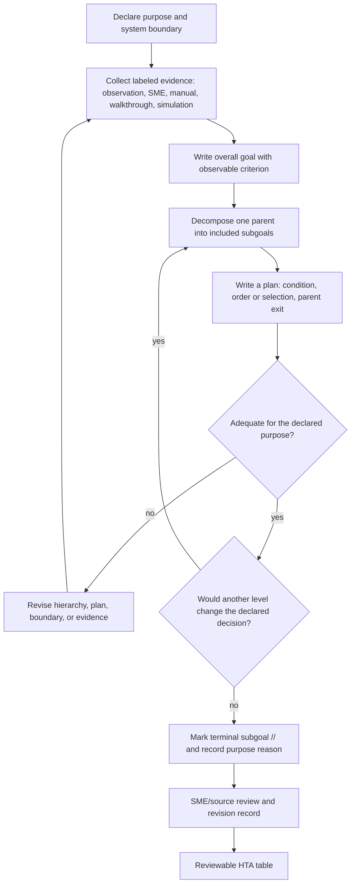

# Goal, plan, and evidence procedure

```mermaid
flowchart TD
  A[Declare purpose and system boundary] --> B[Collect labeled evidence: observation, SME, manual, walkthrough, simulation]
  B --> C[Write overall goal with observable criterion]
  C --> D[Decompose one parent into included subgoals]
  D --> E[Write a plan: condition, order or selection, parent exit]
  E --> F{Adequate for the declared purpose?}
  F -- no --> G[Revise hierarchy, plan, boundary, or evidence]
  G --> B
  F -- yes --> H{Would another level change the declared decision?}
  H -- yes --> D
  H -- no --> I[Mark terminal subgoal // and record purpose reason]
  I --> J[SME/source review and revision record]
  J --> K[Reviewable HTA table]
```

Source-faithful abstraction of Stanton (2006) §§2-3 and Figure 5. It is an analysis workflow, not a ship, software, or medical operating procedure.
