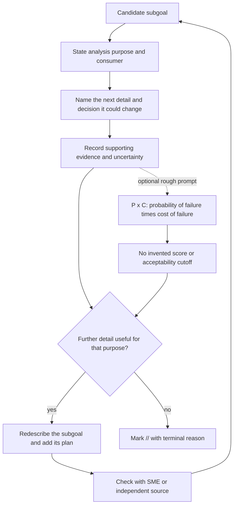

# Purpose-bounded stopping review

Stanton discusses probability of failure × cost of failure as a rough heuristic and also reports difficulty quantifying both terms. The diagram therefore makes purpose and usefulness the decision record rather than a numerical quadrant.
