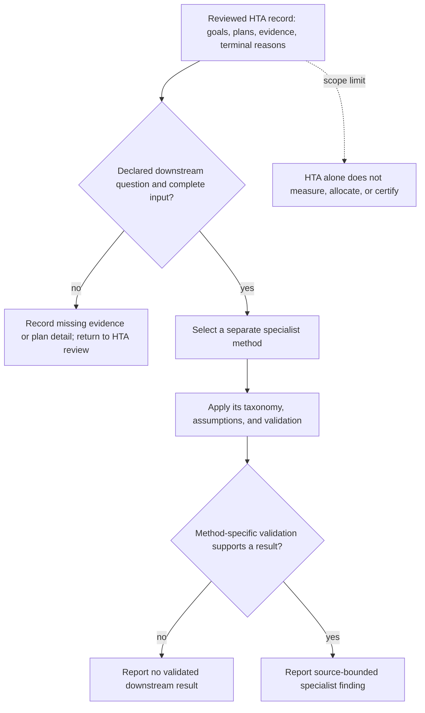

# HTA-to-specialized-analysis handoff

Stanton (2006) §§4–5 discusses these applications. The arrow is a handoff, not evidence that HTA alone completes an error, interface, workload, team, or allocation analysis.
