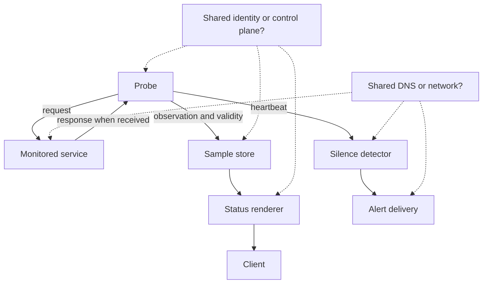

# S12 — Monitor failure-domain map

Solid arrows are requests or evidence delivery. A request timeout is observed by
the probe without a service response; classify it under the capability's rule.
Dashed arrows are audit questions, not verified independence. Record the failure
domains of every node, including collector, renderer and alert delivery. A silence
detector is useful only within its own delivery, timing and dependency assumptions.
