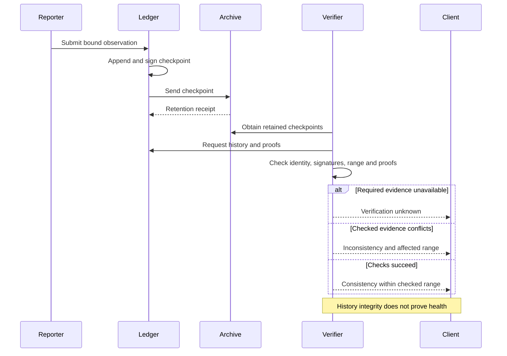

# S13 — Attestation report and verification lifecycle

This is a local design sketch. Archive custody, receipt verification and verifier
independence must be established separately. One retained view cannot exclude an
unseen conflicting view. Health classification also requires the observation's
coverage, age and semantics. A signature or successful consistency check supplies
none of those facts on its own.
