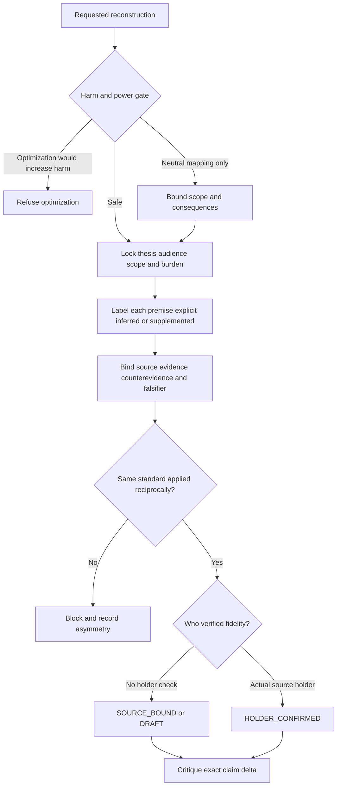

# Steel Man Argument

The goal is fidelity before criticism, not making any thesis maximally
persuasive. A strengthened premise is useful only when its origin and limits
remain visible.

## Gate before reconstruction

1. Identify the requested use: `UNDERSTAND`, `RECIPROCAL_REVIEW`, `CRITIQUE`,
   `PERSUADE`, or `JUSTIFY`.
2. Classify the harm boundary:
   - `SAFE`: normal reconstruction is allowed.
   - `BOUNDED_NEUTRAL_ONLY`: map claims and likely consequences without
     persuasive optimization or sympathetic motive invention.
   - `REFUSE_OPTIMIZATION`: refuse help that improves abuse, discrimination,
     atrocity, scams, coercion, or deceptive influence.
3. In interpersonal disputes, never infer an absent person's motives as fact.
   Record hypotheses as `inferred` with `holderWouldEndorse: UNKNOWN`.
4. Crisis, trauma, diagnosis, addiction, or treatment requests are outside this
   analytical skill. Provide ordinary safety-oriented support instead.



## Fidelity procedure

### 1. Lock the target

Record thesis, audience, scope, burden of proof, source holder when known, and
the exact source corpus. Do not strengthen support by changing the thesis.

### 2. Build a proposition ledger

For every proposition record exact text; provenance (`explicit`, `inferred`, or
`supplemented`); source locator and confidence; whether the holder would endorse
it; strongest attributable evidence and counterevidence; and a concrete
falsifier. Supplemented premises are never silently attributed to the holder.

### 3. Apply a symmetric standard

In reciprocal review, every side receives the same source quality, uncertainty,
falsifier, and confirmation requirements. If one side gets charitable inference
while another needs direct proof, terminate `BLOCKED` and record the asymmetry.

### 4. State verification honestly

- `DRAFT`: interpretation has not been checked against canonical sources.
- `SOURCE_BOUND`: traceable to sources but not confirmed by the holder.
- `HOLDER_CONFIRMED`: the actual holder confirmed the exact reconstruction;
  user approval is insufficient when the user is not that holder.

Confirmation never makes a proposition true and never authorizes action.

### 5. Critique the exact delta

Name agreements, what changed your model, the strongest surviving disagreement,
and its falsifier. Preserve unresolved dissent rather than manufacturing
consensus.

## Shibboleths

- “Stronger” means better supported *without thesis drift*.
- A source locator proves traceability, not truth.
- A charitable hypothesis about an absent person is still a hypothesis.
- Understanding is not endorsement, permission, settlement, or authority.
- Refusing harmful optimization does not require pretending the position has no
  internal logic; bounded neutral description may remain appropriate.

## Anti-patterns

### Rhetorical laundering

**Bad:** add premises the holder never made, then attack or promote the upgraded
position. **Detection:** any premise lacks a provenance label or source.

### False holder confirmation

**Bad:** ask an observer “does this feel fair?” and record
`HOLDER_CONFIRMED`. **Detection:** confirmation receipt does not identify the
actual source holder.

### Disclaimer-unlocked harm

**Bad:** acknowledge harm, then optimize the harmful case. **Detection:**
`REFUSE_OPTIMIZATION` appears with `PERSUADE` or `JUSTIFY` and a non-refused
terminal state.

### One-sided charity

**Bad:** infer benevolent motives for one side while demanding direct evidence
from another. **Detection:** reciprocal standards differ.

## Output and validation

Emit JSON matching `schemas/fidelity-ledger.schema.json`, then a short prose
reconstruction that cites ledger proposition IDs. Validate structure and
cross-field rules:

```bash
node skills/steel-man-argument/scripts/validate-fidelity-ledger.mjs <ledger.json>
node skills/steel-man-argument/scripts/test-bundle.mjs
```

## Load on demand

| File | Load when |
|---|---|
| `references/fidelity-method.md` | Building the proposition and confirmation ledger. |
| `references/harm-and-power-boundary.md` | A power imbalance or consequential harm is plausible. |
| `examples/source-bound-review.json` | Starting a source-bound reciprocal review. |
| `tests/activation.md` | Testing routing and NOT-for behavior. |
| `diagrams/01-fidelity-gate.md` | Explaining the reconstruction gate visually. |
| `scripts/validate-fidelity-ledger.mjs` | Validating one Fidelity Ledger. |
| `scripts/test-bundle.mjs` | Running positive and adversarial validation cases. |
