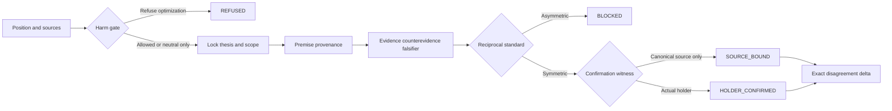

# Fidelity gate

```mermaid
flowchart LR
  I[Position and sources] --> G{Harm gate}
  G -->|Refuse optimization| R[REFUSED]
  G -->|Allowed or neutral only| L[Lock thesis and scope]
  L --> P[Premise provenance]
  P --> E[Evidence counterevidence falsifier]
  E --> Y{Reciprocal standard}
  Y -->|Asymmetric| B[BLOCKED]
  Y -->|Symmetric| C{Confirmation witness}
  C -->|Canonical source only| S[SOURCE_BOUND]
  C -->|Actual holder| H[HOLDER_CONFIRMED]
  S --> D[Exact disagreement delta]
  H --> D
```
