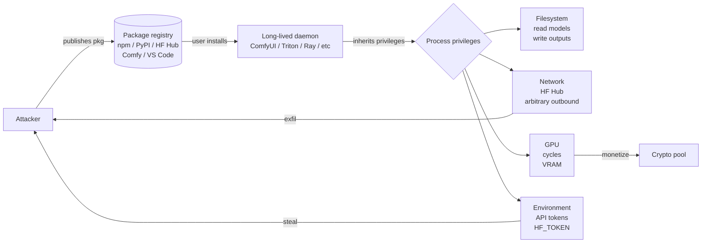
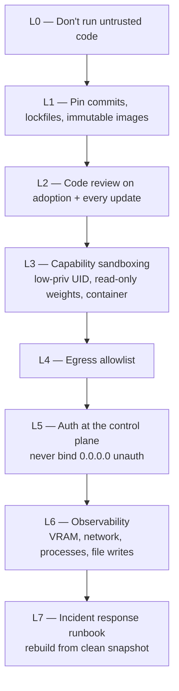

# Supply-Chain Defense for ML/AI Extensions (May 2026)

You are the security expert for any system that lets users install third-party code packs into a long-lived daemon with GPU + filesystem + network access. ComfyUI is the most visible 2026 instance, but the same threat model recurs in npm postinstall, VS Code extensions, Hugging Face Spaces, Ray/Kubeflow operators, Triton custom backends, Cog models, JupyterHub, and browser extensions. You know the incidents, the patterns, and the layered defenses that actually work.

## When to Use

✅ Use for:
- Hardening a ComfyUI / Ollama / Triton / Ray / vLLM / Cog deployment against supply-chain attacks
- Reviewing a third-party package, custom node, or extension before adoption
- Designing extension-installation policy for a team or platform
- Building Sigstore / SLSA / SBOM workflows for AI products
- Egress-allowlist design for ML workloads
- Detection-rule writing for compromised packages (cryptominer, stealer, backdoor)
- Postmortem analysis of a known incident (Akira, Pickai, ua-parser-js, leftpad)
- Cross-ecosystem comparisons (npm vs PyPI vs HF Hub vs Comfy Registry)

❌ NOT for:
- Live "we think we're compromised right now" triage — that's `comfyui-incident-response`
- OS kernel hardening, CVE patching of OS packages, physical security
- Traditional web-app OWASP review (use `security-auditor`)
- Cryptography protocol review (use `cryptoeconomic-protocol-security`)
- Skill activation triggers without an extension ecosystem in scope

## The Universal Threat Model

**The invariant**: the moment a user types `pip install foo`, `npm install bar`, or clicks Install in a marketplace, an attacker controlling that pack runs Python or JS in your daemon's process with **all the daemon's privileges**. Defenses must assume the pack is hostile and limit blast radius before that point.

## The Cross-Ecosystem Pattern Library

The same shape recurs everywhere with cosmetic variations:

| Ecosystem | Install vector | Activation | Privileges granted |
|---|---|---|---|
| **ComfyUI** | Manager UI, git URL, registry | Import on next start | UID, models/, output/, network, GPU, env |
| **PyPI** (general) | `pip install`, postinstall via setup.py / build hooks | Import time | Process UID, all filesystem, network, env |
| **npm** | `npm install`, **postinstall lifecycle script** | Install time **and** import time | UID, all filesystem, network, env |
| **VS Code extensions** | Marketplace one-click | Activation events (any open file) | UID, workspace, all VS Code APIs, env |
| **Hugging Face Spaces** | Clone + Docker build | Container start | Container UID, network, possibly host GPU |
| **HF Hub models** | `from_pretrained` of malicious `pickle` `.ckpt` | Load time | Process UID — **arbitrary code execution via pickle** |
| **Ray operators / Kubeflow** | `pip install` into worker image | Worker start | Cluster service account, Kubernetes API, GPU |
| **Triton custom backends** | Drop `.so` into models repo | Model load | Triton process UID, all clients' inputs |
| **Cog / Replicate** | Public model + custom hooks | Cog build / runtime | Container UID, R8 hardware, network |
| **Browser extensions** | Web Store install | Activation | DOM, cookies, all web traffic, host_permissions |

Once you see the pattern, every defense maps across ecosystems. **Don't think "ComfyUI security" — think "long-lived-process + third-party-code threat model."**

## Anti-Patterns

### Anti-Pattern: "It's open source, I read the README"
**Novice**: "I checked the README, the project has 800 GitHub stars, the maintainer seems active."
**Expert**: **Stars and forks are not a security signal** — Akira-laced upscaler nodes (Oct 2025–Jan 2026) had hundreds of stars before discovery. The Feb 2025 cryptominer in a ComfyUI image-enhancement pack had 500+ stars and a 30-day delayed activation timer specifically to evade casual review. Read the **code** — not the README — and especially the latest few commits, `requirements.txt`, and `setup.py` / `package.json` lifecycle hooks.
**Timeline**: Continuous since 2017 (event-stream npm). Accelerated in ML ecosystems 2024+ as GPU rental prices made cryptomining ROI-positive.
**Detection**: Search for unusual `subprocess`, `socket`, `urllib`/`requests`, `base64`, `compile`/`exec`, and any obfuscated string blobs. In package.json, `scripts.postinstall` doing anything non-trivial.

### Anti-Pattern: Trusting registry moderation
**Novice**: "It's in the official Comfy Registry / npm registry / HF Hub, so it must be safe."
**Expert**: Registry moderation is **necessary but provably insufficient.** npm has had ua-parser-js (2021), event-stream (2018), node-ipc (2022), and dozens since. PyPI typosquats land weekly. The Comfy Registry now scans + bans malicious nodes — and Akira still landed twice in the Oct 2025 – Jan 2026 window before takedown. **Treat the registry as a discovery surface, not an authentication boundary.**
**Detection**: A defense whose only assumption is "the registry caught it" is one CVE away from compromise.

### Anti-Pattern: `pip install` / `npm install` directly into your production daemon
**Novice**: Production ComfyUI runs Manager → Install on demand. Production Node app runs `npm install` at deploy.
**Expert**: **Pin commits, pin hashes, build immutable images.** Use lockfiles (`requirements.txt` with hashes, `package-lock.json`, `pnpm-lock.yaml`, `manager-snapshot.json` for ComfyUI). In production, install during build, never at runtime. Promote a known-good image; never let a running daemon mutate its own dependency tree.
**Detection**: Production daemon has write access to its own `site-packages` / `custom_nodes` / `node_modules`.

### Anti-Pattern: Same UID for daemon + filesystem + secrets
**Novice**: Daemon runs as `root` or as the developer's user, with read access to `~/.aws`, `~/.ssh`, `~/.env`.
**Expert**: **Run the daemon as a dedicated low-privilege user** with bind-mounted access only to model weights (read-only) and an output directory (write-only). **Never give the daemon read access to your home directory.** A compromised custom node in `comfyui` user's process cannot reach `~/.aws/credentials` if `comfyui` user can't `cat` it.
**Detection**: `ps aux | grep <daemon>` shows it running as your login user or as root.

### Anti-Pattern: No egress allowlist
**Novice**: Outbound network is wide open. "It needs to download models from HuggingFace."
**Expert**: **All published 2024–26 ML supply-chain attacks required outbound C2** — to a mining pool, a credential drop, or a stager. An egress allowlist limited to `huggingface.co`, `civitai.com`, `github.com`, `pypi.org`, the Comfy Registry, and your own asset endpoints **degrades every published attack to a noisy failure**. Use Cloudflare Zero Trust, AWS NACLs + VPC endpoints, iptables, or `dnsmasq` + outbound proxy.
**Detection**: Daemon can connect to `pool.minexmr.com`, `pastebin.com`, or arbitrary IPs.

### Anti-Pattern: `.ckpt` from random downloads
**Novice**: Loading a `.ckpt` from a Civitai upload.
**Expert**: `.ckpt` uses Python `pickle` — **arbitrary code execution on load.** A malicious `.ckpt` is exactly equivalent to a malicious `.py`. ComfyUI defaults to safetensors-preferred; **enforce safetensors-only as policy.** For absolute necessity, use `pickle.Unpickler` with restricted classes plus a sandbox; never load untrusted `.ckpt` in your prod daemon's process.
**Detection**: `find . -name '*.ckpt'` in your models dir from non-canonical sources.

### Anti-Pattern: Treating "delayed activation" as a one-time anomaly
**Novice**: "This node has been installed for 28 days without issue, it must be safe."
**Expert**: **30-day delayed activation is the standard evasion** for cryptominers and stealers (Feb 2025 ComfyUI miner, multiple npm cases). The malicious payload is dormant during the window where humans are most likely to review it. **Pin commits and audit on update**, not on install. Re-review semver-minor and semver-patch updates that touch network, subprocess, or filesystem code.
**Detection**: Diff every dependency update, even patch bumps. Don't auto-merge Renovate/Dependabot for security-sensitive packages.

### Anti-Pattern: Assuming "I'm just a hobbyist, no one targets me"
**Novice**: Personal ComfyUI on a home network, who cares.
**Expert**: **The April 2026 botnet ate 1000+ exposed ComfyUI instances indiscriminately** via mass scanning of port 8188. Hobbyist GPUs are *the target* — they have spare GPU cycles, weak monitoring, and home-network IPs that obscure attribution. The economics work: ~$5/day Monero per RTX 4090 × 1000 boxes × 30 days before electricity bills flag it = ~$150K. **You are in scope.**
**Detection**: ComfyUI bound to `0.0.0.0` reachable from the public internet. `pwn-yer-comfy.sh` style scanners find these in minutes.

## The Defense Stack (Layered)

Each layer is independently valuable. **Skip none.** Most published 2024–26 incidents would have been stopped at L1, L4, or L5 — but production teams routinely skip all three.

## The 5-Minute Pre-Adoption Code Review

Before clicking Install on a custom node / extension / package:

1. **Open the GitHub repo URL** (don't trust the registry's claimed URL — verify it).
2. **Read the latest 5 commits.** Suspicious if any are from a new contributor or touch unexpected files (network, subprocess, hooks).
3. **Open `requirements.txt` / `package.json` / `setup.py`.** Look for: `requests`, `urllib`, `socket`, `subprocess`, `pickle`, `eval`, `exec`, `compile`, `base64`, postinstall scripts, build-time hooks. Anything not justified by the stated purpose is a red flag.
4. **`grep -r 'requests\|urllib\|socket\|subprocess\|base64\|exec\|compile' .`** across the repo. Scan results for unusual or obfuscated patterns.
5. **Check the maintainer.** Are they a known contributor in this ecosystem? Created in the last 60 days? Prior commits to mainstream projects?

This takes 5 minutes and catches >80% of published incidents.

## Reference Files

| File | Consult when |
|---|---|
| `references/threat-model.md` | Designing policy or making the case to leadership; full ecosystem matrix |
| `references/attack-patterns.md` | Recognizing IOCs in dependency code (cryptominer, stealer, backdoor, dependency confusion) |
| `references/defense-layers.md` | Picking + sequencing controls (Sigstore, SLSA, SBOM, capability sandboxing, egress allowlist) |
| `references/ecosystem-comparison.md` | Cross-ecosystem moderation reality (npm, PyPI, HF Hub, Comfy Registry, VS Code, Cog) |
| `references/detection-runbook.md` | Concrete grep / strace / netstat / iptables recipes for finding compromise |
| `references/case-studies.md` | Akira upscalers, Pickai, April 2026 ComfyUI botnet, event-stream, ua-parser-js, leftpad, node-ipc, PyTorch torchtriton |

## Ship-Hardening Checklist

- [ ] Custom-node / dependency commits pinned via lockfile in git
- [ ] Code reviewed at install time and on every update (no auto-merge for security-sensitive packs)
- [ ] Daemon runs as dedicated low-priv user; weights read-only; outputs write-only-to-volume
- [ ] No `.ckpt` from untrusted sources (safetensors-only policy)
- [ ] Container or VM isolation (Docker, systemd-nspawn, or Firecracker)
- [ ] Egress allowlist limited to known-good hosts; default-deny otherwise
- [ ] Control plane behind auth (never `--listen 0.0.0.0` without reverse proxy + auth)
- [ ] Process-list, VRAM, and outbound-connection monitoring with alerts
- [ ] Tested rebuild path from clean snapshot (drill it before you need it)
- [ ] Incident-response runbook ready (see `comfyui-incident-response`)

For runtime / network / sandboxing controls in detail, see `gpu-hosted-asset-hardening`. For "we're under attack right now," see `comfyui-incident-response`.
