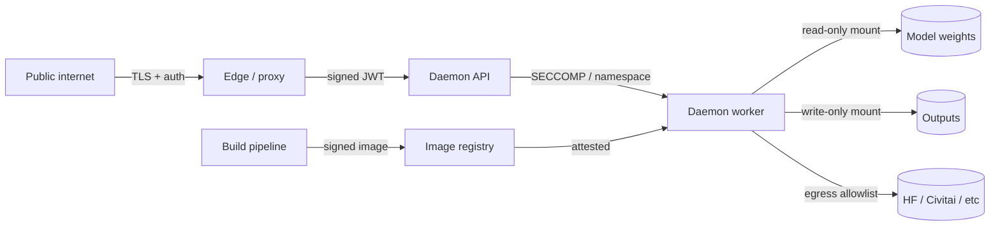

# Threat Model — Third-Party Code in Long-Lived ML Daemons

The systematic version of the SKILL.md decision tree. Use when designing policy, briefing leadership, or red-teaming a deployment.

---

## STRIDE applied to extension ecosystems

| STRIDE | Concrete instance |
|---|---|
| **Spoofing** | Typosquat (`comfyui-impact_pack` vs `ComfyUI-Impact-Pack`); fake maintainer accounts publishing to a registry; SSO-bypass on the registry itself |
| **Tampering** | Malicious commit pushed to a real package after maintainer compromise (event-stream, ua-parser-js); registry-side replacement |
| **Repudiation** | Maintainer denies pushing the bad version; logs incomplete; no signed publishers |
| **Information disclosure** | API tokens (HF_TOKEN, OPENAI_API_KEY) in env stolen and exfiltrated; weights leaked off-host |
| **Denial of service** | Cryptominer saturates GPU; stealer logs flood disk; ransomware encrypts model directory |
| **Elevation of privilege** | Daemon's process becomes a foothold for lateral movement (cloud metadata service, K8s API, mounted host paths) |

---

## Asset model

What an attacker gains by compromising the daemon's process:

1. **GPU cycles** — directly monetizable via Monero. ~$5/day per RTX 4090 at 2026 prices; ~$15/day per H100. Multiplies fast.
2. **Models on disk** — proprietary fine-tunes, customer LoRAs, leaked frontier checkpoints. High resale on grey markets.
3. **Generated outputs** — customer photos / videos / voice. Privacy violation, blackmail material, deepfake corpus.
4. **API tokens** — HF_TOKEN, OPENAI_API_KEY, AWS keys, Stripe keys, S3 credentials in env or `~/.config`.
5. **Network position** — pivot to cloud metadata (`169.254.169.254`), to internal K8s API, to Postgres, to other infra.
6. **Reputation / trust** — your domain serves attacker payloads. Your IP gets blacklisted. Your customers' data leaks under your name.

Each asset has a different attacker class:
- GPU cycles → opportunistic financially-motivated
- Models / API tokens → targeted financially-motivated, occasionally state actors
- Customer outputs → harassment, espionage
- Network position → APT, ransomware operators

Different defenses prioritize differently. **Identify which assets you actually have**; design controls to that.

---

## The full ecosystem matrix

| Ecosystem | Registry | Moderation level (May 2026) | Signed publishers? | Lifecycle hook | Sandboxing default |
|---|---|---|---|---|---|
| **ComfyUI** | registry.comfy.org | Curated default channel; broader registry scanned post-incident | Rolling out 2026 (signed publisher identities) | Import on daemon start | None — runs as daemon UID |
| **PyPI** | pypi.org | Typosquat takedowns reactive; no upload review | PEP 740 (Sigstore-based) lands 2025+, opt-in | `setup.py` build, optional `pyproject.toml` build hooks, import time | None — runs as `pip` invoker UID |
| **npm** | registry.npmjs.org | Reactive takedowns; ~$50M annual security investment post-2018 | Sigstore provenance for some maintainers (opt-in) | `preinstall`, `postinstall`, `prepare`, import time | None — install runs as user; can use `--ignore-scripts` |
| **Hugging Face Hub** | huggingface.co | Pickle-scanning for `.ckpt`; safetensors preferred | Sigstore verification rolling out | `from_pretrained` loads pickle → arbitrary code | None — runs as caller |
| **Hugging Face Spaces** | huggingface.co/spaces | Container build review minimal | n/a | `Dockerfile` build, container start | Container UID; sometimes shared GPU |
| **VS Code Marketplace** | marketplace.visualstudio.com | Microsoft scanning; reactive takedowns | Publisher verification | Activation events (any file open) | Extension Host process; restricted but powerful |
| **Comfy Registry** | registry.comfy.org | Scanning post Akira incident; signed publishers in flight | Rolling out 2026 | Import at ComfyUI start | None |
| **Cog** (Replicate) | r8.im | Replicate-side container scanning | Sigstore for Replicate-published images | Cog build, predict runtime | Container UID |
| **Triton inference server custom backends** | self-managed (S3, registry) | None by default | Customer's responsibility | Backend `.so` load on model load | Triton UID; access to all model inputs |
| **Ray** | self-managed pip install | None | Customer's responsibility | Worker startup `pip install` | Cluster service account (often K8s SA with RBAC) |
| **Browser extensions** | Chrome Web Store / Mozilla AMO | Static + dynamic analysis; reactive | Verified publishers | Activation events (URL match) | Extension sandbox; `host_permissions` extremely powerful |

**Observation**: ML ecosystems (HF Hub, Comfy Registry, Cog, Triton) are roughly where npm was in 2017 — pre-Sigstore, pre-postmortem-culture, pre-defense-in-depth-as-default. The pattern recurs because the economic incentives reward speed-to-publish over verified-publisher-identity.

---

## The "long-lived daemon" multiplier

Why this is worse than a CLI tool:

- **Persistent process** holds API tokens, model weights, sometimes session cookies in memory.
- **Long uptime** lets payloads run multi-week mining campaigns or low-and-slow exfiltration.
- **GPU access** is rare on most hosts but always present here.
- **Network-exposed control plane** (the API endpoint) gives attackers an internet-reachable target distinct from the package supply chain itself.
- **Background custom-node imports happen on every restart**, so a weakly-pinned dependency can re-introduce compromise after a "clean" reboot.

A `pip install` in a CI runner that exits in 60s is annoying. The same `pip install` in a 24/7 Triton server is catastrophic.

---

## Trust boundaries (where to enforce)

Five trust boundaries, all of which need an explicit policy:

1. **Public ↔ Edge** — TLS + client auth (Cloudflare Access, basic auth in front, JWT, mTLS).
2. **Edge ↔ Daemon API** — auth tokens, rate limit, request size limit, content policy.
3. **Daemon ↔ Worker** — process isolation (container, namespace), seccomp.
4. **Worker ↔ Filesystem** — read-only weights, write-only output volume, no read on home directory.
5. **Worker ↔ External Network** — egress allowlist; no arbitrary outbound.

Skip any one and the others lose value. The April 2026 botnet skipped boundary #1 (no auth) and boundary #5 (open egress for the miner C2); that's why a single CVE in unrelated code became a 1000-host botnet.

---

## Adversary classes (May 2026)

| Class | Motivation | Typical TTPs | Detection difficulty |
|---|---|---|---|
| **Opportunistic crypto** | $$ via Monero | Mass scan + commodity miner, 30-day dormancy | Easy if you watch GPU util, hard if you don't |
| **Targeted credential theft** | API tokens, weights | Trojan custom node, exfil over normal-looking HTTPS | Hard; egress allowlist defeats most |
| **APT / state-aligned** | Persistence, intel | Compromised maintainer, clean payload, low-and-slow | Very hard; Sigstore + SLSA + audit logs needed |
| **Vandalism / activism** | Disruption | Destructive payload (event-stream → flatmap-stream → Bitcoin theft against copay; node-ipc → wipe Russian/Belarusian disks) | Variable; signed code helps, code review harder |

Most published 2024–26 ML incidents are class 1. **Build for class 1 first** (egress allowlist + lockfile + low-priv UID) and you'll incidentally defeat ~80% of class 2 attempts.

---

## Cost vs benefit (do you need all this?)

| Profile | Recommended depth |
|---|---|
| Personal ComfyUI on home GPU | L0–L5 minimum (don't expose, low-priv UID, egress allowlist, pin commits) |
| Solo SaaS shipping AI features | + L6 monitoring + L7 incident-response runbook |
| Team / multi-tenant | All of above + signed images + per-tenant isolation |
| Regulated (HIPAA, finserv) | All of above + SBOM + audit log + third-party security assessment |
| Public marketplace (you accept user uploads) | All of above + per-upload sandbox + content-scanning gateway |

The first row alone defeats the April 2026 botnet at near-zero cost. The remaining rows scale with stakes, not with technical difficulty.

For concrete attack patterns, see `attack-patterns.md`. For the full defense playbook, see `defense-layers.md`.
