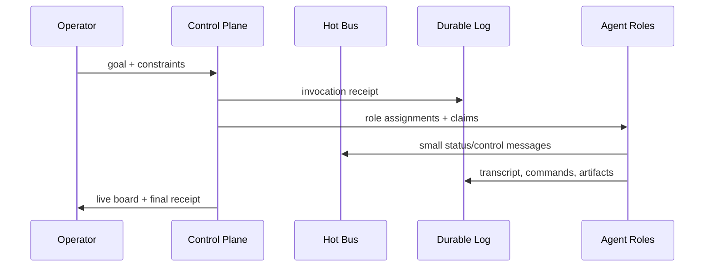

# Swarm Invocation Designer

Design the control surface and protocol layer for summoning, steering, and observing multiple agents.

## Use This For

- Turning "ask several agents" into a typed invocation with roles, budgets, files, worktrees, stop conditions, and receipts.
- Designing hot-path agent communication: local IPC, Unix sockets, WebSocket, gRPC, NATS, Redis Streams, shared memory, or in-process queues.
- Designing durable coordination: append logs, Port Daddy notes, tuple space, tubes, actor inboxes, transcripts, and PR receipts.
- Answering whether "ICP communicating agents" can speak lightning fast.

## Do Not Use This For

- Making agents chat constantly when a note or tuple is enough.
- Treating blockchain/canister consensus as a low-latency local control bus.
- Spawning agents without ownership, budget, or recovery semantics.

## Core Model

Use two channels:

- Hot path: tiny, typed, ephemeral messages for steering, presence, cancellation, and heartbeat. Optimize for p95 latency and low serialization overhead.
- Durable path: append-only transcript, claims, commands, decisions, artifacts, and review receipts. Optimize for auditability and replay.

## ICP / IPC Answer

If the user means **IPC** (inter-process communication), yes: agents can speak very quickly through Unix domain sockets, loopback WebSockets, gRPC, shared-memory rings, NATS, Redis Streams, or an in-process event bus. For LLM agents, model latency usually dwarfs transport latency; optimize message size, batching, and tool-call scheduling before obsessing over microseconds.

If the user means **ICP** as Internet Computer Protocol canisters, do not put the hot path through consensus. Use canisters for durable coordination, identity, receipts, escrow, or cross-organization governance; keep live steering on a local or regional bus and periodically commit signed receipts.

## Invocation Design Steps

1. Name the operator intent and the stop condition.
2. Split roles, not identities: planner, implementer, reviewer, tester, researcher, or integrator.
3. Assign isolation: one worktree per writer, claims per file or symbol, locks only for scarce resources.
4. Define the protocol: request, propose, accept, update, block, cancel, handoff, done.
5. Put every message on either hot or durable path. Never mix "needs to be instant" with "must be audit-complete."
6. Add failure semantics: timeout, duplicate message, stale heartbeat, rejected claim, unsafe command, spend breach, and orphaned session.
7. Score the latency budget with `scripts/latency_budget.mjs`.

## Anti-Patterns

### Swarm Button As Confetti

**Novice**: "Launch five agents and let them figure it out."
**Expert**: Parallelism only helps when roles, file ownership, budgets, and merge points are explicit.
**Detection**: The UI shows agent names but no claims, worktrees, stop conditions, or merge owner.

### Durable Bus For Every Cursor Twitch

**Novice**: "Persist every heartbeat and presence update."
**Expert**: Keep hot-path presence ephemeral and summarize to durable receipts at checkpoints.
**Detection**: The event log fills with messages nobody will replay.

### Consensus On The Steering Wheel

**Novice**: "Put every inter-agent message on-chain or through consensus for trust."
**Expert**: Consensus is for settlement and shared truth, not steering latency. Use signed local messages plus durable checkpoints.
**Detection**: A cancel, pause, or claim update waits for remote finality.

## References

| File | Load When |
| --- | --- |
| `references/fast-agent-bus.md` | Need protocol and transport guidance for fast agent communication. |
| `references/invocation-patterns.md` | Need operator-facing swarm invocation patterns and examples. |
| `examples/expected-output.md` | Need a finished invocation spec example. |
| `templates/output-template.md` | Need a reusable swarm spec template. |
| `schemas/latency-budget.schema.json` | Need to validate hot/durable path inputs. |
| `scripts/latency_budget.mjs` | Need deterministic latency budget analysis. |
| `agents/openai.yaml` | Need a subagent descriptor for delegated swarm invocation design. |

<!-- BEGIN BUNDLE INDEX (auto: index_references.py) -->

## Skill Bundle Index

*Every file in this skill, and when to open it. Auto-generated by the repo skill-architect indexer.*

**root**
- [`CHANGELOG.md`](CHANGELOG.md) — Swarm Invocation Designer — Changelog — - Initial skill creation - Core process defined - Reference files added
- [`README.md`](README.md) — Swarm Invocation Designer — Design guidance for magic-feeling multi-agent invocation, typed coordination contracts, and fast agent-to-agent communication.

**`agents/`**
- [`agents/openai.yaml`](agents/openai.yaml) — openai (data/schema)

**`examples/`**
- [`examples/expected-output.md`](examples/expected-output.md) — Example Output: Swarm Invocation Designer — Pattern: "summon a three-agent review swarm from one PR" Roles: - Skeptic: correctness and edge cases.

**`references/`**
- [`references/fast-agent-bus.md`](references/fast-agent-bus.md) — Fast Agent Bus — Use this when choosing how agents communicate.
- [`references/invocation-patterns.md`](references/invocation-patterns.md) — Swarm Invocation Patterns — Use this when designing the operator-facing "summon agents" action.

**`schemas/`**
- [`schemas/latency-budget.schema.json`](schemas/latency-budget.schema.json) — latency budget.schema (data/schema)

**`scripts/`**
- [`scripts/latency_budget.mjs`](scripts/latency_budget.mjs)

**`templates/`**
- [`templates/output-template.md`](templates/output-template.md) — Swarm Invocation Spec — [What the operator is trying to accomplish.] - Entry point: [button / command / context menu / natural language] - Scope source: [selected d

<!-- END BUNDLE INDEX -->
