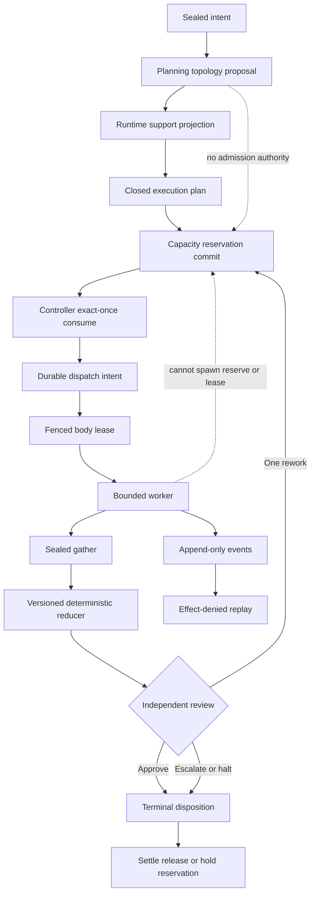
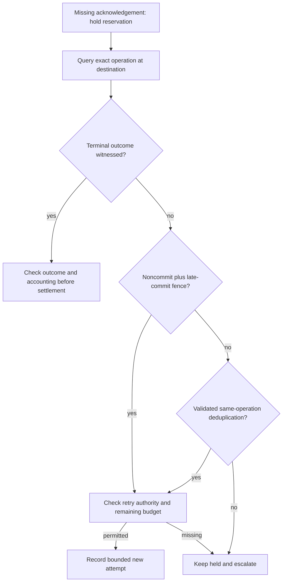

# Swarm Invocation Designer

This is a static contract architect, not a launcher. A planning graph proposes
work; only an external controller can admit attempts, consume reservations,
issue fenced leases, and open effect channels.

## Decision procedure

1. **Scope:** return `OUT_OF_SCOPE_LIVE_OPERATION` for requests to launch,
   supervise, kill, or settle live agents.
2. **Seal intent:** bind objective, completion predicate, excluded effects, plan
   digest/revision, and immutable limit digest.
3. **Separate topologies:** record planning and runtime topologies. A projection
   is `EXACT`, `NARROWED`, `OMITTED`, or `BLOCKED`; non-exact support needs an
   attributable acceptance reference.
4. **Close the graph:** require unique nodes, acyclic dependencies, sealed gather
   membership, declared reducers, reachable work, and bounded review. Rework is
   a new attempt, not a graph cycle.
5. **Separate owners:** identify admission, capacity, lifecycle, effect,
   evidence, and review owners. Workers may propose changes but cannot create
   children, enlarge limits, issue leases, or settle reservations.
6. **Reserve first:** bind every attempt, renewal, elastic slot, rework, and
   resource-consuming gather to plan, revision, node, attempt, body generation,
   route, resource vector, expiry, and idempotency key.
7. **Consume and fence:** the controller consumes one reservation commit before
   one monotonically generated, externally fenced lease.
8. **Persist intent:** durable dispatch intent precedes transmission. Unknown
   transmission becomes `AMBIGUOUS`; retain capacity and reconcile before an
   authorized retry. A new key must never disguise the same uncertain effect.
9. **Gather exactly:** membership is sealed. Semantic partial closure never
   implies cancellation or capacity settlement for absent members.
10. **Reduce and review:** reducers consume ordered artifact hashes and are
    version/digest bound. A producer cannot decide its terminal review. One
    `REWORK` creates a fresh attempt; a second escalates or halts.
11. **Cancel as protocol:** request, acknowledgement deadline, fence,
    termination witness, provider reconciliation, and reservation disposition
    are separate facts.
12. **Settle then replay:** every attempt has an explicit disposition. Only
    witnessed settlement or release permits capacity reuse; `HELD_AMBIGUOUS`
    continues to consume its reservation. Replay reconstructs projections with
    effects denied.



## Invariants

- `maxRecursiveBirths` is zero; topology expansion requires a new reviewed plan.
- Reservation commit precedes lease; lease and durable intent precede dispatch.
- A stale generation cannot produce accepted state or effects.
- Aggregate resource vectors stay under the plan ceiling; native resources are
  not silently converted into one scalar budget.
- Gather membership is immutable and dissent remains visible.
- Cancellation messages do not prove termination, provider state, or release.
- Replay never invokes a provider, tool, hook, or effect broker.
- `STATIC_VALID` means the implemented shape and relationship checks passed. It
  does not prove the completion predicate, capacity enforcement, deterministic
  execution, receipt authenticity, or runtime readiness.

## Lost-ack procedure

Persist an immutable operation key and intent before transmission. Give each
observation its own event identity; several observations can concern the same
operation. CloudEvents `source` plus `id` identifies an event, not a command's
execution count ([v1.0.2](https://github.com/cloudevents/spec/blob/v1.0.2/cloudevents/spec.md)).

If an acknowledgement is absent, retain the reservation and mark the attempt
`AMBIGUOUS`. Query the authoritative destination for that exact operation. A
terminal receipt determines what happened; it permits settlement only after the
controller checks outcome, provider accounting, and reservation disposition. A
current “not found” answer alone does not prevent the original request committing later.

An authorized retry requires either **authoritative noncommit plus a fence that
prevents late commit**, or **validated destination deduplication for the same
operation key**. Both routes require current authority and remaining budget. A
deduplicated retransmission retains the operation key while recording its
separate attempt/generation and cost. Unknown outcomes without either route
remain held. Compensation is a separate authorized effect, not evidence that
the original effect is absent. Every relevant sink must enforce a generation
fence; a stored generation number alone does nothing.



## Static worked case

`review-17` reserves one slot and records operation key `k17`. The controller
loses the acknowledgement after sending; its latest observation says
`AMBIGUOUS`. A second “not found” observation remains insufficient while the
original send could arrive. A terminal absence receipt bound to `k17` plus a
target-enforced fence closes that possibility. Only then, with authority and
budget, can the controller create a new attempt. If the destination instead
supplies proven same-key deduplication, that route may permit a retransmission
without creating a new logical operation. Neither path has run here.

## Validation contract

The JSON contract records design declarations. The validator checks its
supported schema, bounded counts, graph dependencies, gather membership/reducer
links, policy fields, and selected status contradictions. It cannot evaluate
natural-language completion predicates, grant authority, enforce resources,
prove a reducer deterministic, or verify remote deduplication. Keep those as
explicit review and runtime obligations. The trace schema is a structural
envelope; passing it does not validate an execution.

Gather policies require different design parameters: `ALL` uses the sealed
member set; `QUORUM` states its threshold; `DEADLINE_PARTIAL` states its
deadline relative to the invocation. Missing members retain lifecycle/accounting
obligations after partial closure. One rework round is this bundle's chosen
profile, not a result about optimal team design.

## Anti-patterns

### Prompt-shaped fanout

**Bad:** prose directly creates workers. **Detection:** no admitted plan,
reservation commit, or controller lease exists.

### Planning diagram as authority

**Bad:** a manager node may dispatch because it appears in a graph. **Detection:**
planning topology names an admission, capacity, lifecycle, or effect owner.

### Cancellation by message

**Bad:** `cancel sent` releases capacity. **Detection:** no fence, termination
witness, provider reconciliation, or terminal reservation disposition.

### Replay by re-execution

**Bad:** replay calls external effects. **Detection:** `effectsDenied` is false or
absent.

## Outputs

Return only `STATIC_VALID`, `STATIC_INVALID`, `INCOMPLETE_STATIC`,
`OUT_OF_SCOPE`, or `OUT_OF_SCOPE_LIVE_OPERATION`.

```bash
node skills/swarm-invocation-designer/scripts/validate-swarm-invocation.mjs <contract.json>
node skills/swarm-invocation-designer/scripts/test-bundle.mjs
```

## Load on demand

| File | Load when |
|---|---|
| `references/authority-admission-lifecycle.md` | Designing owner, reservation, lease, cancellation, or settlement seams. |
| `references/gathers-reducers-and-replay.md` | Designing gather, reducer, review, or replay semantics. |
| `schemas/swarm-invocation.schema.json` | Producing the static contract. |
| `schemas/swarm-invocation-trace.schema.json` | Designing a future runtime trace without claiming one exists. |
| `examples/valid-static-contract.json` | Starting a bounded static design. |
| `tests/activation.md` | Testing routing boundaries. |
| `scripts/validate-swarm-invocation.mjs` | Validating one contract. |
| `scripts/test-bundle.mjs` | Running adversarial mutations. |
| `agents/openai.yaml` | Delegating static contract design. |

## Imported bundle navigation

These preserved source files add depth when their stated topic is needed.

- [examples/expected-output.md](examples/expected-output.md) — Example Output: Swarm Invocation Designer.
- [references/fast-agent-bus.md](references/fast-agent-bus.md) — Fast Agent Bus.
- [references/invocation-patterns.md](references/invocation-patterns.md) — Swarm Invocation Patterns.
- [references/exactly-once-decomposition.md](references/exactly-once-decomposition.md) — Transport and effect boundaries.
- [schemas/latency-budget.schema.json](schemas/latency-budget.schema.json) — latency-budget.schema.json.
- [scripts/latency_budget.mjs](scripts/latency_budget.mjs) — latency_budget.mjs.
- [templates/output-template.md](templates/output-template.md) — Swarm Invocation Spec.
