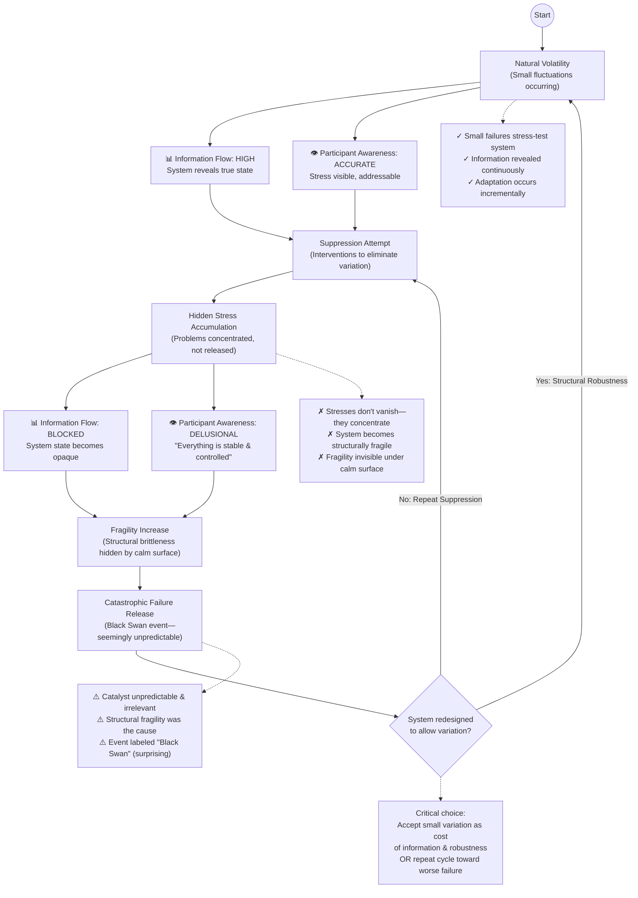

# Volatility Suppression Paradox: System State Evolution

```mermaid
flowchart TD
    Start((Start)) --> NaturalVolatility

    NaturalVolatility["Natural Volatility<br/>(Small fluctuations occurring)"]
    InfoFlow1["📊 Information Flow: HIGH<br/>System reveals true state"]
    Awareness1["👁️ Participant Awareness: ACCURATE<br/>Stress visible, addressable"]

    NaturalVolatility --> InfoFlow1
    NaturalVolatility --> Awareness1

    InfoFlow1 --> SuppressionAttempt
    Awareness1 --> SuppressionAttempt

    SuppressionAttempt["Suppression Attempt<br/>(Interventions to eliminate variation)"]
    SuppressionAttempt --> HiddenStress

    HiddenStress["Hidden Stress Accumulation<br/>(Problems concentrated, not released)"]
    InfoFlow2["📊 Information Flow: BLOCKED<br/>System state becomes opaque"]
    Awareness2["👁️ Participant Awareness: DELUSIONAL<br/>#quot;Everything is stable & controlled#quot;"]

    HiddenStress --> InfoFlow2
    HiddenStress --> Awareness2

    InfoFlow2 --> FragilityIncrease
    Awareness2 --> FragilityIncrease

    FragilityIncrease["Fragility Increase<br/>(Structural brittleness hidden by calm surface)"]
    FragilityIncrease --> CatastrophicRelease

    CatastrophicRelease["Catastrophic Failure Release<br/>(Black Swan event—seemingly unpredictable)"]

    CatastrophicRelease --> Decision{"System redesigned<br/>to allow variation?"}

    Decision -->|Yes: Structural Robustness| NaturalVolatility
    Decision -->|No: Repeat Suppression| SuppressionAttempt

Annotation1["✓ Small failures stress-test system<br/>✓ Information revealed continuously<br/>✓ Adaptation occurs incrementally"]
NaturalVolatility -.-> Annotation1

Annotation2["✗ Stresses don't vanish—they concentrate<br/>✗ System becomes structurally fragile<br/>✗ Fragility invisible under calm surface"]
HiddenStress -.-> Annotation2

Annotation3["⚠️ Catalyst unpredictable & irrelevant<br/>⚠️ Structural fragility was the cause<br/>⚠️ Event labeled #quot;Black Swan#quot; (surprising)"]
CatastrophicRelease -.-> Annotation3

Annotation4["Critical choice:<br/>Accept small variation as cost<br/>of information & robustness<br/>OR repeat cycle toward worse failure"]
Decision -.-> Annotation4
```
