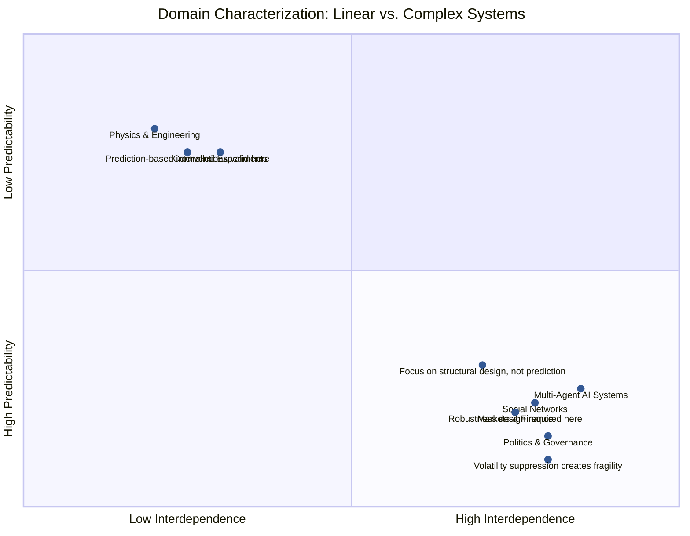

# Domain Characterization: Linear vs. Complex

```mermaid
quadrantChart
%%{init: {"themeVariables": {"quadrantPointFill": "#345995"}}}%%
    title Domain Characterization: Linear vs. Complex Systems
    x-axis Low Interdependence --> High Interdependence
    y-axis High Predictability --> Low Predictability
    
    Physics & Engineering: [0.2, 0.8]
    Controlled Experiments: [0.3, 0.75]
    
    Markets & Finance: [0.75, 0.2]
    Politics & Governance: [0.8, 0.15]
    Multi-Agent AI Systems: [0.85, 0.25]
    Social Networks: [0.78, 0.22]
    
    %%{init: {"quadrantChart": {"chartWidth": 900, "chartHeight": 700}, "themeVariables": {"primaryColor": "#1f77b4", "primaryBorderColor": "#ff7f0e", "lineColor": "#d62728", "secondaryColor": "#2ca02c", "tertiaryColor": "#9467bd"}}}%%
    
    Prediction-based interventions valid here: [0.25, 0.75]
    Robustness design required here: [0.75, 0.2]
    Volatility suppression creates fragility: [0.8, 0.1]
    Focus on structural design, not prediction: [0.7, 0.3]
```
