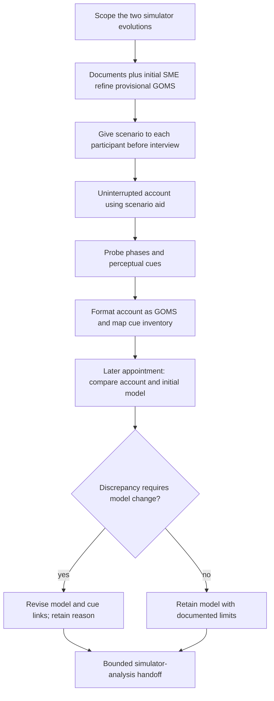

# Source procedure and bounded review

Source abstraction of Grassi IV.A–C, printed pp. 43–50, and Chapters V–VI. IV.C.3 calls its process three phases but enumerates four study steps. Generic CDM in II.F.1 has a separate three-pass account. The diagram preserves the later comparison appointment and does not imply that a complete cue inventory predated the interviews. It is analysis, not authorization for an operational effect.
