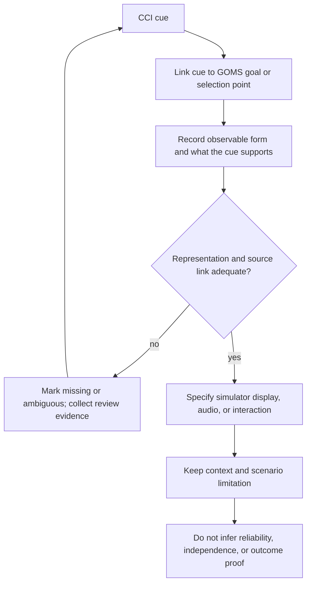

# Cue-to-goal validation card

For example, Grassi's engine-order execution cue rows in Chapter V.C, Table 6 (printed p. 106) concern checking execution. They do not prove later vessel response or provide a quantified sensor-fusion rule. Appendix A is “Standard Commands,” not the CCI appendix.
