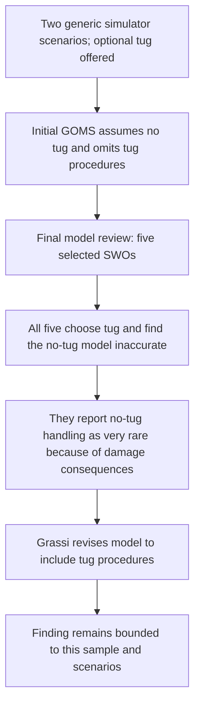

# Tug discrepancy and bounded model revision

Source: Grassi IV.B.1 and IV.C.3 (printed pp. 44–45, 50). Each scenario used a twin-screw ship, empty pier, and 1–2 knots of wind and no current. The tug was optional. This records a specific assumption discrepancy and revision; it does not establish a universal tug rule or advise live operations.
