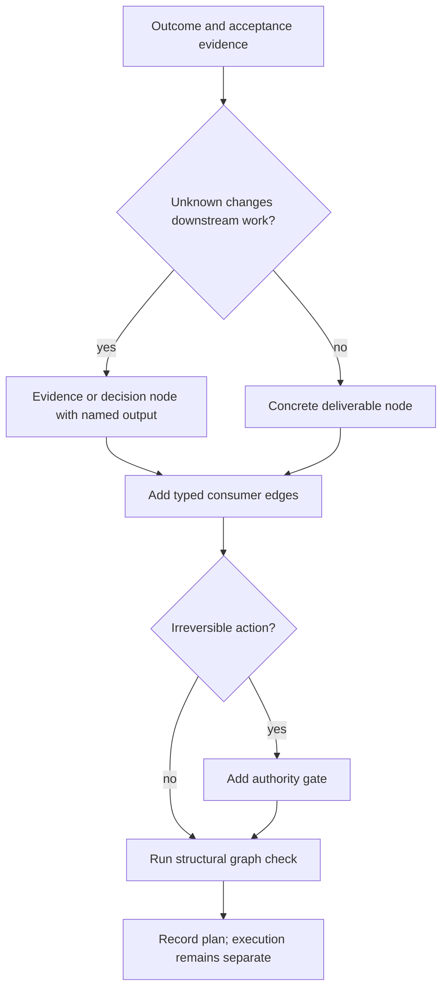

# Outcome to reviewable nodes

```mermaid
flowchart TD
  O[Outcome and acceptance evidence] --> U{Unknown changes downstream work?}
  U -->|yes| E[Evidence or decision node with named output]
  U -->|no| T[Concrete deliverable node]
  E --> X[Add typed consumer edges]
  T --> X
  X --> H{Irreversible action?}
  H -->|yes| G[Add authority gate]
  H -->|no| C[Run structural graph check]
  G --> C
  C --> R[Record plan; execution remains separate]
```
