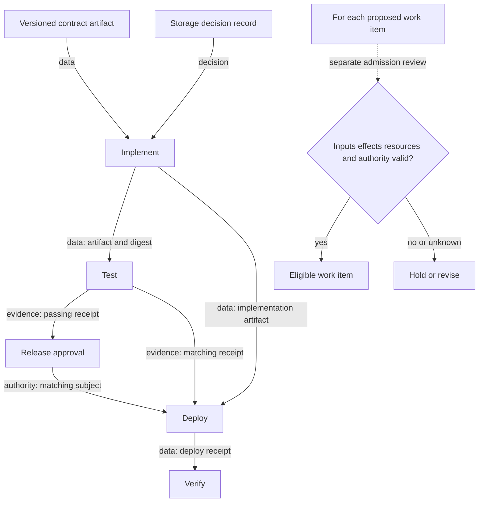

# Typed prerequisite graph and separate admission review

The solid graph describes prerequisites, not observed execution. Test and approval receipts must bind the implementation digest consumed by deploy. The separate admission review supplies additional checks; an edge or topological layer does not grant effect authority.
