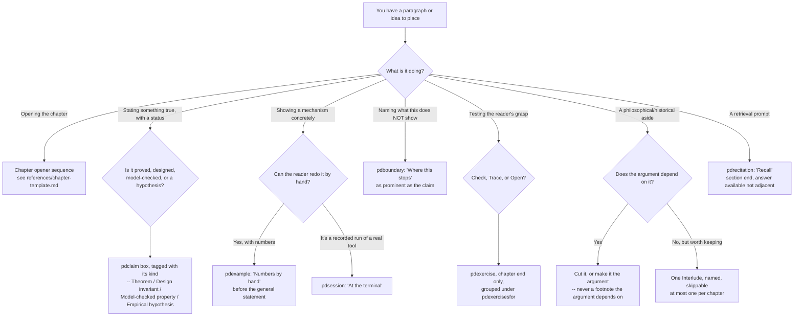

# Textbook Craft

Turn a chapter of formal, honest research prose into a chapter a reader can
actually learn from — using the habits the best math and CS textbooks share,
verified against the seed research and this project's own reading-flow
measurements, not invented from taste.

## When to Use

✅ Use for: drafting or reviewing a chapter opener (epigraph, scene, claim
box); deciding whether something is a worked example, a claim, a boundary, or
an exercise, and where it belongs on the page; placing or auditing an exercise
ladder; checking a chapter's claims are labeled with an honest epistemic kind;
running `scripts/chapter_lint.py` against a `.tex` chapter and acting on its
findings; deciding whether a philosophical/historical aside earns an
Interlude or should be cut.

❌ NOT for: writing a standalone result write-up, execution report, or paper
section (`harbor-exposition` — the seven-moves-plus-two-rails style for one
self-contained argument, not a multi-page chapter with its own exercises and
handoff); drawing or QA-ing a figure (`harbor-chartwork`); LaTeX build/compile
mechanics or the three-edition pipeline (`latex-whitepaper-engineering`,
`HANDOFF-TEXTBOOK.md`); deciding a chapter's spine or which propositions it
covers (an author/editorial decision this skill does not make).

## Relationship to `harbor-exposition`

Both skills share the same honesty discipline and the same instinct
(motivate before formalizing, box the claim, name the boundary as
prominently as the claim). They differ in unit and stakes:

| | `harbor-exposition` | `textbook-craft` |
|---|---|---|
| Unit | One result: statement + numbers + boundary | One chapter: many results, an opener, exercises, a handoff |
| Reader entry | Cold, once | Returning across chapters (spiral, interleaved review) |
| Apparatus | Two rails, two figures | Page grammar, exercise ladder, chapter-close sequence |
| Owns | The seven-moves template, `check_style.py` | The chapter template, `chapter_lint.py` |

A chapter written under this skill still uses `harbor-exposition`'s move
order *inside* a single result (scene → one-breath claim → analogy → box →
numbers → application → boundary); this skill wraps that unit in an opener,
places it among a chapter's other results, and closes the chapter with
exercises and a handoff neither skill's other half owns alone.

## Core Process: which page element does this paragraph need?



## The chapter template (page-by-page)

Full sequence, sourced from the seed memo's §7.1, in
`references/chapter-template.md`. In brief: **page 1** is number+title, one
or two epigraphs (Chicago ¶1.37), a failure scene with a number in it, the
question in one italic sentence, and the claim boxed with its kind. **Page 2**
is three objections in their best form, the route with an express lane, and
the first worked example — hand-checkable, before any definition. Nothing
else appears on these two pages: no abstract, no keyword list, no
reading-time estimate, no learning-objective bullets, no result table.

Every theorem gets a **Proof idea** in plain English before the proof
(Sipser, Lamport). A proof over ~10 lines is hierarchically structured with a
final Q.E.D. restating the goal. A chapter closes, in order: Review of the
Key Ideas → chapter-end Exercises, grouped by section → History and
references → the handoff (what this chapter deliberately did not solve).

## The exercise ladder

Three kinds only — **Check** (short, closed), **Trace** (walk a mechanism by
hand), **Open** (a design/proof obligation, no closed form) — rated 1–3
stars for how much apparatus they need, not raw difficulty. Placed at chapter
end, grouped by the section they test, with a margin pointer where the
cluster used to interrupt the body. Fade the ladder: a fully worked example,
then a Check with the last step removed, then a Trace, then an Open that
supplies the whole plan. Full detail, Pólya's four phases, and
Mason–Burton–Stacey's four processes mapped onto the chapter opener:
`references/exercise-design.md`.

**Solution-key rules** (project-internal, non-negotiable): where an exercise
rests on a false premise, the solution repairs the premise, not the requested
conclusion. An Open exercise gets a defensible obligation, never a fabricated
closed form.

## Worked-example discipline

At least one per section, always before that section's general statement,
with numbers a reader can redo on paper — never a schematic calculation with
letters standing in for numbers that were never chosen. The `pdexample`
head ("Numbers by hand") is a promise: if a passage cannot honestly claim the
reader could redo it, it is not a worked example. Fade across a section's
sequence (`references/exercise-design.md` §Fading); name *why* each step is
taken, not only what it is (the self-explanation effect,
`references/learning-science.md`).

## Page grammar: what may be boxed, what may not

From `whitepaper/figures/pd-pedagogy.tex`, the actual macro vocabulary — use
these names, not new ones:

| Content kind | Environment/macro | How it renders | May it use a tinted fill? |
|---|---|---|---|
| A claim with a status | `pdclaim{KIND}{...}` | hairline, small-caps run-in head, hairline | No |
| A boundary | `pdboundary` | plain ink bar at the left, no fill | No |
| A worked example | `pdexample` | two hairlines, italic run-in head, margin glyph | No |
| A recorded run | `pdsession[title]` | full-width monospace, bold input / regular output | No |
| A retrieval prompt | `pdrecitation` | margin list ("Recall") or compact numbered list | No |
| An exercise | `pdexercise[kind=,rating=]{label}` | numbered hanging paragraph, margin solution pointer | No |
| A chapter-end grouping | `pdexercisesfor{...}{...}`, `pdexercisepointer(one)` | small-caps head; margin pointer at point of use | No |
| A key idea / pitfall / scene / see-also / pull-quote | `\keyidea`, `\pitfall`, `\scene`, `\xrefbox`, `\pullquote` | run-in or margin head, plain prose | **No — the legacy tikz/fill versions are retired** |

**A page never paints a background.** Content kind is signalled by
typography and the margin, never by a tinted rectangle — this is not a
preference, it is Wave 12's own measured fix (`READING-FLOW-AUDIT.md` F2: "five
content kinds signalled by five tinted rectangles; nothing readable at a
glance," now "page grammar by typography and margin; no fills"). A chapter
that still defines `\keyidea`/`\pitfall`/`\exercises{...}` etc. as
`tikzpicture` nodes with `fill=...` is either (a) dead — `figures/pd-pedagogy.tex`'s
own `\AtBeginDocument` block re-`\long\def`'s that *exact macro name*, so the
chapter's own preamble definition never runs at render time no matter
whether the chapter imports the file — or (b) actually rendering tinted
boxes today, because pd-pedagogy.tex does not redefine that name (the old
`\exercises{...}` box, for instance, is not in its neutralized set, so it
renders regardless of any `\input`). Check which with `scripts/chapter_lint.py`'s
`no_tinted_box_macros` floor, which parses `pd-pedagogy.tex` itself rather
than trusting the chapter's own `\input` line — a chapter still needs that
`\input` for the rest of the page grammar (claim boxes, worked examples,
exercises), which is `imports_pd_pedagogy_twin`'s separate floor.

Color is for navigation, status, and semantic contrast only: two box colors,
one accent for headings, a series color for part openers. Never a rainbow of
content-kind fills.

## Pacing rules

- **Time to first checkable fact: the first spread.** A reader with fifteen
  minutes (archetype A8, `READING-FLOW-AUDIT.md`) should hit a checkable
  claim or worked number by page 2.
- **Kinds per page target: ≤3 on 95% of body pages.** A page that is only
  prose is one kind; a page with a claim box, a figure, and prose is three.
  More than that on one page is a density defect even when every element is
  individually well-formed.
- **No run of more than four consecutive body pages with nothing to look
  at** (no figure, table, worked example, or session) outside an Exercises
  section, which is expected to be prose-only. This was the sharpest
  reading-flow defect measured across the Book's chapters (F5); a chapter's
  own worked-example floor (`chapter_lint.py`) is a proxy check for it at the
  source level.
- **Back-references per page: ≤2.** A reader following the argument should
  not have to chase more than two cross-references per page to keep reading.

## The honesty ledger

Every important claim carries its kind, stated where the claim is made, not
only in a manifest:

1. **Theorem** — follows from a formal model whose assumptions are explicit.
2. **Design invariant** — intended to hold; backed by implementation and
   tests.
3. **Model-checked property** — proved only for a bounded or abstract
   program model.
4. **Empirical hypothesis** — needs measurement, calibration, or an
   experiment.

Do not call a type check or a uniqueness constraint a theorem about the
world. Do not undersell a property that can be proved once the boundary is
clean. A boundary section ("Where this stops") is as prominent as the claim
it bounds, never a trailing clause. For every open item in a chapter's
handoff, say whether it is proved elsewhere, promised later with a pointer,
out of scope with a reference, or unknown — "Confess immediately" (Halmos,
p. 137). A scope cut (dropping a section, narrowing a theorem) gets a
sentence stating it as a decision, in the claim's own voice — never a silent
omission (Axler's move, `references/canon.md`).

When a stated theorem or figure turns out to be wrong or overscoped, follow
the memo-solution-key's two rules exactly (`references/exercise-design.md`
§Solution-key rules): repair the premise, don't manufacture the requested
conclusion; give open problems a defensible obligation, never a fictional
closed form. Distinguish a **local** correction (a lemma was wrong; the claim
survives, re-scoped) from a **global** one (the claim itself was false as
printed) — Lakatos's distinction, and say which kind a correction is.

## Anti-Patterns

### Repeated Reader Maps
**Novice**: Every chapter re-explains how to read the book (the personas
table, the "if you're a systems engineer, read §X" map) at full length.
**Expert**: One reader's map belongs in the front matter. A chapter's own
route paragraph (page 2, item 7) states *that chapter's* order and express
lane in one paragraph — it does not re-derive the whole book's audience
taxonomy. The reviewers already estimated the Book "could lose roughly forty
percent without losing a single core idea" by cutting exactly this kind of
repetition.
**Detection**: A persona table or "who should read this" block appears
identically, or near-identically, in more than one chapter.

### Estimator Catalogs
**Novice**: List every possible way to compute or bound a quantity, as a
survey, because completeness feels rigorous.
**Expert**: Meadows's leverage-points lesson (`references/canon.md`): a
catalog is a parameter-level addition papering over a structural question —
*which* estimator does this chapter's argument actually need? Cut the survey;
keep the one the chapter uses, with a pointer to related-work for the rest.
**Detection**: A section lists three or more alternative techniques for the
same problem without using more than one of them in the chapter's own proof
or mechanism.

### Ornamental Theorem Labels
**Novice**: Call something a "Theorem" because it sounds authoritative, or
label a design decision as a theorem to make it feel settled.
**Expert**: The honesty ledger's four kinds are not interchangeable dress —
`pdclaim{Theorem}` on a claim that is actually a design invariant or an
empirical hypothesis is a category error the reader cannot detect without
independently re-deriving the claim's actual status.
**Detection**: `scripts/chapter_lint.py`'s `claims_carry_epistemic_kind`
floor — every theorem/lemma/definition/property environment should carry a
kind tag nearby; an untagged claim is this anti-pattern's leading indicator
even before checking whether the *chosen* kind is correct.

### Philosopher Detours
**Novice**: Weave a Hobbes/Locke/Parfit/Sen aside directly into the
argument's own prose, as if the chapter's claim depended on the philosophical
frame.
**Expert**: At most one such frame per chapter, explicitly labeled an
**Interlude**, clearly bounded, and skippable without losing the chapter's
argument — the *Gödel, Escher, Bach* dialogue slot, not the argument's
premise (`references/chapter-template.md` §Interludes). More than one, or one
woven unlabeled into the body, is exactly what the reviewers flagged as
recurring detours worth cutting.
**Detection**: partial, and the floor says so. `scripts/chapter_lint.py`'s
`at_most_one_labelled_interlude` floor counts sections and subsections
*titled* "Interlude": two or more is a measured violation and fails; one or
none is reported `REVIEW`, never `PASS`, because an aside woven unlabelled
into ordinary prose leaves no mechanical trace. That is not a gap waiting for
a cleverer regex — a keyword list of philosopher names would be a guess
wearing a measurement's clothes, and this repository has spent enough effort
unwinding that kind of false precision. `whitepaper/legible-swarm.tex` is the
standing example: Hobbes as its spine, Scott as its governing warning, both
unlabelled, and the floor counts zero. Only a human read settles it.

### Boxes for Everything
**Novice**: Reach for a tinted box (or a bulleted callout, or a pull-quote
frame) whenever a paragraph feels important, because a box "signals value."
**Expert**: A page that boxes everything communicates nothing — page grammar
assigns exactly one typographic treatment per content kind
(`SKILL.md` §Page grammar table), and "ordinary argument remains ordinary
prose." This was Wave 12's own measured finding (F2): five tinted rectangles
made nothing readable at a glance; the fix was typography and margin, not
more boxes.
**Detection**: `scripts/chapter_lint.py`'s `no_tinted_box_macros` floor.

### Definitions First (shared with `harbor-exposition`)
**Novice**: "Define all terms and notation up front, then use them."
**Expert**: A worked example, hand-checkable, comes before the general
definition — Halmos's rule 7, Gowers's "examples first," Pierce's "motivated
by programming examples," and Hersh's front/back distinction (the reader
should see the back — the guess, the instance — before the polished front).
Rudin's terse definition-theorem-proof style, admired for its precision, is
this anti-pattern executed at the highest level of polish; it is the
counter-example this skill is built against, not the model
(`references/canon.md` §Rudin).
**Detection**: `scripts/chapter_lint.py`'s `worked_example_per_section`
floor: a section with zero `pdexample`/`example` environments before its
first `theorem`/`definition`.

## NOT-for boundaries

- **Not a house style for standalone results.** A single mechanized theorem,
  a PR description, or an execution report is `harbor-exposition`'s job.
- **Not a figure-drawing skill.** Once this skill says a chapter needs a
  regime diagram or a relation map, `harbor-chartwork` draws it.
- **Not a build/compile skill.** Tectonic invocations, the three-edition
  pipeline, and metadata sync are `latex-whitepaper-engineering`'s and
  `HANDOFF-TEXTBOOK.md`'s ground.
- **Not an editorial-authority skill.** Which propositions the Book covers,
  in what order, and which threads get cut to interludes are the author's
  open decisions (`HANDOFF-TEXTBOOK.md` §6) — this skill fixes the *form* a
  chapter takes once those decisions are made, not the decisions themselves.
- **Not a prose-quality linter.** `scripts/chapter_lint.py` checks
  mechanically verifiable structure (counts, placement, tagging); it has no
  opinion on whether a sentence reads well.

## Scripts

- `python3 scripts/chapter_lint.py [CHAPTER.tex ...] [--json|--md] [--strict|--max-blocking N] [--table] [--apparatus FILE]` —
  a DO-CONFIRM checklist (Gawande, `references/canon.md`) that strips TeX
  comments (an unescaped `%`, the same idiom `check_plate_provenance.py` uses
  in the harbor-research scripts, not yet merged to main <!-- cite-exempt -->)
  before every regex pass, then reports, against this
  skill's floors:
  - **`worked_example_per_section`** — every body section has >=1 worked
    example (`pdexample`/`example`). Counts use each section span, so duplicate
    headings cannot borrow examples. This measures presence, not whether the
    example precedes the general statement. Only explicit `--apparatus FILE`
    declarations exclude sections; undeclared sections remain body. An empty
    body fails rather than passing vacuously.
  - **`claims_carry_epistemic_kind`** — every claim-like environment
    (theorem/lemma/definition/property/corollary, or `pdclaim{KIND}{...}`)
    carries an epistemic-kind tag *inside its own body* (a brace-and-env
    -balanced extent, not a fixed character window that can borrow a
    neighboring claim's tag).
  - **`no_tinted_box_macros`** — a legacy `\newcommand` that draws a
    `fill=` node is dead only if `whitepaper/figures/pd-pedagogy.tex`'s own
    `\AtBeginDocument` block actually re-`\long\def`'s that exact macro
    name (parsed from the file itself, not inferred from whether the
    chapter happens to `\input` it — see SKILL.md's Page grammar section).
  - **`imports_pd_pedagogy_twin`** — the chapter `\input{s}`
    `figures/pd-pedagogy` at all, independent of whether any legacy macro
    happens to be neutralized: without it the chapter gets no shared page
    grammar (claim boxes, boundaries, worked examples, exercises).
  - **`exercises_at_chapter_end`** (advisory) — every `pdexercise` cluster
    sits inside the chapter's own closing `\section{Exercises}`, not
    scattered mid-body. Which section *is* that one is decided by exact
    title first (the normalized title IS "Exercises"), then by which
    candidate actually contains `\pdexercisesfor`/`\pdexercise` clusters,
    then by position; the report names the section it judged against. A
    plain substring rule picked `spawn-to-person.tex`'s later
    "Open problems (the starred exercises, collected)" and reported all 50
    correctly-placed clusters as misplaced. Advisory because the Book's
    chapters have not all been relocated to this rule yet.
  - **`chapter_opener_and_claim_labeling`** (advisory) — the chapter's
    first body `\section` opens with prose or an epigraph macro rather than a
    cold table or claim, and every claim-like environment is tagged.
    Advisory because no chapter in the corpus yet opens with an epigraph.
  - **`at_most_one_labelled_interlude`** — sections/subsections *titled*
    "Interlude". Two or more fails and blocks; one or none reports `REVIEW`,
    not `PASS`, since the unlabelled kind is outside what any script can
    see (§Philosopher Detours). A citation-footprint count rides along
    explicitly marked as a hint and never sets the verdict.
  - **`chapter_close_apparatus`** — Review/History/boundary sections present
    by title keyword.

  Four statuses: `PASS` (met, and the floor can see the whole rule it
  states), `REVIEW` (everything measurable came back clean, but the rule is
  only partly mechanically visible — a human still has to read; never
  blocks), `WARN` (an advisory floor unmet), `FAIL` (a blocking floor
  unmet). Report-only by default (exit 0); `--strict` exits 1 if any
  **blocking** (non-advisory) floor is violated — an advisory floor left
  unmet is reported (status `WARN`) but never trips `--strict`. Given more than one
  chapter, or `--table`, the report becomes one consolidated table (chapter,
  floor, status, detail) instead of N separate reports; given no chapter at
  all, the chapter list is read from `whitepaper/textbook.json` (the same
  convention `skills/tufte-evidence-design/scripts/margin_lint.py` uses), so
  neither this script's CLI nor its CI step hard-codes the Book's chapter
  paths. Tested on `whitepaper/single-writer-kernel.tex` (see
  `examples/chapter1-lint-report.txt`) and, consolidated across all eight
  Book chapters, in `examples/consolidated-lint-report.txt` — the same
  report `library-checks.yml`'s CI step reads using
  `--apparatus whitepaper/chapter-apparatus.json --max-blocking 15`. The
  ceiling is the current measured debt, not a clean chapter verdict, and
  the step is required. Invalid metadata fails independently of the budget. Unit tests:
  `tests/test_chapter_lint.py` and `tests/test_apparatus_metrics.py`
  (`python3 -m unittest discover -s
  skills/textbook-craft/tests -p 'test_*.py'`).

### Explicit apparatus declarations

Section roles are explicit editorial declarations, not inferred classifications. The checker
accepts a versioned JSON sidecar through `--apparatus FILE`, with paths
relative to `--repo-root` (symlink aliases resolve to the same source):

```json
{
  "version": 1,
  "chapters": {
    "whitepaper/chapter.tex": [
      {"label": "sec:reader-map", "role": "front-matter", "reason": "Author-declared navigation"},
      {"title": "Review of the key ideas", "role": "review", "reason": "Author-declared retrieval prompts"}
    ]
  }
}
```

Use a heading's stable `label` where available. An exact `title` selector is
allowed for an existing unlabelled heading, but must select one top-level
section. The allowed roles are `front-matter`, `review`, `exercises`,
`references`, and `appendix`. Each declaration requires a reason. Titles,
`app:` labels, and `\appendix` alone grant no exemption: a threat model,
handoff, proof or teaching appendix remains body unless its author declares
otherwise. This mechanism does not replace the existing separate close,
exercise-placement, or interlude checks, whose heuristic limits still apply.
Claims in declared apparatus still require epistemic labels.

Missing or ambiguous selectors, repeated declarations, duplicate JSON keys,
missing source files and paths outside the repository exit 2. Every declared
chapter is validated even when a command selects only one. Reports expose
body/apparatus counts and every excluded section; JSON `section_metrics`
also includes each heading's labels, role and individual example count.
Without `--apparatus`, every section counts as body.

`--max-blocking N` is a nonnegative aggregate failure-count ceiling, mutually
exclusive with `--strict`. It keeps existing failures visible and exits 1
only above the ceiling; input/metadata errors still exit 2. It can allow one
new failure to offset one repaired failure, so it is not a per-floor debt
allowlist or chapter approval. Remeasure current source with the accepted
apparatus declarations before setting a CI budget; an old report is not a
baseline. The active Book policy in `whitepaper/chapter-apparatus.json`
selects only the eight authored recap sections and eight grouped exercise
collections. Comparative literature sections and all substantive teaching,
proof, status, threat-model, handoff and conclusion sections stay body.
Widening these exemptions requires an explicit editorial decision.

At main `cf07690b03a3f6082092fc9760155f36c7d47256`, the selected policy
measures 117 body sections (77 without a counted worked example), 15
blocking failures, 6 advisory failures and 8 REVIEW rows. Those failures
remain visible; CI fails above 15. Three actual CLI-process regression tests
prove a ceiling breach exits 1, a stale selector exits 2, and an unlabelled
claim inside declared apparatus still fails the gate.

- `python3 scripts/readers_eye.py [CHAPTER.tex ...] [--json|--summary] [--rule RULE] [--limit N] [--strict] [--selftest]` —
  the mechanical half of the reader's-eye check. Where `chapter_lint.py`
  measures **structure** (is the worked example present, is the claim
  tagged, is the exercise at the end), this asks whether a reader could
  follow the sentence at all. It counts and matches; it does not judge
  prose. Six rules, each countable without a taste judgement:
  `abstraction-run`, `artifact-register-drift`, `caption-carries-the-fact`,
  `metaphor-domain-collision`, `metaphor-never-instantiated`,
  `undefined-slash-pair`. Given no chapter it reads the chapter list from
  `whitepaper/textbook.json`, the same convention `chapter_lint.py` uses.
  Exit 0 when nothing is reported, 1 under `--strict` when something is,
  2 when a file cannot be read; `--selftest` runs the clean-vs-bad fixture
  pair and reports whether they separate. Stdlib only. Advisory in CI on
  day one, on the same reasoning that made the figure-blocker step
  advisory: a check nobody has cleaned up after yet must not freeze the
  merge queue. Its word lists live in
  `references/readers-eye-lexicon.json`, not in the script. The judge pass it
  hands off to is `references/readers-eye.md` §5, which also carries the
  reader's persona, the finding shape, and the corpus baseline the
  thresholds were tuned against. Unit tests:
  `tests/harbor-research/test_readers_eye.py`.

## References

- `references/chapter-template.md` — Read when drafting or reviewing a
  chapter opener, its proof discipline, or its closing sequence.
- `references/exercise-design.md` — Read when placing, rating, or grading an
  exercise, or writing its solution.
- `references/learning-science.md` — Read when justifying a craft rule, or
  deciding whether a proposed change is supported by the cited literature.
- `references/canon.md` — Read when you need the specific move a named book
  makes and why it is worth stealing (or, for Rudin, why it is not).
- `references/sources.md` — Read when citing this skill's own provenance, or
  checking a claim's tier before repeating it in a review comment.
- `references/readers-eye.md` — Read before reviewing a chapter for prose a
  reader cannot follow, before changing a threshold in `readers_eye.py`, and
  whenever running the Layer-2 judge pass.
- `references/readers-eye-lexicon.json` — the word lists `scripts/readers_eye.py`
  matches against (metaphor domains, abstraction vocabulary, register
  markers). Read or edit when a rule is firing on prose it should not, or
  missing prose it should catch: the fix usually belongs in this data file
  rather than in the script, on the same separation
  `skills/make_copy_and_media_human` uses, where the tells live in
  `references/catalog.json` and the script measures only densities and ratios.
