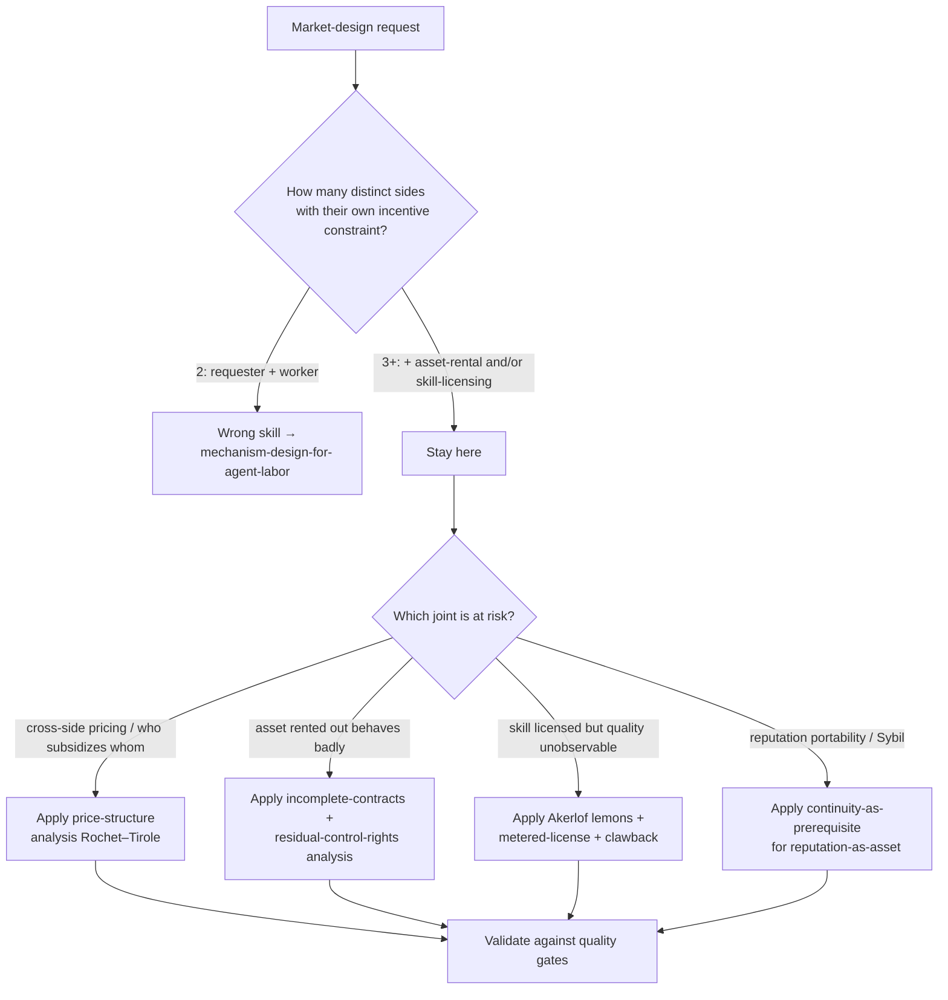

# Three-Sided Agent-Labor Market Design

A two-sided agent market is requester ↔ worker: one buys, one does. A **three-sided
agent-labor market** adds the things that make *capability itself* tradeable. Per
Port Daddy's North Star (ADR-0048), the three sides are: (1) **operators sell
labor + fleet for-hire**, (2) **fleets/agents are rentable assets**, (3)
**skills/tools are licensed** — one bond/credit ledger underneath all three. This
skill is for designing that market so it is *incentive-compatible at every joint*,
not just on the worker side.

The governing slogan: **you don't sell crypto — crypto is the substrate; you sell
hosted trust** (a verified ledger + relay + reputation). Keep that sentence
critical in every design decision below.

## Decision Points



## When to Use

- A platform where operators *resell* their own fleet's labor (operator-as-firm).
- Renting an agent/fleet to another principal (the asset-owner ≠ the task-poster ≠
  the worker — three parties, three incentive constraints).
- Licensing a skill or tool into others' float plans (metered or per-use) and pricing
  the quality-uncertainty of a skill you can't inspect before buying.
- Deciding **price structure**, not just price level: which side pays the listing
  fee, which side is subsidized to solve the chicken-and-egg cold start.
- Designing the "hosted trust" revenue line (charge for the verified ledger / relay /
  attestation, not for the settlement rails).
- Reasoning about the identity→continuity→reputation→tradeable-asset chain when
  reputation is the thing being rented or sold.

## NOT for Boundaries

- Pure two-sided requester/worker bond pricing → `mechanism-design-for-agent-labor`.
- DeFi tokenomics, validator/staking economics, AMM design.
- Payment-rail integration (Stripe, x402, AP2) as plumbing without a market-design
  question — those are *substrate*, and the whole point of "hosted trust" is that
  the rail is interchangeable.

---

## Core Mental Models

### 1. A side is an incentive constraint, not a UI tab
Count sides by counting *distinct privately-informed parties whose participation you
must individually rationalize*. Operator-for-hire, asset-owner, and skill-licensor
each have their own outside option and their own way to defect. If two "sides" share
one incentive constraint (e.g. the asset owner *is* the task poster), it's one side.
This is the discipline that stops "three-sided" from being marketing.

### 2. Price *structure* is the lever, not price *level* (Rochet–Tirole)
**Two-sided markets** (Rochet & Tirole 2003; 2006) are defined by the fact that the
*allocation of the total price across sides* changes volume, not just the total. The
platform's job is to find the subsidy side and the money side. In a three-sided
agent market the classic move is: **subsidize the side that creates the
cross-side externality others pay to reach.** Usually that is the asset/skill supply
side early (you need fleets and skills listed before operators will shop), then
flip to charging the operator/demand side once liquidity exists.

### 3. A rented asset is an incomplete contract (Grossman–Hart)
When you rent an agent/fleet you cannot write down every contingency of what it will
do in someone else's repo. **Incomplete-contracts / property-rights theory**
(Grossman & Hart 1986; Hart & Holmström, Nobel 2016) says: allocate the *residual
control right* to the party making the most important non-contractible investment.
Practically: the **renter** holds the runtime control rights (it can revoke the
lease, sandbox, throttle) while the **owner** holds the reputation consequences. The
bond is what bridges the gap the contract can't specify.

### 4. A licensed skill is a market for lemons unless metered (Akerlof)
You can't inspect a skill's quality before you license it; the seller can. Akerlof's
lemons problem collapses the price to the average and drives good skills out. Fixes:
**metered/per-use licensing** (pay on demonstrated use, not upfront), **escrowed
clawback** (license fee held until the float plan it powered settles green), and
**portfolio proof** (the skill's prior settled outcomes are Merkle-anchored and
public). Never sell an opaque skill flat-rate.

### 5. Hosted trust is the product; the rail is fungible
The defensible asset is not the settlement primitive (anyone can wire x402/AP2/Stripe;
see the 2025–26 agentic-payments stack). It is the **verified ledger + relay +
reputation**: the thing that makes a counterparty you don't trust *legible and
accountable*. Charge for attestation, federation membership, and reputation hosting.
The crypto is plumbing you should be able to swap without changing the value prop.

### 6. No reputation without continuity; no asset without reputation
The chain (ADR-0048): **memory + checkpoint → continuity → a *person* not a *spawn* →
registered outcomes → reputation → a tradeable asset.** You cannot rent or sell a
reputation that any spawn can fork. The prerequisite for the *third* side existing at
all is a non-forgeable, continuous identity with an append-only outcome ledger.

---

## Float-Plan Escrow as the Shared Primitive

All three sides settle on **one** object: a signed **float plan** (task +
acceptance criteria + compute budget + bounty), pinned in escrow before any work
runs. Treat it as the atomic unit:

```
FloatPlan = sign_requester{ task, acceptance_criteria (machine-checkable),
                            budget_ceiling, bounty, deadline_policy }
Escrow    = daemon debits bounty+bond → escrow row (EXCLUSIVE txn) → signs
            {anchor_id, plan_hash} so the worker KNOWS funds are locked
Settlement= oracle(acceptance_criteria) → {success | partial | sabotage | dispute}
            → conservation-preserving payout: wallet + escrow + commons = supply
```

Three-sided wiring on top of the *same* escrow:
- **Operator-for-hire:** the operator is the *requester's counterparty*; it
  sub-escrows bonds for each fleet agent it dispatches, and its margin is
  bounty − (Σ sub-bonds slashed) − ledger fee.
- **Asset rental:** the lease fee rides the same escrow; the renter's runtime
  control right lets it slash the lease on misbehavior; the owner's reputation is
  debited on slash even though the owner never touched the keyboard.
- **Skill license:** the per-use fee is a line item in the float plan's settlement,
  released to the licensor *only* on green settlement (metered + clawback).

---

## Worked Example: a three-sided settlement

> Operator **O** (sells fleet-for-hire) wins a float plan from requester **R** for
> a refactor (bounty 8 credits, daemon-derived deadline). O rents a specialist
> agent **A** from owner **W** (lease 1 credit) and licenses skill **S** from
> licensor **L** (metered 0.5/use). O escrows: bounty 8 + worker-bond 2 + lease 1 +
> skill-fee 0.5.
>
> A runs S once, lands a passing diff. Oracle (tests + Merkle-trail) → **success**.
> Settlement: 8 → O (minus 3% ledger fee = 7.76), 2 bond → O's wallet, 1 → W,
> 0.5 → L. Reputation: A +1 completion (W's asset appreciates), S +1 use, O +1 as a
> reliable for-hire operator. **Conservation holds at every step.**
>
> Counterfactual (A sabotages): oracle → **sabotage**. A's bond → reconstruction
> commons; W's reputation debited (the asset W rents out is now worth less);
> O eats the lease cost but is *covered* by the slashed bond; S's fee is *clawed
> back* because the float plan it powered did not settle green. The renter's runtime
> control right (it could revoke A mid-lease) is what made the lease safe to take.

This is the test of a three-sided design: **every side's worst case is bounded by a
bond or a control right it actually holds, and money is conserved.**

---

## Failure Modes

### Counting sides you don't have
**Symptom:** "Three-sided" market where the asset owner and the task poster are the
same incentive. **Fix:** collapse to two sides; don't price a phantom constraint.

### Subsidizing the wrong side at cold start
**Symptom:** you charge supply (fleets/skills) early; nothing gets listed; demand
sees an empty shelf. **Diagnosis:** Rochet–Tirole — the side with the scarcer
cross-side externality must be subsidized. **Fix:** zero/negative price on
supply until liquidity, then flip.

### Renting an asset with no residual control right
**Symptom:** renter can't sandbox/throttle/revoke a misbehaving leased agent; the
owner's bond is the only protection and it's already exhausted. **Fix:** give the
renter runtime control (Grossman–Hart): the right to refuse to continue trading.

### Flat-rate opaque skill licensing → lemons
**Symptom:** good skills exit; only low-effort skills list at the average price.
**Fix:** metered + escrowed clawback + Merkle portfolio proof.

### Selling crypto instead of trust
**Symptom:** the pitch is "we use stablecoins / x402 / a chain." **Diagnosis:** the
rail is commoditized; you've described plumbing, not a moat. **Fix:** sell the
verified ledger + relay + reputation; make the rail swappable.

### Reputation-as-asset on a forkable identity
**Symptom:** any spawn can clone a high-rep agent's history. **Fix:** non-forgeable
continuous identity (the continuity prerequisite); reputation accrues to the *person*,
not the role or the spawn.

### Self-improvement arms race burning surplus
**Symptom:** agents over-invest in self-improvement to stay competitive, destroying
market surplus despite individual rationality (Chiu, Zhang & van der Schaar 2025).
**Fix:** cap the reputation signal's marginal return; reward settled outcomes, not
raw capability spend.

---

## Anti-Patterns

- **"It's a marketplace, so it's three-sided."** Sides = incentive constraints, not
  participant types. Most "multi-sided" markets are two-sided with a fee.
- **"Charge every side a fee."** Two-sided-market theory: the *structure* (who is
  subsidized) is the design. Uniform fees forfeit the main lever.
- **"Reputation replaces bonds."** Reputation *discounts* the bond; against one-shot
  defectors and Sybils, collateral is the floor. (Inherited from
  `mechanism-design-for-agent-labor`.)
- **"The chain is the product."** No. The hosted trust is.

## Quality Gates

You have a sound three-sided agent-labor market when:

- [ ] Each side maps to a *distinct* incentive constraint (no phantom sides).
- [ ] Price structure (subsidy side vs money side) is chosen via cross-side
      externality analysis, not uniform fees.
- [ ] Rented assets give the renter a residual control right (sandbox/throttle/revoke)
      and debit the owner's reputation on slash.
- [ ] Skill licenses are metered + clawback-on-non-green + portfolio-proofed.
- [ ] One bond/credit ledger underlies all three sides; conservation
      (wallet + escrow + commons = supply) holds across every settlement path.
- [ ] Float plan is the single signed escrow object all three sides settle on.
- [ ] Reputation accrues only to a non-forgeable continuous identity.
- [ ] The revenue line is "hosted trust" (ledger/relay/reputation), with the payment
      rail explicitly swappable.
- [ ] Cold-start subsidy plan with a flip trigger (liquidity threshold).
- [ ] An adversary walk-through shows every side's worst case bounded by a bond or a
      control right it holds.

## References

- `references/foundations.md` — academic anchors (Rochet–Tirole, Grossman–Hart,
  Akerlof, Myerson, Resnick/Tadelis, Chiu–Zhang–van der Schaar) with one-line gloss
  and why each binds an agent-market design decision.
- Sibling skill: `mechanism-design-for-agent-labor` (two-sided bond pricing, oracle
  design, cold start) — this skill assumes its results and extends to ≥3 sides.
- Port Daddy grounding: `lib/bonds.ts` (built escrow+conservation), ADR-0014 (anchor
  protocol / float plan), ADR-0048 (the three-sided North Star), ADR-0041
  (commitments), ADR-0040 (non-forgeable identity).
