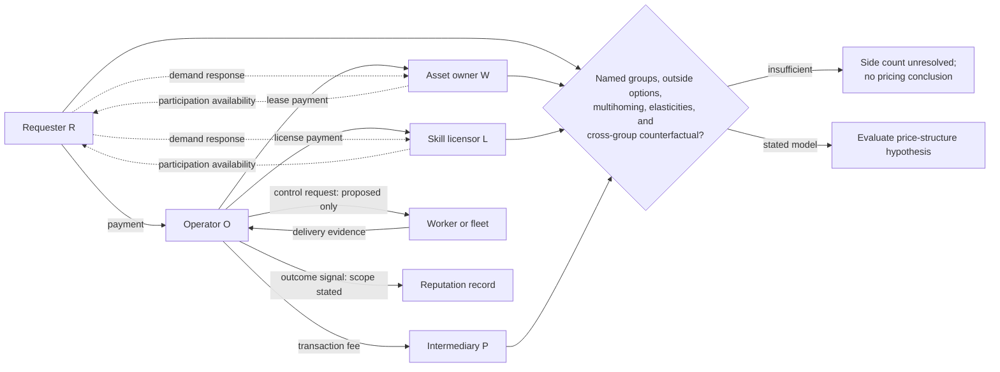

# Group, flow, and side-model check

**Edge legend:** solid edges are constructed money/control/evidence/signal flows; dotted edges are hypothesised participation effects. Role count does not determine side count. The diagram does not grant O authority over A or establish a settled reputation outcome.
