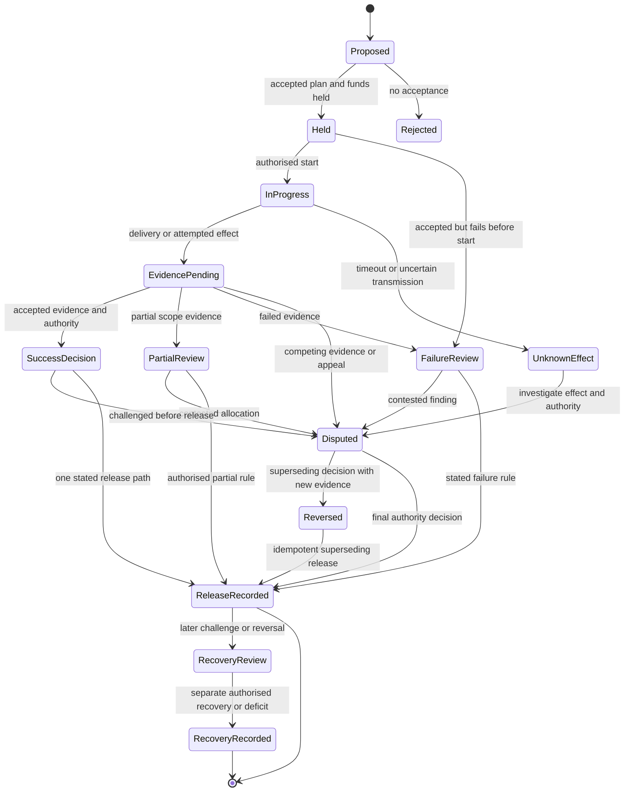

# Proposed settlement state machine

This is a constructed state model. “Held,” “authority,” “release,” and “reversal” must be bound to an actual first-party contract before they are claimed as enforced behavior.

The pre-release dispute path preserves held funds. A challenge after release enters a separate recovery review; it cannot recreate the original hold. Partial releases require a stated disposition for any remaining balance.
